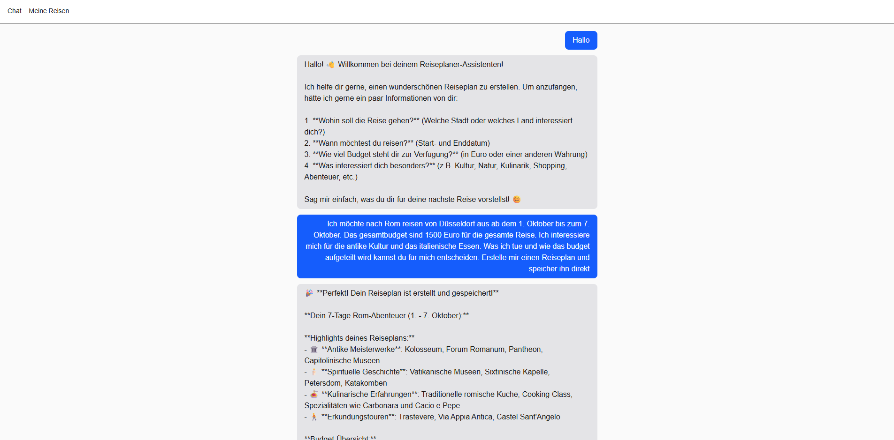
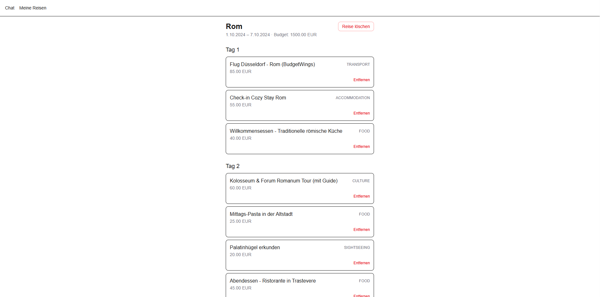

# AI Trip Planner

KI-gestützter Reiseplaner zum Lernen von Next.js, NestJS, Prisma/PostgreSQL,
echten LLM-Tool-Use-Agent-Workflows und E2E-Testing mit Playwright.

**Live-Demo:** https://witty-pond-0504bdc0f.7.azurestaticapps.net (Frontend, Azure Static Web Apps; siehe [Architektur](#architektur-azure))

## Screenshots

| Chat | Trip-Übersicht |
| --- | --- |
|  |  |

## Struktur

- `apps/web` – Next.js Frontend (Chat-Oberfläche + Reiseplan-Anzeige unter `/trips`), als statischer Export gebaut
- `apps/api` – NestJS Backend (inkl. `prisma/` Schema+Migrations, Prisma-Anbindung und Agent-Logik in `src/`, LLM-Anbieter austauschbar über `src/llm/`), `Dockerfile` für den produktiven Container
- `data/knowledge` – Markdown-Wissensbasis für RAG (Reiseziel-Dokumente, siehe [Datenherkunft & Lizenzen](#wissensbasis-datenherkunft))
- `services/rag` – Python/FastAPI-Service für lokale Embeddings und semantische Suche (siehe [services/rag/README.md](services/rag/README.md))
- `packages/mcp-server` – MCP-Server, macht die Trip-Planner-Tools für Claude Code & Co. nutzbar (siehe [packages/mcp-server/README.md](packages/mcp-server/README.md))
- `e2e` – Playwright End-to-End-Tests
- `infra` – Bicep-Templates für das Azure-Deployment (siehe [Architektur](#architektur-azure))
- `docker-compose.yml` – lokale PostgreSQL-Instanz + RAG-Service (siehe [Architektur](#architektur-lokal))
- `.github/workflows` – CI-Pipeline (Lint, Test, Build, E2E) und Azure-Deployment-Workflow

## Architektur (lokal) <a name="architektur-lokal"></a>

```
┌─────────────┐        ┌──────────────────────┐        ┌───────────────────┐
│  apps/web   │──────▶ │       apps/api        │──────▶ │  Groq / Anthropic  │
│  (Next.js)  │        │  (NestJS, Agent +     │        │  (LLM_PROVIDER)    │
│  Port 3001  │        │   LlmProvider)        │        └───────────────────┘
└─────────────┘        │       Port 3000       │
                        └───────────┬───────────┘
                                    │ Reisepläne
                                    ▼
                        ┌───────────────────────┐        ┌───────────────────┐
                        │   Postgres + pgvector  │ ◀───── │   services/rag     │
                        │  Itinerary-Tabellen +  │ Chunks │   (FastAPI)        │
                        │  Document/DocumentChunk│ Suche  │   Port 8001        │
                        │       Port 5432        │──────▶ │                    │
                        └────────────────────────┘        └─────────┬──────────┘
                                                                     │ liest (Ingestion)
                                                                     ▼
                                                            ┌───────────────────┐
                                                            │  data/knowledge    │
                                                            │  (Markdown-Dateien)│
                                                            └───────────────────┘
```

`apps/api` ruft `services/rag` aktuell **noch nicht** auf (das ist Phase 4) -
beide Services laufen bereits nebeneinander über `docker compose up`, sind
aber noch nicht verdrahtet. `apps/web` und `apps/api` laufen lokal nativ mit
Hot-Reload (siehe unten), `postgres` und `rag` über Docker Compose.

## Lokales Setup

Voraussetzungen: Node.js 20+, Docker Desktop.

1. Abhängigkeiten installieren (installiert automatisch auch den generierten Prisma-Client via `postinstall`):
   ```
   npm install
   ```
2. Postgres + RAG-Service starten (baut `services/rag` beim ersten Mal, dauert etwas):
   ```
   docker compose up -d
   ```
3. `apps/api/.env.example` nach `apps/api/.env` kopieren und ausfüllen:
   ```
   cp apps/api/.env.example apps/api/.env
   ```
   - **LLM-Provider:** Standardmäßig `LLM_PROVIDER=groq` mit kostenlosem `GROQ_API_KEY` (siehe [console.groq.com/keys](https://console.groq.com/keys); Free Tier: 30 Requests/Minute, ca. 1.000/Tag, 8.000 Tokens/Minute). Alternativ `LLM_PROVIDER=anthropic` mit `ANTHROPIC_API_KEY` (siehe [console.anthropic.com](https://console.anthropic.com); wird separat abgerechnet).
   - **Login-Zugangsdaten** für die eigene App:
     ```
     AUTH_USERNAME=dein-username
     AUTH_PASSWORD_HASH=<bcrypt-Hash, siehe unten>
     JWT_SECRET=<zufälliger String, siehe unten>
     ```
     Hash und Secret generieren:
     ```bash
     node -e "console.log(require('bcrypt').hashSync('DEIN_PASSWORT', 10))"
     node -e "console.log(require('crypto').randomBytes(32).toString('base64'))"
     ```
4. Datenbank-Migrationen anwenden (nur beim allerersten Setup nötig, danach nur bei Schema-Änderungen):
   ```
   cd apps/api && npx prisma migrate dev
   ```
5. Backend starten (Port 3000):
   ```
   cd apps/api && npm run start:dev
   ```
6. Frontend starten (Port 3001, in einem zweiten Terminal; braucht `apps/web/.env.local` mit `NEXT_PUBLIC_API_URL=http://localhost:3000`):
   ```
   cd apps/web && npm run dev
   ```
7. Chat unter `http://localhost:3001`, gespeicherte Reisen unter `http://localhost:3001/trips`.

## Backend-Endpunkte (`apps/api`)

- `GET /health` – prüft die Datenbankverbindung (offen, kein Login nötig – Azure Container Apps pingt das ungeachtet von Auth)
- `POST /auth/login` – Login, Body: `{ "username": "...", "password": "..." }`, gibt bei Erfolg `{ "accessToken": "..." }` zurück
- `POST /agent/chat` 🔒 – Chat mit dem Reiseplaner-Agenten, Body: `{ "sessionId": "...", "message": "..." }`
- `POST /itineraries` 🔒 – Legt einen neuen Reiseplan mit Tagesplan an (dieselbe Logik, die auch der Agent per `save_itinerary`-Tool und der MCP-Server per `create_itinerary` nutzen)
- `GET /itineraries` 🔒 – Liste aller gespeicherten Reisen
- `GET /itineraries/:id` 🔒 – Details einer Reise inkl. Tagesplan-Punkte
- `DELETE /itineraries/:id` 🔒 – löscht eine Reise (inkl. ihrer Programmpunkte)
- `DELETE /itineraries/:id/stops/:stopId` 🔒 – löscht einen einzelnen Programmpunkt

🔒 = verlangt einen gültigen JWT im `Authorization: Bearer <token>`-Header (per `POST /auth/login` erhalten). Das Frontend kümmert sich darum automatisch (Login-Seite unter `/login`, Token liegt im `localStorage`).

Gespeicherte Reisepläne lassen sich auch mit `npx prisma studio` (in `apps/api`) im Browser unter `http://localhost:5555` einsehen.

## Wissensbasis: Datenherkunft & Lizenzen (`data/knowledge`) <a name="wissensbasis-datenherkunft"></a>

Für die RAG-Funktion (Phase 3/4 des Erweiterungsplans) liegen unter
`data/knowledge/` Markdown-Dokumente zu Reisezielen, die später in Chunks
zerlegt und embedded werden (Format siehe [`data/knowledge/README.md`](data/knowledge/README.md)).
Woher diese Inhalte stammen, ist bewusst kein Detail, sondern Teil der
Datenbasis selbst:

- **Eigene Inhalte** (die vier Beispieldokumente): selbst formulierte
  Kurzüberblicke zu Sehenswürdigkeiten, Essen und Transport. Keine
  Lizenzfragen, da nichts aus einer fremden Quelle übernommen wurde.
- **Optionaler Import aus frei lizenzierten Quellen** (z.B. Wikivoyage,
  standardmäßig unter [CC BY-SA](https://creativecommons.org/licenses/by-sa/4.0/deed.de)
  lizenziert): erlaubt, aber an Bedingungen geknüpft. CC-BY-SA verlangt
  **Namensnennung** (Autor:innen bzw. Projektname, i.d.R. "Wikivoyage-Autoren"
  plus Link auf die Originalseite) **und** dass abgeleitete Inhalte unter
  derselben Lizenz weitergegeben werden ("Share-Alike") - ein importiertes
  Dokument darf also nicht als "Eigene Inhalte" deklariert werden, und ein
  daraus erzeugtes Produkt (z.B. eine Zusammenfassung) muss dieselbe Lizenz
  tragen. Jedes importierte Dokument braucht deshalb vollständig ausgefüllte
  `source`-, `url`- und `license`-Frontmatter-Felder - das ist die Grundlage
  für eine korrekte Attribution, nicht nur ein Metadatum. Es gibt aktuell
  keinen Import-Code in diesem Repo, nur die Struktur dafür.

"Wir haben einfach alles gecrawlt" ist im Gespräch keine gute Antwort, weil es
zwei Dinge verwechselt: technisch möglich (Scraping ist meist trivial) und
rechtlich zulässig (Urheberrecht, Nutzungsbedingungen der Quelle, bei
personenbezogenen Daten zusätzlich Datenschutzrecht) sind unabhängige Fragen.
Gerade im regulierten Umfeld (Gesundheits-/Abrechnungsdaten bei opta data)
ist die Fähigkeit, Datenherkunft und Lizenzlage sauber zu dokumentieren,
selbst Teil der fachlichen Anforderung - nicht nur Compliance-Kosmetik.

## E2E-Tests (`e2e`)

Playwright-Test, der den kompletten Flow gegen den echten Chat-Agenten prüft (Backend, Frontend und Postgres müssen laufen). Der Test loggt sich zuerst ein, braucht dafür das Klartext-Gegenstück zu deinem `AUTH_PASSWORD_HASH` aus `apps/api/.env` (den Hash selbst kann man ja nicht zurückrechnen):

```bash
export E2E_AUTH_USERNAME=dein-username   # gleicher Wert wie AUTH_USERNAME
export E2E_AUTH_PASSWORD=dein-passwort   # das Passwort, aus dem AUTH_PASSWORD_HASH generiert wurde
cd e2e && npx playwright test
```

Läuft auch automatisch in der CI-Pipeline (eigener `e2e`-Job mit Postgres-Service-Container und dem `ANTHROPIC_API_KEY`-Repository-Secret).

## Architektur (Azure) <a name="architektur-azure"></a>

Das Projekt lässt sich per Infrastructure-as-Code (Bicep, `infra/`) nach Azure deployen:

```
                 ┌──────────────────────────────┐
                 │   GitHub Actions (CI/CD)      │
                 │   .github/workflows/deploy.yml│
                 │   Login via OIDC              │
                 └───────────────┬────────────────┘
                                 │
                 ┌───────────────┼────────────────────────────┐
                 │               ▼                             │
                 │   docker push          az deployment group  │
                 │       │                    create           │
                 ▼       │                       │              │
   ghcr.io (Backend-Image)                       ▼              │
                 │                 Azure Resource Group          │
                 │        ┌─────────────────────────────────┐   │
                 └───────▶│ Container Apps Environment       │   │
                          │   └─ Container App (NestJS API)  │   │
                          │        │              │           │  │
                          │        │              └─────▶ Application Insights
                          │        │                          │       ▲
                          │        ▼                          │       │
                          │  PostgreSQL Flexible Server        │  Log Analytics
                          │  (Burstable B1ms, Firewall:        │   Workspace
                          │   nur Azure-interne Dienste)        │
                          └─────────────────────────────────┘   │
                                        ▲                        │
                                        │ NEXT_PUBLIC_API_URL     │
                          ┌──────────────────────┐               │
              Browser ───▶│ Static Web App (Free)│───────────────┘
                          │ Next.js, statischer   │
                          │ Export aus apps/web    │
                          └──────────────────────┘
```

| Dienst | Zweck |
| --- | --- |
| **Azure Static Web Apps** | Hosting des Next.js-Frontends als statischer Export (HTML/JS/CSS, globales CDN, kostenloses TLS) |
| **Azure Container Apps** | Laufzeitumgebung fürs NestJS-Backend, Scale-to-Zero (keine Kosten im Leerlauf) |
| **Azure Database for PostgreSQL – Flexible Server** | Verwaltete Postgres-Datenbank, Burstable-Tier (günstigste SKU) |
| **Application Insights + Log Analytics** | Monitoring/Logs des Backends – `applicationinsights`-SDK läuft in `apps/api` (Setup in `src/tracing.ts`, ganz am Anfang von `main.ts` geladen), erfasst automatisch Requests/Dependencies/Exceptions/Konsolen-Logs plus ein Custom Event `ItinerarySaved`. Abrufbar im Portal unter "Live Metrics"/"Logs" (KQL) oder per `az monitor app-insights query` |
| **GitHub Container Registry (ghcr.io)** | Hostet das Backend-Docker-Image |

Alle Ressourcen werden über `infra/main.bicep` (bindet die Module aus `infra/modules/` ein) in einer einzigen Resource Group angelegt.

### Deployment einrichten

Voraussetzungen: ein Azure-Account/-Subscription, [Azure CLI](https://learn.microsoft.com/cli/azure/install-azure-cli) (`az`) und die Bicep-CLI (`az bicep install`).

**1. Azure AD App-Registrierung für den OIDC-Login (einmalig):**

```bash
az ad app create --display-name "ai-trip-planner-deploy"
# App-ID (Client-ID) und Tenant-ID notieren, z. B.:
az account show --query tenantId -o tsv
```

Danach im Azure-Portal (oder per `az ad app federated-credential create`) für diese App eine **Federated Credential** anlegen, die dem GitHub-Actions-OIDC-Token von `push`-Events auf `main` in diesem Repo vertraut (Subject: `repo:<owner>/<repo>:ref:refs/heads/main`). Der App anschließend die Rolle `Contributor` auf die Ziel-Subscription/Resource-Group zuweisen:

```bash
az role assignment create \
  --assignee <APP_CLIENT_ID> \
  --role Contributor \
  --scope /subscriptions/<SUBSCRIPTION_ID>
```

Falls Federated Credentials im eigenen Tenant nicht eingerichtet werden können: alternativ einen Service Principal mit Secret anlegen (`az ad sp create-for-rbac`) und statt `client-id`/`tenant-id`/`subscription-id` einen `AZURE_CREDENTIALS`-Secret mit dem `azure/login`-Action-Parameter `creds:` verwenden – weniger sicher (langlebiger Schlüssel), aber ein funktionierender Fallback.

**2. Folgende Secrets im Repo anlegen** (Settings → Secrets and variables → Actions):

| Secret | Zweck |
| --- | --- |
| `AZURE_CLIENT_ID`, `AZURE_TENANT_ID`, `AZURE_SUBSCRIPTION_ID` | OIDC-Login gegen Azure |
| `POSTGRES_ADMIN_LOGIN`, `POSTGRES_ADMIN_PASSWORD` | Zugangsdaten für den Postgres Flexible Server |
| `GROQ_API_KEY` | Standard-LLM-Provider fürs Backend (kostenloses Tier, siehe [Lokales Setup](#lokales-setup)) |
| `ANTHROPIC_API_KEY` | Fallback-Provider fürs Backend, umschaltbar per `LLM_PROVIDER`-Env-Var ohne neues Secret (existiert vermutlich schon aus der CI-Pipeline) |
| `GHCR_PAT` | GitHub Personal Access Token mit Scope `read:packages` – wird als Registry-Pull-Credential in die Container App geschrieben (das kurzlebige `GITHUB_TOKEN` reicht dafür nicht, siehe Kommentar in `deploy.yml`) |
| `AUTH_USERNAME`, `AUTH_PASSWORD_HASH`, `JWT_SECRET` | Login-Zugangsdaten fürs deployte Backend (`POST /auth/login`) – gleiche Werte/gleiches Prinzip wie in `apps/api/.env` lokal, siehe [Lokales Setup](#lokales-setup) für die Generierung. Ruhig ein anderes Passwort als lokal verwenden. |

**3. Deployen:** Push auf `main` (oder manuell über den "Run workflow"-Button bei `deploy.yml`) baut das Backend-Image, deployt die Bicep-Templates und veröffentlicht das Frontend – alles automatisch.

Region/Namens-Präfix lassen sich in `infra/main.parameters.json` anpassen.

**Secrets nachträglich ändern (z. B. Login-Passwort rotieren):** GitHub-Secret aktualisieren und `deploy.yml` erneut laufen lassen reicht **nicht automatisch** – Azure Container Apps legt bei einer reinen Secret-*Wert*-Änderung (ohne Änderung an Image-Tag/Env-Var-Namen) keine neue Revision an, der laufende Container behält seine beim Start eingelesenen (alten) Werte. Nach jeder Secret-Rotation zusätzlich eine neue Revision erzwingen:
```bash
az containerapp update --name trip-planner-dev-api --resource-group trip-planner-dev-rg --revision-suffix rotate$(date +%s)
```

### Kosten im Blick behalten

Die Konfiguration ist bewusst auf die günstigsten Optionen ausgelegt (Container Apps Scale-to-Zero, Postgres Burstable-Tier, Static Web Apps Free-Tier, gedeckelte Log-Analytics-Aufnahme) – trotzdem läuft der **PostgreSQL Flexible Server nicht automatisch in einen Nullkosten-Zustand**, wenn er nicht benutzt wird (anders als die Container App). Wer länger pausiert, sollte ihn manuell stoppen:

```bash
az postgres flexible-server stop --name trip-planner-dev-psql3 --resource-group trip-planner-dev-rg
```

Wieder starten:

```bash
az postgres flexible-server start --name trip-planner-dev-psql3 --resource-group trip-planner-dev-rg
```

Ein gestoppter Server startet sich nach 7 Tagen automatisch wieder (Azure-Limit) – bei längeren Pausen den Befehl ggf. wiederholen, oder die Ressourcen bei Nichtgebrauch mit `az group delete` komplett entfernen (dann müsste vor dem nächsten Deployment allerdings `npx prisma migrate deploy` erneut laufen, da eine neue, leere Datenbank entsteht).

**Wichtig:** Das Stoppen von Postgres allein schützt **nicht** vor unautorisierter Nutzung des Anthropic-API-Keys – `/agent/chat` ruft die Anthropic-API auf, bevor überhaupt auf die Datenbank zugegriffen wird (nur `save_itinerary` braucht die DB). `/agent/chat` verlangt inzwischen einen gültigen Login (siehe [Backend-Endpunkte](#backend-endpunkte-appsapi)), das ist die eigentliche Absicherung gegen fremde Nutzung. Für den Fall, dass die Login-Zugangsdaten mal kompromittiert werden (oder man einfach jeden Zugriff inkl. `/health` unterbinden will, z. B. bei längerer Pause), bleibt die Container-App-Revision als zusätzlicher Not-Aus-Schalter:

```bash
# aktuelle Revision ermitteln
az containerapp revision list --name trip-planner-dev-api --resource-group trip-planner-dev-rg --query "[0].name" -o tsv

# damit deaktivieren (ersetzt <revision-name> durch die Ausgabe von oben)
az containerapp revision deactivate --revision <revision-name> --resource-group trip-planner-dev-rg

# und wieder aktivieren
az containerapp revision activate --revision <revision-name> --resource-group trip-planner-dev-rg
```
