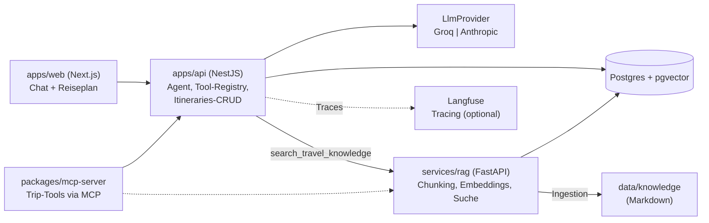
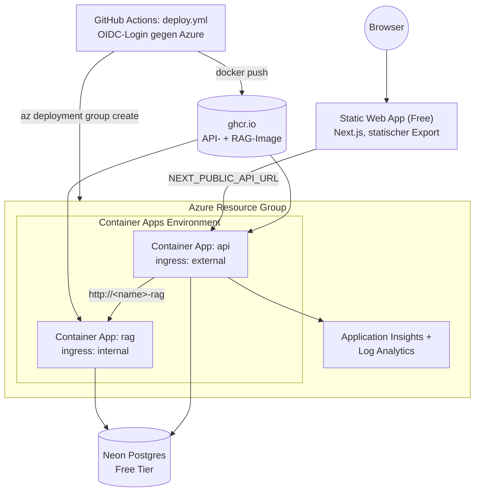

# AI Trip Planner

Ein Chat-Agent, der einen Reiseplan im Dialog erarbeitet, Faktenfragen zu
Reisezielen mit belegten Quellen statt Vermutungen beantwortet und das
Ergebnis speichert. Gebaut als Lernprojekt für produktionsnahe LLM-Anwendungen:
Tool-Use-Agenten, Retrieval-Augmented Generation, austauschbare LLM-Anbieter,
ein eigener MCP-Server, automatisierte Qualitätsmessung und ein
Cloud-Deployment, das bei Nichtnutzung nichts kostet.

**Live-Demo:** https://witty-pond-0504bdc0f.7.azurestaticapps.net

## Screenshots

| Chat | Trip-Übersicht |
| --- | --- |
|  |  |

## Features

- **Dialogbasierte Reiseplanung**: der Agent fragt aktiv nach Ziel, Zeitraum,
  Budget und Präferenzen, statt eine Eingabemaske auszufüllen
- **Belegte Faktenantworten statt Vermutungen**: Fragen zu Sehenswürdigkeiten,
  Essen und Transport werden über eine eigene RAG-Wissensbasis beantwortet,
  inklusive sichtbarer Quelle im Frontend - findet sich nichts Passendes,
  sagt der Agent das, statt zu spekulieren
- **Gespeicherte, wiederauffindbare Reisepläne** unter `/trips`, mit
  Tagesprogramm und Kategorien pro Programmpunkt
- **Austauschbarer LLM-Anbieter** (Groq oder Anthropic) per einer
  Env-Variable, kein Codeeingriff nötig
- **MCP-Server**: dieselben Fähigkeiten (Wissenssuche, Reiseplan anlegen/
  auflisten) direkt aus Claude Code, Claude Desktop oder jedem anderen
  MCP-Client nutzbar - stdio- und abgesicherter HTTP-Transport
- **Tracing** jedes Agentenlaufs (Langfuse), bewusst ohne Freitext-Inhalte
- **Automatisierte Qualitätsmessung**: ein Eval-Harness misst Retrieval- und
  Tool-Genauigkeit gegen ein festes Golden Dataset, nachts gegen Groq
  wiederholt, Report als CI-Artefakt
- **Cloud-Deployment** (Azure, Infrastructure-as-Code) mit Scale-to-Zero -
  keine laufenden Kosten ohne Nutzung

## Architektur (lokal) <a name="architektur-lokal"></a>



`apps/web` und `apps/api` laufen lokal nativ mit Hot-Reload, `postgres` und
`rag` über `docker compose` (siehe `docker-compose.yml` - bewusst nur
unterstützende Infrastruktur, kein Container-Rebuild pro Codeänderung für die
beiden aktiv entwickelten Apps).

## Technologien

| Bereich | Wahl | Warum |
| --- | --- | --- |
| Frontend | Next.js, statischer Export | Kein eigener Node-Server für das Frontend nötig - passt zu Azure Static Web Apps (CDN, kostenloses TLS, Free Tier) |
| Backend | NestJS | Modulare DI-Struktur passt zum Tool-Registry-/Provider-Pattern des Agenten, TypeScript durchgehend mit dem Frontend geteilt |
| Datenbank | PostgreSQL + pgvector | Eine Datenbank für Anwendungsdaten (Reisepläne) und Vektorsuche statt einer zusätzlichen dedizierten Vektor-DB |
| LLM | Groq (Standard) / Anthropic (Fallback) | Groq: kostenloses Tier, OpenAI-kompatible Schnittstelle (`openai`-Paket statt `groq-sdk` - ein Adapter für jeden OpenAI-kompatiblen Endpunkt). Beide hinter einem `LlmProvider`-Interface austauschbar |
| RAG-Service | Python/FastAPI, eigener Prozess | Embedding-Ökosystem lebt in Python - echte polyglotte Systemintegration statt alles in eine Sprache zu zwingen |
| Embeddings | fastembed, lokal (ONNX) | Kein API-Key, keine laufenden Kosten, volle Datenhoheit - relevant im Gesundheits-/Abrechnungsumfeld |
| Agent-Fähigkeiten extern | MCP-Server | Macht dieselbe Tool-Logik ohne Duplikation auch außerhalb des eigenen Frontends nutzbar (Claude Code, Claude Desktop, ...) |
| Observability | Langfuse (OpenTelemetry-basiertes SDK) | Anbieterneutral instrumentiert (Groq **und** Anthropic), sauber deaktiviert ohne Account |
| Qualitätsmessung | Eigener Eval-Harness (Recall@k, MRR, Tool-Genauigkeit) | Ohne Messung ist RAG-Qualität eine Meinung - Grundlage für ein CI-Gate |
| E2E-Tests | Playwright | Prüft den kompletten Flow gegen den echten Agenten, nicht nur einzelne Komponenten |
| Infrastruktur | Bicep, Azure Container Apps | Scale-to-Zero passt zu unregelmäßiger Portfolio-Nutzung; Infrastructure-as-Code statt Klick-Ops |

## Eval-Ergebnisse

Letzter Lauf gegen den echten Stack (`nightly-eval.yml`, Modell
`groq/openai/gpt-oss-120b`), 8 Fragen im Golden Dataset:

| Metrik | Ergebnis | Schwelle |
| --- | --- | --- |
| Recall@3 | 100,0 % | ≥ 80,0 % |
| MRR | 1,00 | ≥ 0,60 |
| Tool-Genauigkeit | 100,0 % | ≥ 80,0 % |
| LLM-as-Judge | 5,00 / 5 | - |

Metriken, Golden Dataset und Interpretation (insbesondere der Unterschied
zwischen Recall@k und MRR): [evals/README.md](evals/README.md).

## Lokales Setup

Voraussetzungen: Node.js 20+, Docker Desktop.

```bash
npm install
docker compose up -d          # Postgres + RAG-Service (baut rag beim ersten Mal)
cp apps/api/.env.example apps/api/.env
```

In `apps/api/.env` ausfüllen:
- **LLM-Provider:** Standardmäßig `LLM_PROVIDER=groq` mit kostenlosem
  `GROQ_API_KEY` ([console.groq.com/keys](https://console.groq.com/keys);
  Free Tier: 30 Requests/Minute, ca. 1.000/Tag, 8.000 Tokens/Minute).
  Alternativ `LLM_PROVIDER=anthropic` mit `ANTHROPIC_API_KEY`.
- **Login-Zugangsdaten:**
  ```
  AUTH_USERNAME=dein-username
  AUTH_PASSWORD_HASH=<bcrypt-Hash>
  JWT_SECRET=<zufälliger String>
  ```
  Generieren:
  ```bash
  node -e "console.log(require('bcrypt').hashSync('DEIN_PASSWORT', 10))"
  node -e "console.log(require('crypto').randomBytes(32).toString('base64'))"
  ```

Danach:

```bash
cd apps/api && npx prisma migrate dev   # nur beim ersten Setup nötig
npm run start:dev                        # Backend, Port 3000
```

Frontend in einem zweiten Terminal (braucht `apps/web/.env.local` mit
`NEXT_PUBLIC_API_URL=http://localhost:3000`):

```bash
cd apps/web && npm run dev              # Port 3001
```

Chat unter `http://localhost:3001`, gespeicherte Reisen unter
`http://localhost:3001/trips`.

## Backend-Endpunkte (`apps/api`)

- `GET /health` – prüft die Datenbankverbindung (offen, kein Login nötig – Azure Container Apps pingt das ungeachtet von Auth)
- `POST /auth/login` – Login, Body: `{ "username": "...", "password": "..." }`, gibt bei Erfolg `{ "accessToken": "..." }` zurück
- `POST /agent/chat` 🔒 – Chat mit dem Reiseplaner-Agenten, Body: `{ "sessionId": "...", "message": "..." }`
- `POST /itineraries` 🔒 – Legt einen neuen Reiseplan mit Tagesplan an (dieselbe Logik, die auch der Agent per `save_itinerary`-Tool und der MCP-Server per `create_itinerary` nutzen)
- `GET /itineraries` 🔒 – Liste aller gespeicherten Reisen
- `GET /itineraries/:id` 🔒 – Details einer Reise inkl. Tagesplan-Punkte
- `DELETE /itineraries/:id` 🔒 – löscht eine Reise (inkl. ihrer Programmpunkte)
- `DELETE /itineraries/:id/stops/:stopId` 🔒 – löscht einen einzelnen Programmpunkt

🔒 = verlangt einen gültigen JWT im `Authorization: Bearer <token>`-Header (per `POST /auth/login` erhalten). Das Frontend kümmert sich darum automatisch (Login-Seite unter `/login`, Token liegt im `localStorage`).

Gespeicherte Reisepläne lassen sich auch mit `npx prisma studio` (in `apps/api`) im Browser unter `http://localhost:5555` einsehen.

## Struktur & weiterführende READMEs

- `apps/web` – Next.js Frontend (Chat-Oberfläche + Reiseplan-Anzeige unter `/trips`), als statischer Export gebaut
- `apps/api` – NestJS Backend (Prisma-Schema/Migrations, Agent-Logik in `src/`, LLM-Anbieter austauschbar über `src/llm/`), `Dockerfile` für den produktiven Container
- `data/knowledge` – Markdown-Wissensbasis für RAG, siehe [data/knowledge/README.md](data/knowledge/README.md) und [Datenherkunft & Lizenzen](#wissensbasis-datenherkunft)
- `services/rag` – Python/FastAPI-Service für lokale Embeddings, Ingestion und semantische Suche, siehe [services/rag/README.md](services/rag/README.md)
- `packages/mcp-server` – MCP-Server für die Trip-Planner-Tools, siehe [packages/mcp-server/README.md](packages/mcp-server/README.md)
- `evals` – Eval-Harness mit Golden Dataset, siehe [evals/README.md](evals/README.md)
- `e2e` – Playwright End-to-End-Tests
- `infra` – Bicep-Templates für das Azure-Deployment, siehe [Architektur (Azure)](#architektur-azure)
- `docs/deployment.md` – Kosten und Groq-Free-Tier-Grenzen im Produktivbetrieb
- `docker-compose.yml` – lokale PostgreSQL-Instanz + RAG-Service
- `.github/workflows` – CI/CD, siehe [CI/CD](#cicd)

## Observability: Tracing mit Langfuse

Jeder Agentenlauf (`POST /agent/chat`) wird als [Langfuse](https://langfuse.com)-Trace
aufgezeichnet: ein Span pro Chat-Nachricht, darin verschachtelt ein
`generation`-Span je LLM-Aufruf (Modell, Token-Usage, Latenz, Finish-Reason)
sowie ein `tool`- bzw. `retriever`-Span je Tool-Aufruf - Letzteres speziell
für `search_travel_knowledge`, inklusive der Titel/Quellen/Scores der
gefundenen Wissensbasis-Treffer.

**Setup (optional):** kostenloser Account auf
[cloud.langfuse.com](https://cloud.langfuse.com) (50.000 Units/Monat, keine
Kreditkarte), dann in `apps/api/.env`:

```
LANGFUSE_SECRET_KEY=sk-lf-...
LANGFUSE_PUBLIC_KEY=pk-lf-...
LANGFUSE_BASE_URL=https://cloud.langfuse.com
```

**Warum das aktuelle JS-SDK statt eines OpenAI-Wrappers:** Langfuse bewirbt
für Node/TypeScript primär den OpenTelemetry-basierten SDK-Ansatz
(`@langfuse/tracing` + `@langfuse/otel`, siehe
[Langfuse-Doku](https://langfuse.com/docs/observability/get-started)) mit
manuellen `startActiveObservation`/`propagateAttributes`-Aufrufen statt eines
Wrappers wie `observeOpenAI`. Das passt hier besser: der Agent läuft über
Groq **oder** Anthropic (`LlmProvider`-Abstraktion in `apps/api/src/llm/`),
ein OpenAI-SDK-spezifischer Wrapper würde nur einen der beiden Anbieter
erfassen. Die manuelle Instrumentierung in `agent.service.ts` ist dagegen
anbieterneutral, weil sie am bereits normalisierten `LlmChatResult` ansetzt.

**Sauber deaktiviert ohne Account:** `apps/api/src/tracing.ts` registriert den
`LangfuseSpanProcessor` nur, wenn beide Keys gesetzt sind. Fehlen sie, bleibt
der globale OpenTelemetry-Tracer der eingebaute No-Op-Tracer - alle
`startActiveObservation`/`propagateAttributes`-Aufrufe im Agent-Code laufen
dann folgenlos durch, ohne Fehler und ohne Sonderfall-`if`s an den Aufrufstellen.

**Was bewusst nicht getraced wird:** Weder die rohe Nutzernachricht noch die
volle Antwort des Agenten landen als Trace-Input/-Output in Langfuse - beides
kann Reisepräferenzen oder andere indirekt personenbezogene Angaben enthalten,
die nichts in einem Drittanbieter-Dashboard verloren haben. Getraced wird nur
die *Form* des Laufs: Modellname, Token-Zahlen, Latenz, welche Tools mit wie
vielen Treffern liefen. In einem Kontext mit sensibleren Daten würde dieselbe
Überlegung zusätzlich für Tool-Argumente und -Ergebnisse gelten (z.B.
Reiseziel, Zeitraum, Budget bei `save_itinerary`) - im Zweifel maskiert man
nicht einzelne Freitext-Felder nachträglich, sondern lässt sie wie hier von
vornherein weg.

## Wissensbasis: Datenherkunft & Lizenzen (`data/knowledge`) <a name="wissensbasis-datenherkunft"></a>

Unter `data/knowledge/` liegen Markdown-Dokumente zu Reisezielen, die der
RAG-Service in Chunks zerlegt und embedded (Format siehe
[`data/knowledge/README.md`](data/knowledge/README.md)). Woher diese Inhalte
stammen, ist bewusst kein Detail, sondern Teil der Datenbasis selbst:

- **Eigene Inhalte** (die vier Beispieldokumente): selbst formulierte
  Kurzüberblicke zu Sehenswürdigkeiten, Essen und Transport. Keine
  Lizenzfragen, da nichts aus einer fremden Quelle übernommen wurde.
- **Optionaler Import aus frei lizenzierten Quellen** (z.B. Wikivoyage,
  standardmäßig unter [CC BY-SA](https://creativecommons.org/licenses/by-sa/4.0/deed.de)
  lizenziert): erlaubt, aber an Bedingungen geknüpft. CC-BY-SA verlangt
  **Namensnennung** (Autor:innen bzw. Projektname, i.d.R. "Wikivoyage-Autoren"
  plus Link auf die Originalseite) **und** dass abgeleitete Inhalte unter
  derselben Lizenz weitergegeben werden ("Share-Alike") - ein importiertes
  Dokument darf also nicht als "Eigene Inhalte" deklariert werden, und ein
  daraus erzeugtes Produkt (z.B. eine Zusammenfassung) muss dieselbe Lizenz
  tragen. Jedes importierte Dokument braucht deshalb vollständig ausgefüllte
  `source`-, `url`- und `license`-Frontmatter-Felder - das ist die Grundlage
  für eine korrekte Attribution, nicht nur ein Metadatum. Es gibt aktuell
  keinen Import-Code in diesem Repo, nur die Struktur dafür.

"Einfach alles crawlen" verwechselt zwei unabhängige Fragen: technisch
möglich (Scraping ist meist trivial) und rechtlich zulässig (Urheberrecht,
Nutzungsbedingungen der Quelle, bei personenbezogenen Daten zusätzlich
Datenschutzrecht). Datenherkunft und Lizenzlage sauber zu dokumentieren ist
deshalb Teil der fachlichen Arbeit, nicht nachträgliche Compliance-Kosmetik -
besonders in regulierten Umfeldern mit Gesundheits- oder Abrechnungsdaten.

## Architekturentscheidungen

Es gibt (noch) keine separaten ADR-Dateien in diesem Repo - die Begründungen
stehen stattdessen direkt bei den jeweiligen Themen (verlinkt unten). Die
wichtigsten Entscheidungen im Überblick:

- **LLM hinter einem `LlmProvider`-Interface** statt direkter Anthropic- oder
  Groq-Kopplung: der Wechsel des Standard-Anbieters war dadurch eine
  Env-Variable plus ein Adapter, kein Umbau des Agenten. Details:
  `apps/api/src/llm/llm-provider.interface.ts`.
- **RAG als separater Python-Service statt In-Process-Bibliothek**: das
  Embedding-Ökosystem (fastembed, ONNX) lebt in Python, die
  Agent-Orchestrierung in TypeScript - eine dokumentierte HTTP-Schnittstelle
  zwischen beiden statt eines Sprachkompromisses für alles. Details:
  [services/rag/README.md](services/rag/README.md).
- **RAG als Agent-*Tool*, nicht als starre Vorschaltsuche**: das Modell
  entscheidet selbst, wann es die Wissensbasis braucht, statt jede Anfrage
  unabhängig vom Inhalt erst durch die Suche zu schicken.
- **RAG-Container ohne öffentliche Erreichbarkeit** im Azure-Deployment
  (`ingress.external: false`): `/search` und `/embed` haben keine eigene
  Authentifizierung, das Backend erreicht den Service stattdessen intern über
  seinen Namen. Details: [docs/deployment.md](docs/deployment.md).
- **Tracing ohne Freitext-Inhalte**: Trace-Daten beschreiben die Form eines
  Agentenlaufs (Tokens, Latenz, Tool-Nutzung), nicht dessen Inhalt. Details
  siehe [Observability](#observability-tracing-mit-langfuse) oben.
- **Kein MCP-Tool für destruktive Aktionen**: `DELETE /itineraries/:id`
  existiert als REST-Endpunkt, aber bewusst nicht als MCP-Tool - ein Modell
  soll nicht autonom unwiderruflich Daten löschen können. Details:
  [packages/mcp-server/README.md](packages/mcp-server/README.md).

## CI/CD <a name="cicd"></a>

| Workflow | Trigger | Zweck |
| --- | --- | --- |
| `ci.yml` → `lint-test-build` | Push/PR | Lint, Unit-Tests, Build über alle Node-Workspaces |
| `ci.yml` → `rag-lint-test` | Push/PR | Ruff, mypy (strict), pytest für `services/rag` - unabhängig vom Node-Job |
| `ci.yml` → `docker-build` | Push/PR | Baut `apps/api`- und `services/rag`-Dockerfiles, bevor gemerged wird |
| `ci.yml` → `e2e` | Push/PR | Playwright-Test gegen den kompletten Stack (siehe [E2E-Tests](#e2e-tests-e2e)) |
| `nightly-eval.yml` | täglich 03:00 UTC + manuell | Eval-Harness gegen den echten Stack, Report als Artefakt. Übersprungen (nicht rot), solange kein `GROQ_API_KEY`-Secret gesetzt ist |
| `deploy.yml` | Push auf `main` + manuell | Baut beide Images, deployt die Bicep-Templates, veröffentlicht das Frontend |

## E2E-Tests (`e2e`)

Playwright-Test, der den kompletten Flow gegen den echten Chat-Agenten prüft (Backend, Frontend und Postgres müssen laufen). Der Test loggt sich zuerst ein, braucht dafür das Klartext-Gegenstück zu deinem `AUTH_PASSWORD_HASH` aus `apps/api/.env` (den Hash selbst kann man ja nicht zurückrechnen):

```bash
export E2E_AUTH_USERNAME=dein-username   # gleicher Wert wie AUTH_USERNAME
export E2E_AUTH_PASSWORD=dein-passwort   # das Passwort, aus dem AUTH_PASSWORD_HASH generiert wurde
cd e2e && npx playwright test
```

## Architektur (Azure) <a name="architektur-azure"></a>



| Dienst | Zweck |
| --- | --- |
| **Azure Static Web Apps** | Hosting des Next.js-Frontends als statischer Export (HTML/JS/CSS, globales CDN, kostenloses TLS) |
| **Azure Container Apps** | Laufzeitumgebung fürs NestJS-Backend und den RAG-Service (zweite Container App in derselben Environment, `ingress.external: false` - nur intern über ihren Namen erreichbar, keine eigene Auth), beide Scale-to-Zero. Details und Kosten: [docs/deployment.md](docs/deployment.md) |
| **Neon (PostgreSQL + pgvector)** | Verwaltete Postgres-Datenbank, Free Tier, öffentlich erreichbar (kein VNet-Firewall-Handshake nötig) |
| **Application Insights + Log Analytics** | Monitoring/Logs des Backends – erfasst automatisch Requests/Dependencies/Exceptions/Konsolen-Logs plus ein Custom Event `ItinerarySaved` |
| **GitHub Container Registry (ghcr.io)** | Hostet beide Docker-Images (Backend, RAG-Service) |

Alle Ressourcen werden über `infra/main.bicep` (bindet die Module aus `infra/modules/` ein) in einer einzigen Resource Group angelegt.

### Deployment einrichten

Voraussetzungen: ein Azure-Account/-Subscription, [Azure CLI](https://learn.microsoft.com/cli/azure/install-azure-cli) (`az`) und die Bicep-CLI (`az bicep install`).

**1. Azure AD App-Registrierung für den OIDC-Login (einmalig):**

```bash
az ad app create --display-name "ai-trip-planner-deploy"
# App-ID (Client-ID) und Tenant-ID notieren, z. B.:
az account show --query tenantId -o tsv
```

Danach im Azure-Portal (oder per `az ad app federated-credential create`) für diese App eine **Federated Credential** anlegen, die dem GitHub-Actions-OIDC-Token von `push`-Events auf `main` in diesem Repo vertraut (Subject: `repo:<owner>/<repo>:ref:refs/heads/main`). Der App anschließend die Rolle `Contributor` auf die Ziel-Subscription/Resource-Group zuweisen:

```bash
az role assignment create \
  --assignee <APP_CLIENT_ID> \
  --role Contributor \
  --scope /subscriptions/<SUBSCRIPTION_ID>
```

Falls Federated Credentials im eigenen Tenant nicht eingerichtet werden können: alternativ einen Service Principal mit Secret anlegen (`az ad sp create-for-rbac`) und statt `client-id`/`tenant-id`/`subscription-id` einen `AZURE_CREDENTIALS`-Secret mit dem `azure/login`-Action-Parameter `creds:` verwenden – weniger sicher (langlebiger Schlüssel), aber ein funktionierender Fallback.

**2. Folgende Secrets im Repo anlegen** (Settings → Secrets and variables → Actions):

| Secret | Zweck |
| --- | --- |
| `AZURE_CLIENT_ID`, `AZURE_TENANT_ID`, `AZURE_SUBSCRIPTION_ID` | OIDC-Login gegen Azure |
| `DATABASE_URL` | Fertiger Neon-Connection-String (inkl. `sslmode=require`) für Backend **und** RAG-Service |
| `GROQ_API_KEY` | Standard-LLM-Provider fürs Backend (kostenloses Tier) und für `nightly-eval.yml` - fehlt dieses Secret, wird der nächtliche Eval-Lauf sauber übersprungen statt die Pipeline rot zu färben |
| `ANTHROPIC_API_KEY` | Fallback-Provider fürs Backend, umschaltbar per `LLM_PROVIDER`-Env-Var ohne neues Secret |
| `GHCR_PAT` | GitHub Personal Access Token mit Scope `read:packages` – wird als Registry-Pull-Credential in beide Container Apps geschrieben (das kurzlebige `GITHUB_TOKEN` reicht dafür nicht, siehe Kommentar in `deploy.yml`) |
| `AUTH_USERNAME`, `AUTH_PASSWORD_HASH`, `JWT_SECRET` | Login-Zugangsdaten fürs deployte Backend (`POST /auth/login`) – gleiche Werte/gleiches Prinzip wie in `apps/api/.env` lokal. Ruhig ein anderes Passwort als lokal verwenden. |

**3. Deployen:** Push auf `main` (oder manuell über den "Run workflow"-Button bei `deploy.yml`) baut beide Images, deployt die Bicep-Templates und veröffentlicht das Frontend – alles automatisch.

Region/Namens-Präfix lassen sich in `infra/main.parameters.json` anpassen.

**Secrets nachträglich ändern (z. B. Login-Passwort rotieren):** GitHub-Secret aktualisieren und `deploy.yml` erneut laufen lassen reicht **nicht automatisch** – Azure Container Apps legt bei einer reinen Secret-*Wert*-Änderung (ohne Änderung an Image-Tag/Env-Var-Namen) keine neue Revision an, der laufende Container behält seine beim Start eingelesenen (alten) Werte. Nach jeder Secret-Rotation zusätzlich eine neue Revision erzwingen:

```bash
az containerapp update --name trip-planner-dev-api --resource-group trip-planner-dev-rg --revision-suffix rotate$(date +%s)
```

### Kosten im Blick behalten

Container Apps (beide, Scale-to-Zero) und Neon (Free Tier, pausiert bei
Inaktivität automatisch) verursachen im Leerlauf keine Kosten - anders als
frühere Setups mit einem dauerhaft laufenden Azure-Postgres-Server gibt es
hier keinen manuellen Stop/Start-Schritt mehr. Details inkl. konkreter
Zahlen: [docs/deployment.md](docs/deployment.md).

**Wichtig:** Das reicht allein **nicht** als Schutz gegen unautorisierte Nutzung der LLM-API-Keys – `/agent/chat` verlangt bereits einen gültigen Login (siehe [Backend-Endpunkte](#backend-endpunkte-appsapi)), das ist die eigentliche Absicherung. Für den Fall, dass Zugangsdaten kompromittiert werden (oder man jeden Zugriff inkl. `/health` unterbinden will, z. B. bei längerer Pause), bleibt die Container-App-Revision als zusätzlicher Not-Aus-Schalter:

```bash
# aktuelle Revision ermitteln
az containerapp revision list --name trip-planner-dev-api --resource-group trip-planner-dev-rg --query "[0].name" -o tsv

# damit deaktivieren (ersetzt <revision-name> durch die Ausgabe von oben)
az containerapp revision deactivate --revision <revision-name> --resource-group trip-planner-dev-rg

# und wieder aktivieren
az containerapp revision activate --revision <revision-name> --resource-group trip-planner-dev-rg
```
