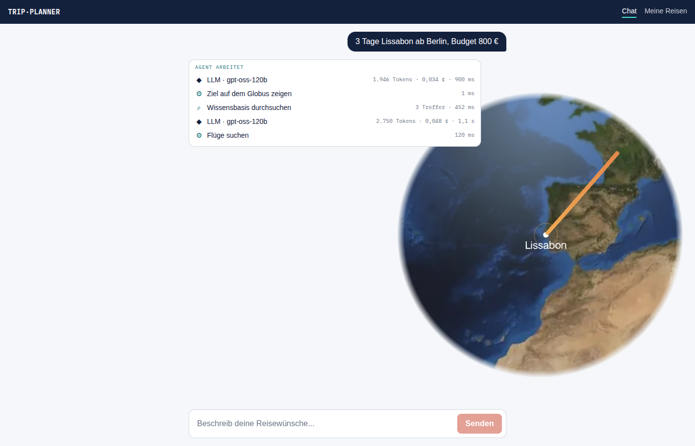
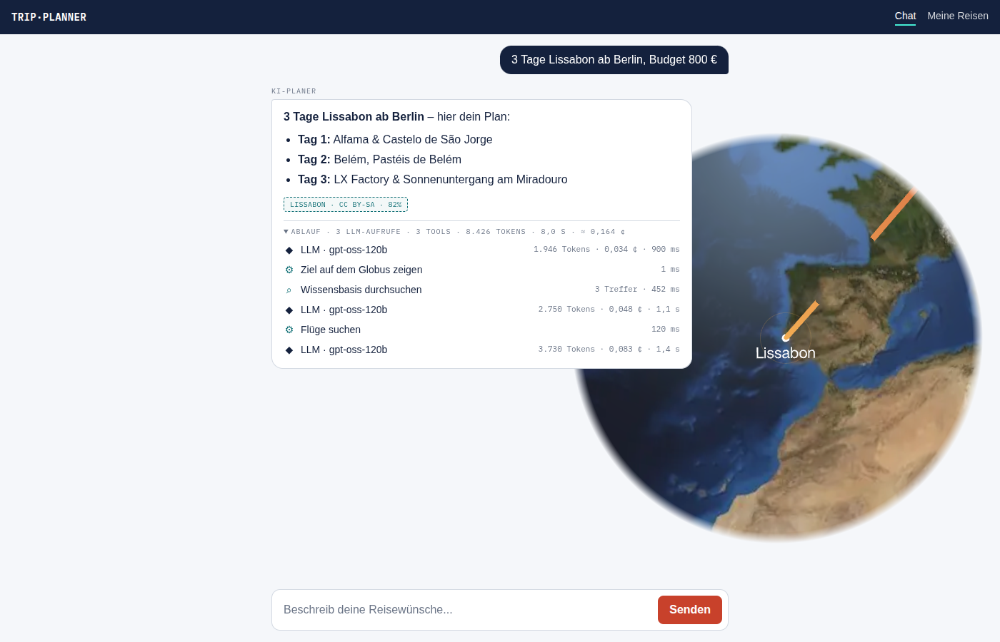
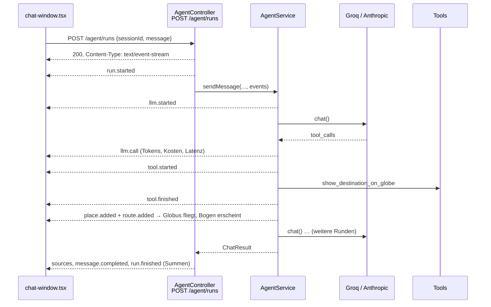

# Phase 1: „Man sieht den Agenten denken“

Teil des Plans in [`../trip-planner-2.0-plan.md`](../trip-planner-2.0-plan.md).

## Vorher → Nachher

**Vorher:** Nach dem Absenden stand 5–30 Sekunden lang nur „Plant deine Reise…“ mit einem Spinner da.
Erst danach kam die ganze Antwort auf einmal, als ein einziges JSON von `POST /agent/chat`.

**Nachher:** Jeder Schritt des Agenten erscheint sofort, während er arbeitet: jeder LLM-Aufruf mit Tokens,
Kosten und Dauer, jedes Tool und die Treffer der Wissensbasis. Der Globus fliegt schon zum Ziel und
zeichnet die Flugroute, bevor die Antwort fertig ist.

| Während der Agent arbeitet | Nach der Antwort („Ablauf“ aufgeklappt) |
| --- | --- |
|  |  |

Die Screenshots stammen aus dem echten Frontend. Das Backend war dabei ein Mock, der realistische
Ereignisse abspielt. Die Zahlen sind also Beispielwerte.

## Die Idee in einem Satz

Der Agent ruft bei jedem Schritt `events.emit(...)` auf, der Server schickt jedes Ereignis sofort als
**Server-Sent Event** (SSE) über die noch offene HTTP-Antwort, und das Frontend baut daraus mit einem
**Reducer** Stück für Stück Timeline, Globus und Antwort auf.

## Die Ereignisse

Die Ereignisse sind in [`apps/api/src/runs/run-events.ts`](../../apps/api/src/runs/run-events.ts)
definiert. Jedes kommt im gleichen Umschlag an: `{ type, seq, elapsedMs, data }`.

| Ereignis | Wann | Was das Frontend damit macht |
| --- | --- | --- |
| `run.started` | sofort nach dem Absenden | Panel „Agent arbeitet“ erscheint |
| `llm.started` / `llm.call` | vor und nach jedem LLM-Aufruf | Zeile mit Spinner, danach Modell, Tokens, Kosten, Dauer |
| `tool.started` / `tool.finished` | vor und nach jedem Tool | Zeile „Flüge suchen · 120 ms“, bei Suche mit Trefferzahl |
| `place.added` / `route.added` | sobald das Globus-Tool lief | Marker, Kamerafahrt, Flugbogen |
| `sources` | am Ende | Quellen-Chips wie bisher |
| `message.completed` | am Ende | Antworttext |
| `run.finished` | am Ende | Summenzeile: LLM-Aufrufe, Tools, Tokens, Dauer, Kosten |
| `run.error` | bei Fehlern | verständliche Meldung (z. B. Rate-Limit) |

**Datenschutz:** Die Ereignisse beschreiben nur die *Form* des Laufs (welches Tool, wie lange, wie viele
Tokens). Nutzertext steckt nur in `message.completed`, und das sieht nur der Nutzer selbst. Das folgt der
bestehenden Regel „Tracing ohne Freitext“.

## Rundgang durch den Code

### Backend (`apps/api`)

1. **Ereignistypen:** [`runs/run-events.ts`](../../apps/api/src/runs/run-events.ts). Ein Typ pro Ereignis,
   TypeScript prüft, dass jedes `emit` die richtigen Felder mitgibt.
2. **Emitter:** [`runs/run-event-emitter.ts`](../../apps/api/src/runs/run-event-emitter.ts). Nummeriert die
   Ereignisse (`seq`), stempelt die Zeit seit Laufbeginn darauf und zählt Tokens und Kosten mit.
   `formatSse()` macht daraus das Textformat `event: …\nid: …\ndata: {…}\n\n`.
3. **Kosten:** [`llm/pricing.ts`](../../apps/api/src/llm/pricing.ts). Preis pro 1 Mio. Tokens je Modell.
   Unbekannte Modelle bekommen `null` statt einer erfundenen Zahl.
4. **Agent:** [`agent.service.ts`](../../apps/api/src/agent.service.ts). Die bestehende Tool-Schleife bleibt
   gleich, sie bekommt nur einen optionalen Parameter `events`:
   - `callLlm()` misst die Dauer und meldet `llm.started` / `llm.call`.
   - Die neue `executeTool()` legt dieselbe Messung um jedes Tool.
   - Die neue `emitGlobeUpdates()` schickt Marker und Bogen, **sobald** das Tool lief, nicht erst am Ende.
   - Ohne `events` (also bei `POST /agent/chat`) verhält sich alles wie vorher. Evals, MCP-Server und
     E2E-Tests merken nichts davon.
5. **Endpunkt:** [`agent.controller.ts`](../../apps/api/src/agent.controller.ts). Neues `POST /agent/runs`:
   - prüft die Eingabe **vor** dem Stream, damit ungültige Anfragen weiter eine normale 400 bekommen,
   - setzt die SSE-Header und ruft `flushHeaders()` auf, damit der Browser sofort „verbunden“ sieht,
   - schickt alle 15 s einen Heartbeat (`: ping`), weil der Azure-Ingress stille Verbindungen kappt,
   - meldet Fehler als `run.error`, weil der HTTP-Status 200 zu diesem Zeitpunkt schon raus ist.

   **Warum im selben Request statt über einen zweiten Endpunkt?** Die API läuft auf bis zu 3 Instanzen.
   Ein separates `GET /events` könnte auf einer Instanz landen, die vom Lauf nichts weiß.
6. **Globus-Tool:** [`tools/show-destination.tool.ts`](../../apps/api/src/tools/show-destination.tool.ts).
   Neu ist ein optionaler `origin` (Abreiseort). Daraus entsteht eine Route. Ist der Abreiseort ungültig,
   wird das Ziel trotzdem gezeigt, nur ohne Bogen.

### Frontend (`apps/web`)

1. **SSE lesen:** [`lib/sse.ts`](../../apps/web/src/lib/sse.ts). Die Browser-API `EventSource` kann nur
   GET und keinen `Authorization`-Header. Deshalb wird der Body von `fetch()` selbst gelesen und an den
   Leerzeilen in Ereignisse zerlegt. Ein Netzwerkpaket kann mitten in einem Ereignis enden, deshalb gibt es
   den Puffer.
2. **Reducer:** [`lib/run-state.ts`](../../apps/web/src/lib/run-state.ts). `applyRunEvent(zustand, ereignis)`
   liefert einen neuen Zustand. Er ist rein, ohne React und ohne fetch, und deshalb mit
   [`run-state.test.ts`](../../apps/web/src/lib/run-state.test.ts) ohne Browser testbar. Später lässt er
   sich auch für das Abspielen gespeicherter Läufe (Phase 2) wiederverwenden.
3. **Anzeige:** [`components/trace-panel.tsx`](../../apps/web/src/components/trace-panel.tsx). Während des
   Laufs offen („Agent arbeitet“), danach eingeklappt als „Ablauf“ unter der Antwort.
4. **Chat:** [`app/chat-window.tsx`](../../apps/web/src/app/chat-window.tsx). Statt
   `await response.json()` läuft jetzt `for await (const event of readRunEvents(response))`. Jedes Ereignis
   geht durch den Reducer, `place.added` und `route.added` gehen zusätzlich an den Globus.
5. **Globus:** [`components/globe-canvas.tsx`](../../apps/web/src/components/globe-canvas.tsx). Neues Prop
   `places` für weitere Marker. Die Bögen (`arcs`) konnte die Komponente schon, sie bekommt jetzt zum
   ersten Mal Daten.

## Tests

| Test | Prüft |
| --- | --- |
| `apps/api/src/agent.service.spec.ts` | Reihenfolge der Ereignisse eines Laufs, Globus-Updates **vor** dem letzten LLM-Aufruf |
| `apps/api/src/agent.controller.spec.ts` | SSE-Header, Ereignisfolge bis `run.finished`, 429 wird zu `run.error`, 400 vor dem Stream |
| `apps/api/src/runs/run-event-emitter.spec.ts` | fortlaufende `seq`, Summen, SSE-Format |
| `apps/api/src/llm/pricing.spec.ts` | Kostenrechnung, Modellnamen mit Datum, unbekannte Modelle |
| `apps/api/src/tools/show-destination.tool.spec.ts` | Route mit Abreiseort, ungültiger Abreiseort |
| `apps/web/src/lib/run-state.test.ts` | Reducer: Timeline, Orte ohne Duplikate, Fehler (läuft mit `node --test`, ohne Test-Framework) |

Ausführen: `npm test` im Root, oder einzeln mit `npm test -w api` bzw. `npm test -w web`.

## Bewusst noch nicht in Phase 1

- **Geocoding über Open-Meteo:** Die Koordinaten kommen weiter vom Modell. Kommt mit den anderen echten
  Datenquellen in Phase 2.
- **Gemeinsames Paket `packages/agent-events`:** Die Typen liegen vorerst doppelt, einmal in
  `apps/api/src/runs/run-events.ts` und einmal in `apps/web/src/lib/run-events.ts`. Ein Kommentar in beiden
  Dateien weist darauf hin.
- **Abbruch des Laufs beim Schließen des Tabs:** Der Agent läuft zu Ende, damit der Chat-Verlauf konsistent
  gespeichert wird. Es wird nur nichts mehr gesendet.
- **Kostenpreise:** Die Werte in `llm/pricing.ts` sind Listenpreise mit Stand 09/2026. Vor einer
  Präsentation gegen die Preisseiten der Anbieter prüfen.
