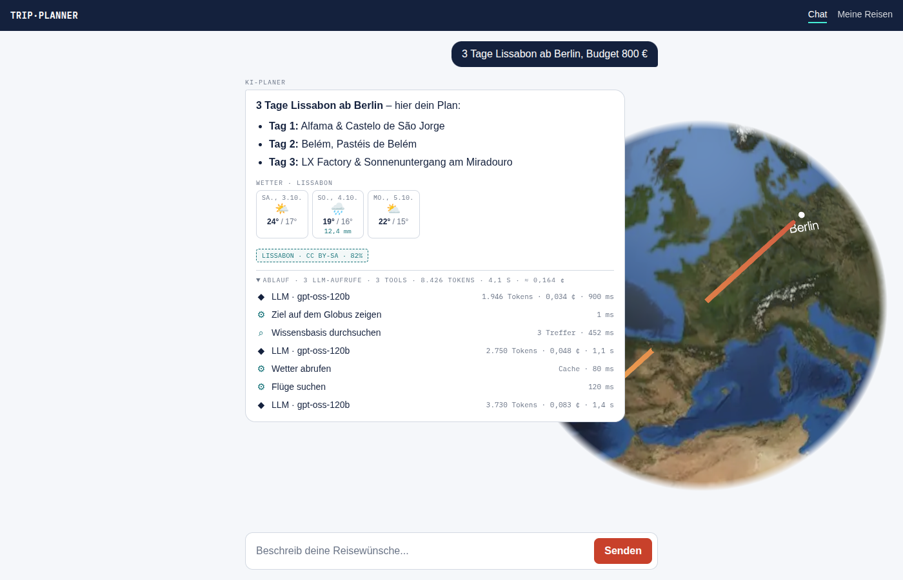
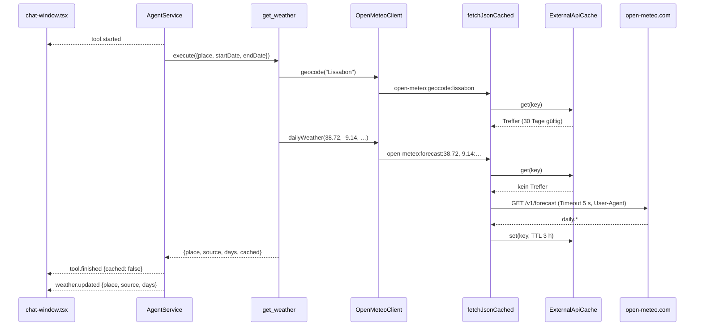
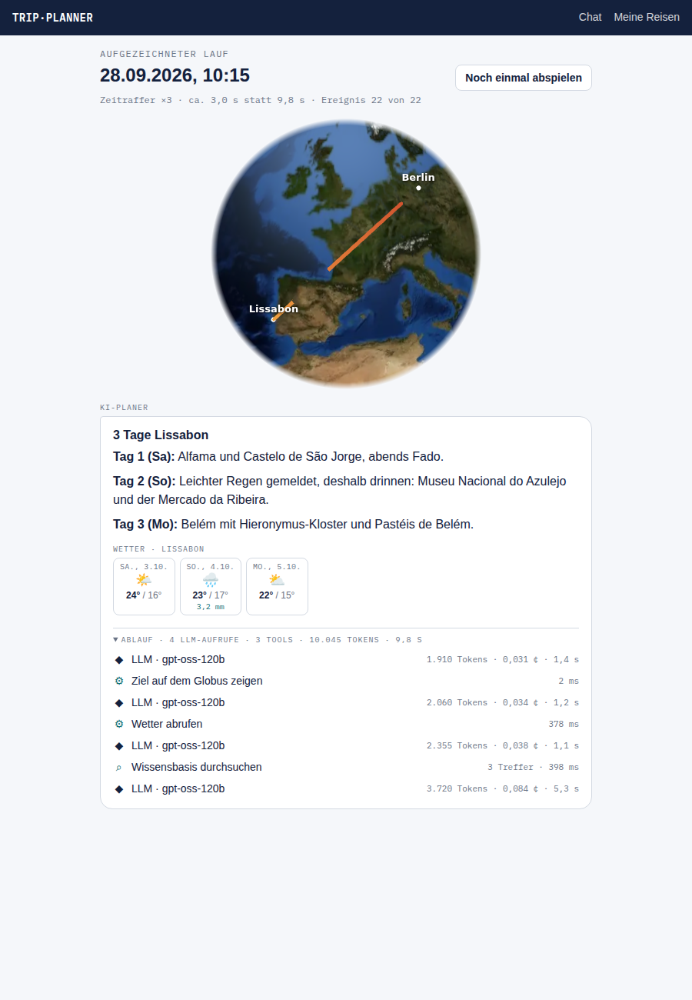
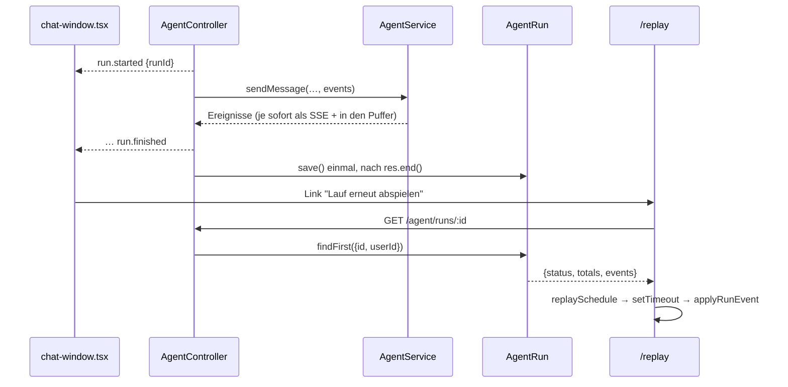

# Phase 2: Echte Wetterdaten mit Cache, Läufe speichern und abspielen

Teil des Plans in [`../trip-planner-2.0-plan.md`](../trip-planner-2.0-plan.md), Abschnitt 4, Phase 2.
Baut auf [Phase 1](../phase-1/README.md) auf (Ereignisse, `POST /agent/runs`, Reducer).

## Vorher → Nachher

**Vorher:** Der Agent kannte das Wetter nur aus dem Gedächtnis. Zu „3 Tage Lissabon nächste Woche“ gab
es allgemeine Sätze wie „im Oktober meist mild“, ohne Bezug zu den echten Reisetagen.

**Nachher:** Sobald Ziel und Reisedaten feststehen, ruft der Agent `get_weather` auf. Unter der Antwort
(und schon während des Laufs) erscheint pro Reisetag ein Chip mit Wochentag, Wettersymbol,
Höchst- und Tiefstwert und Regenmenge. Regentage plant der Agent mit Indoor-Programm. Liegt die Reise
mehr als 16 Tage in der Zukunft, kommen die Werte desselben Zeitraums im Vorjahr, sichtbar als
„Vorjahreswerte“ markiert. Ein zweiter gleicher Aufruf kommt aus dem Cache, im Ablauf steht dann „Cache“.

Screenshot aus dem echten Frontend. Das Backend war dabei ein Mock mit Beispielwerten, Open-Meteo selbst ist noch nicht live getestet.

## Die Idee in einem Satz

Alle externen APIs laufen über **einen** HTTP-Client, der zuerst einen **Cache in Postgres** fragt, nie
wirft und stattdessen `available: false` liefert. Das Wetter-Tool meldet sein Ergebnis zusätzlich als
Ereignis `weather.updated`, das der Reducer aus Phase 1 in Wetter-Chips übersetzt.

## Die neuen Ereignisse

| Ereignis | Wann | Was das Frontend damit macht |
| --- | --- | --- |
| `tool.finished` (neu: `cached`) | nach jedem Tool, das externe APIs nutzt | „Cache“ in der Zeile, erklärt eine Laufzeit von wenigen ms |
| `weather.updated` | direkt nach `get_weather`, noch vor dem nächsten LLM-Aufruf | Wetter-Chips pro Tag, bei `source: 'climate'` mit Hinweis „Vorjahreswerte“ |

Wie in Phase 1 beschreiben die Ereignisse nur Orte, Daten und Messwerte, keinen Nutzertext.

## Rundgang durch den Code

### Backend (`apps/api`)

1. **Datenmodell:** `ExternalApiCache` in [`prisma/schema.prisma`](../../apps/api/prisma/schema.prisma),
   Migration `20260928130000_external_api_cache`. Schlüssel, Anbieter, JSON-Antwort, Ablaufzeit.
   In der Datenbank statt im Arbeitsspeicher, weil die API auf bis zu 3 Instanzen läuft und auf 0 skaliert.
2. **Cache:** [`external/external-cache.ts`](../../apps/api/src/external/external-cache.ts). Schnittstelle
   `ExternalCache` mit Token `EXTERNAL_CACHE`, genau wie `ConversationStore`: Die Clients kennen Prisma
   nicht, Tests nutzen `InMemoryExternalCache`.
   - Ein Datenbankfehler ist ein Cache-Miss, kein Fehler. Der Cache ist eine Abkürzung, keine Voraussetzung.
   - Abgelaufene Einträge werden höchstens einmal pro Stunde beim Schreiben gelöscht (kein Timer, weil
     die API bei Scale-to-Zero keine Timer hat).
3. **HTTP-Client:** [`external/http-client.ts`](../../apps/api/src/external/http-client.ts).
   `fetchJsonCached(url, {cache, cacheKey, provider, ttlMs, isValid})` liefert
   `{available, data, cached}` und wirft nie (Muster aus `rag-client.ts`). Fehler, Timeouts, Status außerhalb
   2xx und Antworten, die `isValid` nicht bestehen, werden **nicht** gecacht: Sonst säße eine Fehlerseite
   tagelang fest.
4. **Open-Meteo:** [`external/open-meteo.client.ts`](../../apps/api/src/external/open-meteo.client.ts).
   - `geocode(name)`: erster Treffer auf Deutsch, `null` für unbekannte Orte (kein Ausfall, das Modell
     soll den Namen anders schreiben können).
   - `dailyWeather(lat, lng, start, end)`: Liegt der ganze Zeitraum in den nächsten 16 Tagen, die
     Vorhersage, sonst derselbe Zeitraum im Vorjahr aus dem Archiv (`source: 'climate'`). Die Tage werden
     auf die angefragten Reisedaten zurückgerechnet, der 29. Februar wird im Vorjahr zum 28.
   - Koordinaten im Cache-Schlüssel auf 2 Nachkommastellen (~1 km) gerundet, damit „38.7223“ und
     „38.72“ denselben Eintrag treffen.
   - TTL: Geocoding und Vorjahreswerte 30 Tage, Vorhersage 3 h.
   - „Heute“ ist injizierbar, damit Tests Vorhersage und Vorjahr mit festem Datum prüfen.
5. **Tool:** [`tools/weather.tool.ts`](../../apps/api/src/tools/weather.tool.ts). `get_weather` prüft Ort,
   Datumsformat (auch Kalender: „2026-02-30“ fällt durch), Reihenfolge, höchstens 14 Tage und „nicht in der
   Vergangenheit“. Fehler gehen als Tool-Fehler ans Modell, damit es sich korrigieren kann. Bei
   Vorjahreswerten steht ein `note` im Ergebnis, damit das Modell sie nicht als Vorhersage ausgibt.
6. **Tool-Schnittstelle:** [`tools/tool-registry.ts`](../../apps/api/src/tools/tool-registry.ts). `AgentTool`
   hat zwei neue optionale Hooks, `cached(output)` und `weather(output)`. Der AgentService kennt weiterhin
   keine einzelnen Tools.
7. **Agent:** [`agent.service.ts`](../../apps/api/src/agent.service.ts). Bekommt `EXTERNAL_CACHE` injiziert,
   sendet `cached` in `tool.finished` und `weather.updated` direkt nach dem Tool. Der System-Prompt hat
   eine Zeile zu `get_weather` (Regentage mit Indoor-Programm, Vorjahreswerte als solche benennen).

### Frontend (`apps/web`)

1. **Typen:** [`lib/run-events.ts`](../../apps/web/src/lib/run-events.ts), Spiegel der API-Typen
   (`WeatherReport`, `cached`).
2. **Reducer:** [`lib/run-state.ts`](../../apps/web/src/lib/run-state.ts). `weather` sammelt einen Bericht
   pro Ort. Fragt der Agent denselben Ort erneut ab, ersetzt der neue Bericht den alten an seiner Stelle.
3. **Anzeige:** [`components/weather-strip.tsx`](../../apps/web/src/components/weather-strip.tsx). Chips mit
   Wochentag und Datum (in UTC formatiert, damit keine Zeitzone den Tag verschiebt), Symbol nach
   WMO-Code, Max/Min in °C, Regen erst ab 1 mm.
4. **Chat:** [`app/chat-window.tsx`](../../apps/web/src/app/chat-window.tsx) zeigt die Chips im Live-Panel
   und in der Antwortkarte (aus dem gespeicherten `trace`). Der Ablauf
   ([`trace-panel.tsx`](../../apps/web/src/components/trace-panel.tsx)) zeigt „Wetter abrufen“ und „Cache“.

## Tests

| Test | Prüft |
| --- | --- |
| `apps/api/src/external/http-client.spec.ts` | Miss → Fetch → Speichern, Treffer ohne Fetch (`cached: true`), TTL-Ablauf, non-2xx / Netzwerkfehler / Timeout → `available: false`, ungültige Antwort wird nicht gecacht, User-Agent |
| `apps/api/src/external/external-cache.spec.ts` | abgelaufene Einträge werden nicht ausgeliefert, DB-Fehler = Miss, Aufräumen höchstens 1×/Stunde |
| `apps/api/src/external/open-meteo.client.spec.ts` | Geocoding (Treffer, unbekannt, Ausfall), Vorhersage vs. Vorjahr an der 16-Tage-Grenze, 29. Februar, Rundung im Cache-Schlüssel, fehlende Messwerte, WMO-Texte |
| `apps/api/src/tools/weather.tool.spec.ts` | Validierung (leer, Format, 30. Februar, Reihenfolge, > 14 Tage, Vergangenheit), unbekannter Ort, Ausfall, Hinweis bei Vorjahreswerten, Hooks |
| `apps/api/src/agent.service.spec.ts` | Reihenfolge `tool.finished` → `weather.updated` → nächster LLM-Aufruf, zweiter gleicher Aufruf ist Cache-Treffer ohne Netz, Ausfall ohne `weather.updated` |
| `apps/web/src/lib/run-state.test.ts` | Wetter pro Ort, Ersetzen bei erneutem Bericht, Cache-Markierung |

Open-Meteo wird in allen Tests über `global.fetch = jest.fn()` gemockt. Ein echter Aufruf gehört nicht in
die Unit-Tests (Netz, Rate-Limit, wechselnde Werte).

## Bewusst noch offen

- **Kein Live-Test gegen Open-Meteo:** Die Entwicklungsumgebung blockiert open-meteo.com. Das
  Antwortformat ist aus der Dokumentation nachgebaut. Vor dem Deployment einmal lokal gegen die echte API
  prüfen (`get_weather` im Chat mit einem Ziel in den nächsten Tagen und einem in einigen Monaten).
- **Globus-Tool nutzt das Geocoding noch nicht:** `show_destination_on_globe` nimmt weiter die Koordinaten
  des Modells. Der Client ist bereit, die Umstellung ist ein eigener Schritt.
- **„Climate“ ist ein einzelnes Vorjahr, kein Mittel:** Ein verregneter Oktober im Vorjahr färbt die
  Anzeige. Ein Mittel über mehrere Jahre (Climate API oder mehrere Archiv-Abfragen) wäre genauer, kostet
  aber mehr Aufrufe.
- **`/agent/chat` liefert kein Wetter im Ergebnis:** Nur der SSE-Weg (`/agent/runs`) sendet
  `weather.updated`. Evals und MCP sehen das Wetter nur im Antworttext.

## Teil c: Läufe speichern und abspielen

**Vorher:** Ein Agentenlauf existierte nur, solange der Stream lief. Danach war der Ablauf weg, und um ihn
jemandem zu zeigen, musste man neu fragen (Wartezeit, Tokens, Rate-Limit).

**Nachher:** Jeder Lauf über `POST /agent/runs` wird am Ende gespeichert. Unter jeder Antwort steht im
eingeklappten Ablauf „Lauf erneut abspielen“. Der Link führt nach `/replay?run=<id>`, dort läuft derselbe
Ablauf dreimal so schnell noch einmal ab: Timeline, Wetter-Chips, Globus mit Orten und Bögen, am Ende die
Antwort. „Sofort alles zeigen“ springt ans Ende.

Screenshot aus dem echten Frontend. Das Backend war ein Mock, der einen erfundenen Lauf (Berlin → Lissabon,
Wetter, Wissensbasis) als gespeicherten Lauf ausliefert.

### Rundgang durch den Code

1. **Datenmodell:** `AgentRun` in [`prisma/schema.prisma`](../../apps/api/prisma/schema.prisma), Migration
   `20260928140000_agent_runs`. Status (`OK`, `ERROR`, `ABORTED`; `RUNNING` ist vorgesehen, wird aber nie
   geschrieben), Summen als Spalten (Kosten als ganze Mikro-US-Dollar, wie `budgetCents` ohne Float),
   `events` als JSON, Index auf `(userId, createdAt)`, Cascade beim Löschen des Nutzers. `AgentStep` aus
   Plan 2.4 fehlt bewusst (siehe unten).
2. **Speicher:** [`runs/agent-run-store.ts`](../../apps/api/src/runs/agent-run-store.ts). Schnittstelle
   `AgentRunStore` mit Token `AGENT_RUN_STORE`, `PrismaAgentRunStore` und `InMemoryAgentRunStore` für
   Tests, dasselbe Muster wie `ConversationStore`.
   - `capEvents`: höchstens 500 Ereignisse. Behalten werden der Anfang und die letzten 10 (Stationen,
     Quellen, Antwort, `run.finished`), damit ein gekürzter Lauf im Replay trotzdem ein Ergebnis zeigt.
   - Aufräumen beim Speichern, höchstens einmal pro Stunde: Läufe älter als
     `CONVERSATION_RETENTION_DAYS` (Default 30), dieselbe Frist wie die Chat-Verläufe.
3. **Controller:** [`agent.controller.ts`](../../apps/api/src/agent.controller.ts).
   - Die ID entsteht vor dem Lauf (`randomUUID`) und geht mit `run.started` an den Client. So kennt das
     Frontend den Replay-Link, ohne auf das Speichern zu warten.
   - Die Senke des `RunEventEmitter` schreibt jedes Ereignis in den Stream und in einen Puffer. Gespeichert
     wird **einmal** nach `res.end()`, bei Erfolg, Fehler und abgebrochener Verbindung. Summen kommen aus
     `events.totals()`, wie in `run.finished`.
   - `ABORTED` heißt: Der Client hat die Verbindung vor dem Ende geschlossen. Der Agent läuft in diesem Fall
     weiter (wie seit Phase 1), das Replay zeigt deshalb trotzdem den ganzen Lauf.
   - Schlägt das Speichern fehl, wird das geloggt. Die Antwort ist da schon beim Nutzer.
   - `GET /agent/runs/:id` liefert `{ id, createdAt, status, totals, events }`. Weil `message.completed`
     die Antwort auf die Frage des Nutzers enthält, bekommt nur der Eigentümer den Lauf. Die Abfrage
     filtert nach ID **und** Nutzer, ein fremder Lauf ist wie ein unbekannter eine 404.
4. **Ereignisse:** `run.started` hat jetzt `{ runId }`, in
   [`runs/run-events.ts`](../../apps/api/src/runs/run-events.ts) und im Spiegel
   [`lib/run-events.ts`](../../apps/web/src/lib/run-events.ts).
5. **Zeitraffer:** [`lib/replay.ts`](../../apps/web/src/lib/replay.ts). `replaySchedule(events, speed)`
   sortiert nach `seq` und rechnet aus `elapsedMs` die Pause vor jedem Ereignis: geteilt durch den Faktor
   (Standard 3) und auf 1,5 s gekappt, damit ein langer LLM-Aufruf das Replay nicht stehen lässt.
   `globeView(state)` leitet Fokus, Marker, Bögen und Route aus dem Laufzustand ab, wie der Chat sie setzt.
6. **Seite:** [`app/replay/page.tsx`](../../apps/web/src/app/replay/page.tsx). Statische Seite, lädt im
   Browser mit `authFetch` (Muster `trips/detail`). Eine `setTimeout`-Kette gibt die Ereignisse durch
   `applyRunEvent`, also denselben Reducer wie live. Die Antwort nutzt die aus dem Chat herausgelöste
   [`components/reply-markdown.tsx`](../../apps/web/src/components/reply-markdown.tsx).
7. **Chat:** `RunState.runId` kommt aus `run.started`. [`trace-panel.tsx`](../../apps/web/src/components/trace-panel.tsx)
   zeigt im eingeklappten Ablauf den Link „Lauf erneut abspielen“ (auf `/replay` selbst ausgeblendet).

### Tests

| Test | Prüft |
| --- | --- |
| `apps/api/src/agent.controller.spec.ts` | genau ein Speichern pro Lauf, gespeicherte Ereignisse = gestreamte Ereignisse, Summe der `llm.call`-Tokens = gespeicherte `inputTokens + outputTokens`, `runId` in `run.started` = gespeicherte ID, `ERROR` bei Fehler, `ABORTED` bei geschlossener Verbindung, Speicherfehler bricht den Lauf nicht; `GET /agent/runs/:id` für Eigentümer, 404 für fremden Nutzer und unbekannte ID |
| `apps/api/src/runs/agent-run-store.spec.ts` | Kürzen auf 500 mit Anfang und Ende, Mikro-Dollar, Spalten beim Speichern, Abfrage nach ID und Nutzer, Aufräumen nach 30 Tagen höchstens 1×/Stunde, Speichern trotz Fehler beim Aufräumen |
| `apps/web/src/lib/replay.test.ts` | Raffen um den Faktor, Kappen langer Pausen, Sortierung nach `seq`, rückwärts laufende Zeitstempel, Geschwindigkeit ∞ und 0, Globus-Daten wie im Chat |
| `apps/web/src/lib/run-state.test.ts` | `runId` aus `run.started` |

Zusätzlich einmal von Hand gegen eine Wegwerf-Datenbank geprüft: `migrate deploy` auf leerer Datenbank,
Speichern mit vorab erzeugter ID, Lesen durch Eigentümer und Fremden, Cascade beim Löschen des Nutzers.
Die Seite selbst wurde mit Playwright gegen einen Mock geprüft (Abspielen, Sprung ans Ende, 404-Meldung).

### Bewusst offen

- **Kein `AgentStep`:** Die flache Tabelle pro Schritt (Plan 2.4) lohnt sich erst für Auswertungen wie
  „Ø Latenz Recherche“. Die Ereignisse enthalten alle Werte, die Tabelle lässt sich später daraus füllen.
- **Keine öffentlichen Replays:** `isPublicDemo` und ein Replay ohne `message.*` für Fremde kommen mit dem
  Demo-Einstieg (Phase 6). Heute ist jeder Lauf privat.
- **Gäste sehen ihre Läufe nur in ihrem Browser:** Der Link hängt am Gast-Token in `localStorage`. In einem
  anderen Browser gibt es eine 404 mit Hinweis.
- **`/agent/chat` speichert nichts:** Nur der Stream-Weg erzeugt Ereignisse. Evals und MCP bleiben ohne
  Replay.
- **Quellen-Chips fehlen im Replay:** Die Antwortkarte zeigt Markdown, Wetter und Ablauf, aber nicht das
  `SourcesPanel` aus dem Chat.
- **Kein E2E-Test:** `live-trace.spec.ts` mit eingecheckter Ereignis-Datei (Plan, Abschnitt Tests) steht
  noch aus.
- **`RUNNING` wird nie geschrieben:** Ein Lauf, bei dem die Instanz mitten drin abstürzt, fehlt ganz statt
  als hängender Lauf aufzutauchen. Für ein Replay ist das egal, für ein Tokens-Kontingent pro Gast
  (Plan: `GUEST_DAILY_TOKEN_BUDGET`, summiert aus `AgentRun`) muss das neu bewertet werden.

## Rest von Phase 2

Noch nicht umgesetzt, Reihenfolge als Vorschlag:

1. **Unterkünfte, Anreise, Währung:** `lodging.tool.ts` (Overpass, über denselben Cache),
   `transport-estimate.tool.ts` (Haversine + Tarifmodell, als Schätzung markiert), `currency.tool.ts`
   (Frankfurter). Danach `travel-search.tools.ts` entfernen.
2. **Token-Limiter:** `token-budget-limiter.ts` liest die Groq-Header `x-ratelimit-*` und wartet vor
   einem Aufruf, statt in ein 429 zu laufen.
3. **Aufräumen bündeln:** `RetentionService` für Chat-Verläufe, Läufe und Cache (heute räumen
   `PrismaConversationStore`, `PrismaAgentRunStore` und `PrismaExternalCache` je für sich auf).
4. **Globus unter `/trips/detail`** mit allen gespeicherten Stops.
5. **E2E-Test für das Replay** mit einer eingecheckten Ereignis-Datei (siehe Teil c, bewusst offen).

Erledigt: Läufe speichern und abspielen (Teil c oben).
