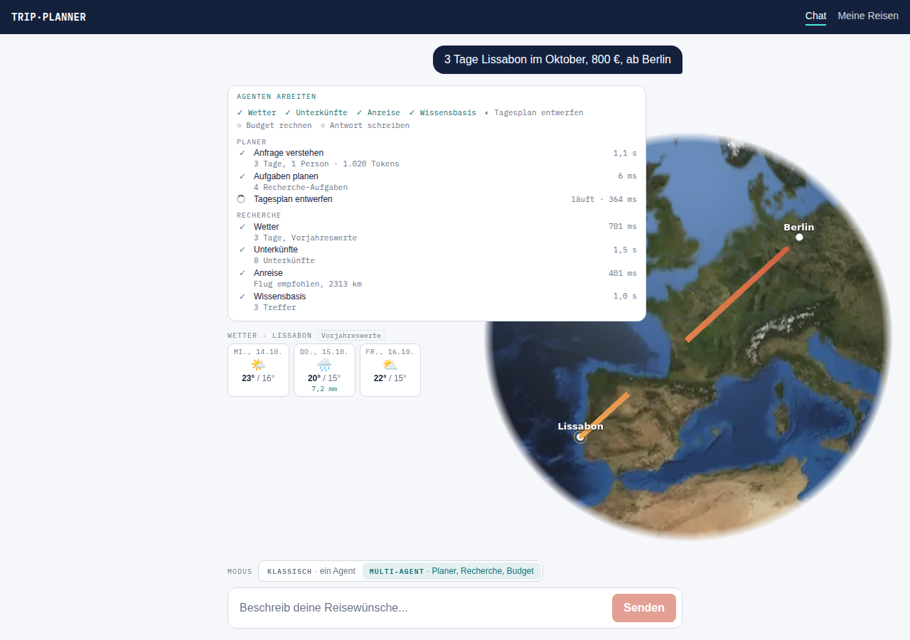
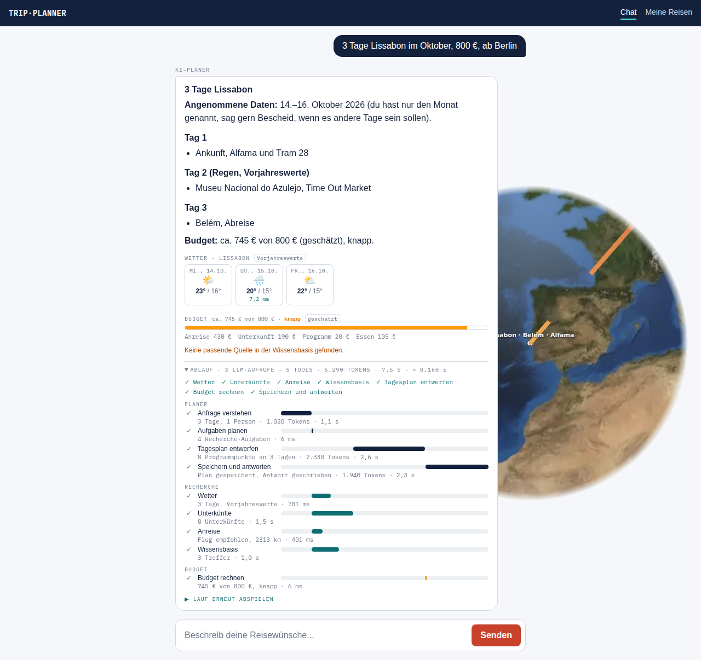
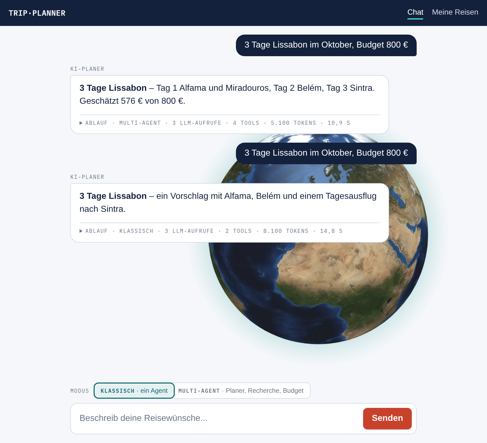
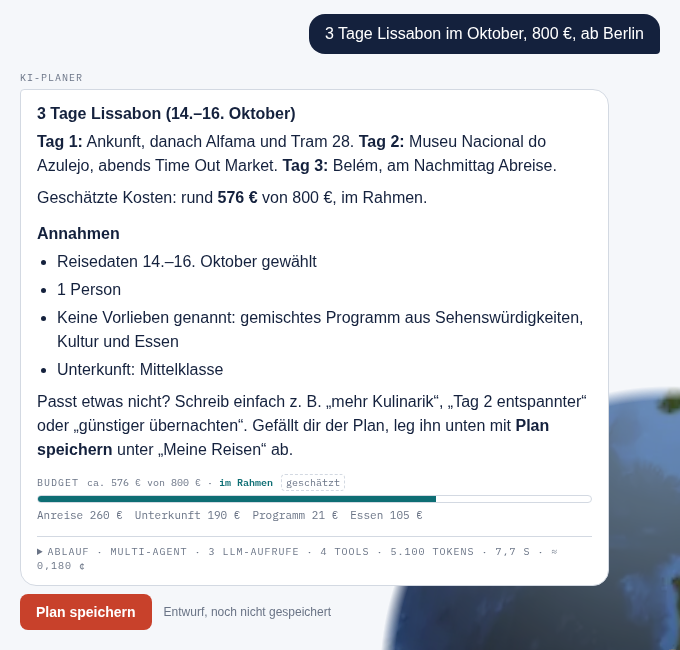
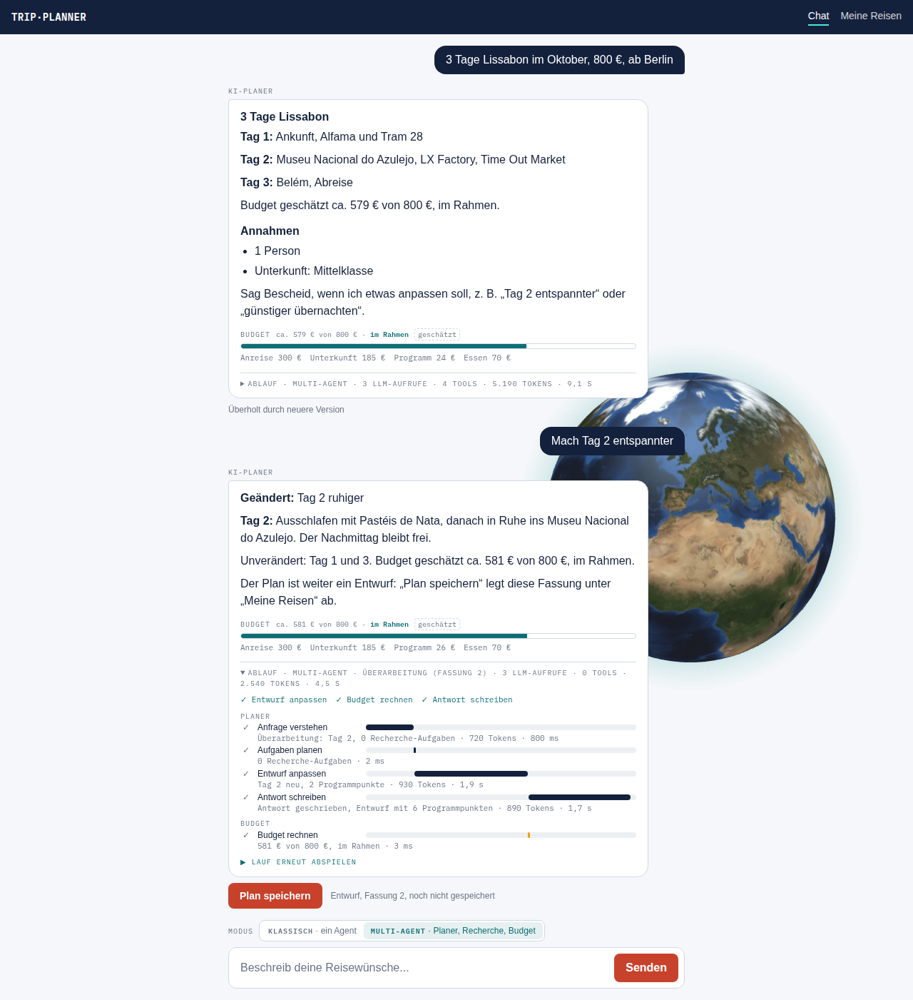
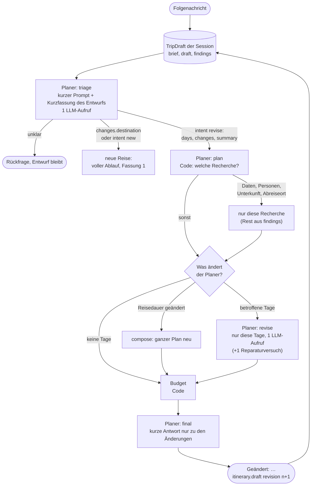
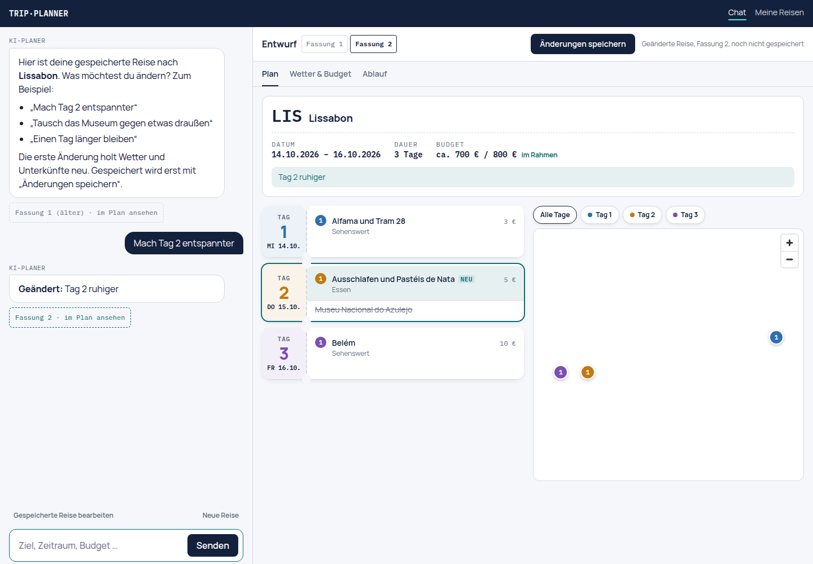

# Phase 3: Multi-Agenten-Orchestrator (Teil a)

Teil des Plans in [`../trip-planner-2.0-plan.md`](../trip-planner-2.0-plan.md), Abschnitt 4, Phase 3.
Baut auf [Phase 1](../phase-1/README.md) (Ereignisse, Reducer) und [Phase 2](../phase-2/README.md)
(echte Tools, Replay, Groq-Limiter) auf. Die Grundsatzentscheidung steht in
[ADR 0001](../adr/0001-eigener-orchestrator.md).

## Vorher → Nachher

**Vorher:** Ein einziger Agent mit einem großen `SYSTEM_PROMPT` (~700 Tokens) und allen sieben
Tool-Definitionen in **jedem** Aufruf. Das Modell entschied Runde für Runde, welches Tool als
Nächstes dran ist, meist eines pro Runde. Eine vollständige Reiseplanung brauchte 4–6 LLM-Aufrufe,
jeder mit dem wachsenden Verlauf, und lief damit schnell in Groqs Limit von 8.000 Tokens pro Minute.

**Nachher (mit `AGENT_MODE=multi`):** Drei Agenten mit klaren Aufgaben. Der **Planer** liest die
Anfrage, plant die Aufgaben und schreibt Tagesplan und Antwort, jeweils mit einem eigenen, kurzen
Prompt ohne Tool-Definitionen. Die **Recherche** ruft Wetter, Unterkünfte, Anreise und Wissensbasis
gleichzeitig auf, ohne LLM. Das **Budget** rechnet in Code. Ein vollständiger Lauf braucht
**3 LLM-Aufrufe** (höchstens 4), eine Rückfrage genau **1**. Im Ablauf steht pro Agent eine Lane, die
parallelen Recherchen laufen sichtbar nebeneinander, darüber die Aufgaben als Checkliste, unter der
Antwort ein Budget-Balken.

| Während des Laufs (Recherche parallel) | Nach der Antwort |
| --- | --- |
|  |  |

Screenshots aus dem echten Frontend, das Backend war dabei ein Mock mit Beispieldaten.

Screenshot aus dem echten Frontend. Das Backend war ein Mock, der einen erfundenen Lauf
(Berlin → Lissabon) mit realistischen Zeiten abspielt; die Zahlen sind Beispielwerte.

Ohne die Variable bleibt der Server-Default **`AGENT_MODE=classic`**; im Chat lässt sich der Modus
pro Anfrage wählen (siehe [Modus wählen](#modus-wählen)). `POST /agent/chat` (Evals, MCP-Server)
nutzt immer den Classic-Agenten.

## Modus wählen



- **Umschalter:** Über dem Eingabefeld steht „Klassisch · ein Agent“ | „Multi-Agent · Planer,
  Recherche, Budget“ (Radiogruppe, mit Pfeiltasten bedienbar). Default ist Multi-Agent, die Wahl
  merkt sich der Browser in `localStorage`. Sie geht mit jeder Anfrage als `mode` an
  `POST /agent/runs`; ungültige Werte lehnt die API vor dem Stream mit 400 ab.
- **Vergleich:** Die eingeklappte Ablauf-Zeile unter jeder Antwort beginnt mit dem Modus, den der
  Server tatsächlich genutzt hat (aus `run.started.mode`), z. B. „Multi-Agent · 3 LLM-Aufrufe · …“.
  So lässt sich dieselbe Frage in beiden Modi direkt nebeneinander vergleichen. Das Replay zeigt
  den Modus ebenso.
- **Server-Default:** Schickt ein Client keinen `mode` (ältere Frontends, Skripte), gilt
  `AGENT_MODE` (`classic`, wenn nicht gesetzt). In Azure setzt ihn der Bicep-Parameter `agentMode`,
  in `infra/main.parameters.json` steht `multi`.
- **Notbremse:** `AGENT_MODE_LOCKED=true` (Bicep-Parameter `agentModeLocked`) erzwingt
  `AGENT_MODE` für alle Läufe und ignoriert die Wahl des Clients, ohne neues Frontend. Der
  Umschalter bleibt sichtbar, die Ablauf-Zeile zeigt dann den erzwungenen Modus. Das Startup-Log
  nennt Default und Sperrstatus („Agentenmodus für POST /agent/runs: multi (Default, Client kann
  per mode wählen)“).

## Entwurf statt Auto-Speichern



**Warum:** Anfangs hat der Planer den fertigen Plan am Ende selbst über `save_itinerary`
gespeichert. Das Feedback dazu: „Er hat es direkt gespeichert, nicht gefragt, man konnte nichts
anpassen, ich habe keine Präferenzen gegeben.“ Vorab nach Vorlieben zu fragen, würde jede Anfrage
um eine Runde verlängern. Deshalb plant der Multi-Modus weiter **sofort**, liefert den Plan aber
als **Entwurf**, nennt seine Annahmen offen und speichert erst, wenn der Nutzer es will.

**Ablauf:**

1. **triage** liest wie bisher Ziel und Zeitraum; nur wenn eines davon fehlt, gibt es eine
   Rückfrage. Nach Vorlieben, Interessen oder Personenzahl fragt der Planer nicht, er nimmt sie an
   und schreibt sie als kurze Stichpunkte in `TripBrief.assumptions` (z. B. „1 Person“,
   „Unterkunft: Mittelklasse“). Liefert das Modell keine, ergänzt der Code, was er selbst weiß
   (keine Vorlieben → gemischtes Programm, kein Budget → mittleres Preisniveau).
2. **compose** bekommt die Annahmen mit und plant danach.
3. **final** speichert **nicht** mehr. Der Planer baut den Entwurf im Format von
   `CreateItineraryDto` (Budget = genanntes Budget oder geschätzte Summe), prüft ihn mit
   `itineraryValidationErrors` und schickt ihn als Ereignis `itinerary.draft`
   (`{ itinerary, assumptions }`); die Stationen gehen wie bisher per `stops.updated` an den Globus.
   Die Antwort endet mit einem Abschnitt **„Annahmen“**, einer Einladung zum Anpassen („mehr
   Kulinarik“, „Tag 2 entspannter“, „günstiger übernachten“) und dem Hinweis auf „Plan speichern“.
   In der Checkliste heißt die Aufgabe jetzt „Antwort schreiben“.
4. **Button „Plan speichern“** unter der Antwortkarte, nur wenn der Lauf einen Entwurf geliefert
   hat ([`components/save-draft-button.tsx`](../../apps/web/src/components/save-draft-button.tsx)):
   `POST /itineraries` mit genau dem Entwurf (über `authFetch`, also dem Konto bzw. Gast des
   Browsers). Danach „Gespeichert · In Meine Reisen ansehen“ mit Link auf
   `/trips/detail?id=<id>`, der Button bleibt deaktiviert. Bei einem Fehler steht eine kurze
   Meldung daneben, der Button ist wieder klickbar; ein Doppelklick speichert nicht doppelt. Das
   Replay zeigt keinen Button, nur den Hinweis „Entwurf“.

Der Classic-Modus bleibt, wie er ist: Dort speichert der Agent weiterhin nur, wenn der Nutzer es
im Gespräch will.

## Entwurf per Folgenachricht anpassen



Screenshot aus dem echten Frontend, das Backend war ein Mock mit Beispieldaten (Tokens und Zeiten
sind Beispielwerte).

**Warum:** Die Antwort lädt zum Anpassen ein („Tag 2 entspannter“, „günstiger übernachten“). Bisher
lief so eine Folgenachricht wieder durch den ganzen Ablauf: triage las mit dem Dialog als Kontext
einen neuen Brief, die Recherche lief komplett neu, compose schrieb alle Tage neu, auch die, an denen
der Nutzer nichts ändern wollte. Jetzt kennt der Orchestrator den letzten Entwurf der Session und
ändert gezielt nur, was die Nachricht betrifft.

**Gespeicherter Entwurf:** Prisma-Modell `TripDraft` (Migration `20260929120000_trip_drafts`), ein
Eintrag pro `(userId, sessionId)` mit `brief` (TripBrief), `draft` (Tage, Stops, Koordinaten),
`findings` (Wetter, Unterkünfte, Anreise, Treffer der Wissensbasis, damit nicht neu recherchiert
werden muss), `budget` und `revision` (Fassung in der Session). Der Orchestrator lädt ihn am Anfang
jedes Laufs zusammen mit dem Dialog und ersetzt ihn nach jedem erfolgreichen Lauf
([`orchestrator/trip-draft-store.ts`](../../apps/api/src/orchestrator/trip-draft-store.ts), Muster wie
`ConversationStore`: Schnittstelle, Token `TRIP_DRAFT_STORE`, Prisma-Implementierung, Variante im
Arbeitsspeicher für Tests). Eine Rückfrage oder ein Fehler lässt den alten Entwurf stehen. Aufgeräumt
wird wie beim Chat-Verlauf beim Schreiben, höchstens einmal pro Stunde, nach
`CONVERSATION_RETENTION_DAYS` (30 Tage) ohne Änderung; `User` löscht per `onDelete: Cascade` mit.



**triage mit Entwurf:** Hat die Session einen Entwurf, bekommt triage statt des normalen Prompts
`triageRevisePrompt`: die Kurzfassung des Entwurfs (Eckdaten und die Titel pro Tag, ~150 Tokens,
`draftDigest`) und nur die Frage, was sich ändert. Antwort z. B.
`{"status":"ready","intent":"revise","days":[2],"changes":{"lodging":"budget"},"summary":"Tag 2 ruhiger, Unterkunft günstiger"}`
oder eine Rückfrage. Frühere Antworten gehen nur mit den ersten 300 Zeichen in den Verlauf; den Plan
kennt triage aus der Kurzfassung. `parseRevision` ([`orchestrator/draft-revision.ts`](../../apps/api/src/orchestrator/draft-revision.ts))
übernimmt nur erlaubte Felder (`destination`, `origin`, Daten, `travelers`, `budget`, `preferences`,
`lodging`), prüft den neuen Brief mit `parseTripBrief` (ungültig → Rückfrage), nimmt nur gültige
Tage und entfernt Annahmen, die eine ausdrückliche Angabe überholt hat („Unterkunft: Mittelklasse“
nach „günstiger übernachten“). Ein anderes Ziel ist eine **neue Reise** (voller Ablauf, der alte
Entwurf wird ersetzt, Fassung wieder 1), ebenso `intent: "new"` („plan alles neu“) und ein
vollständiger Brief ohne `changes`.

**Welche Änderung welche Recherche auslöst** (`revisionResearch`, in Code, getestet):

| Änderung | Recherche neu | Planer |
| --- | --- | --- |
| Programm, Tempo („Tag 2 entspannter“, „mehr Kulinarik an Tag 3“) | keine | `revise` für die genannten Tage |
| Vorlieben, Gesamtbudget in Euro | keine | `revise` nur, wenn Tage genannt sind |
| Unterkunftsniveau („günstiger übernachten“, „gutes Hotel“) | Unterkünfte | keiner, nur Budget und final |
| Personen | Unterkünfte (Zimmer, Such-Links) | `revise` nur, wenn Tage genannt sind |
| Daten bei gleicher Dauer | Wetter + Unterkünfte | `revise` nur, wenn Tage genannt sind |
| Reisedauer | Wetter + Unterkünfte | `compose` für den ganzen Plan |
| Abreiseort | Anreise | – |
| Budget in fremder Währung | Umrechnung | – |
| anderes Ziel | alles (neue Reise) | `compose` |

Bei einem Tagesausflug entfällt die Unterkunft. Was neu recherchiert wird, ersetzt in den
gespeicherten `findings` genau seinen Teil (`mergeFindings`); fällt eine Recherche aus, fehlt der
Teil danach, statt veraltet stehen zu bleiben.

**Unterkunftsniveau:** Neu im `TripBrief` ist `lodging` (`budget` | `mid` | `upscale`), die triage
setzt es nur, wenn der Nutzer eins nennt. Bei „günstig“ sucht die Recherche mit
`budgetPerNightEur` = 80 % des unteren Hotelpreises der Stadt (Lissabon: 60 €), passende Unterkünfte
kommen zuerst; das Budget rechnet dann mit dem Median der unteren Preisenden unter dieser Grenze
statt mit dem Median der Mitten, bei „gehoben“ mit dem Median der oberen Enden.

**revise:** Das Modell sieht die betroffenen Tage vollständig, die übrigen nur als Titel (gegen
Dopplungen), das Wetter nur für die betroffenen Tage und den Wunsch des Nutzers (`revisePrompt`,
Ausgabe wie compose). Der Code prüft: nur Punkte der freigegebenen Tage, dann mit den unveränderten
Tagen zusammen dieselbe Prüfung wie compose (`tripDraftErrors`), fehlende Koordinaten ergänzt er.
Fehler gehen genau einmal zurück ans Modell, danach `PlannerOutputError`. Die Stops der anderen Tage
bleiben dieselben Objekte (`replaceDays`), also Stop für Stop identisch.

**Antwort und Ereignisse:** final bekommt bei einer Überarbeitung `finalRevisionPrompt` und nur die
geänderten Tage, die Nummern der unveränderten, das neue Budget und Unterkünfte nur, wenn sie neu
gesucht wurden. Der Code stellt „**Geändert:** Tag 2 ruhiger“ (Beschreibung aus der triage, sonst aus
Code, z. B. „Tag 2 angepasst, Unterkunft günstig“) vor die Antwort. `itinerary.draft` trägt
`revision` (Fassung) und `change`, `plan.updated` die Aufgabe `revise` („Entwurf anpassen“ in
Checkliste und Lanes). Im Chat bietet nur die neueste Antwort mit Entwurf „Plan speichern“, ältere
zeigen „Überholt durch neuere Version“ (war eine ältere Fassung schon gespeichert, bleibt ihr Link
stehen; `lib/draft-versions.ts`). Die Ablauf-Zeile beginnt mit „Überarbeitung (Fassung 2)“.

**Tokens:** Eine Überarbeitung ohne Recherche braucht 3 LLM-Aufrufe (triage, revise, final), ohne
betroffene Tage 2. Gemessen an den Prompts im Orchestrator-Test (Zeichen, mit drei Treffern der
Wissensbasis in voller Länge): Erstplan 9.629 Zeichen Input (triage 2.181, compose 3.939, final
3.509), „Tag 2 entspannter“ 6.113 (triage 2.265, revise 2.084, final 1.764), also ~63 %. Dazu kommt
die viel kürzere Ausgabe (ein Tag statt drei, Antwort nur zu den Änderungen), siehe
[Token-Rechnung](#token-rechnung-pro-lauf).

**Tests:**

| Test | Prüft |
| --- | --- |
| `orchestrator/orchestrator.spec.ts` | Erstplan → „Tag 2 entspannter“: genau 3 LLM-Aufrufe, kein Tool und keine API, Ereignisfolge triage/plan/revise/budget/final, nur Tag 2 neu, Tag 1 und 3 identisch, `revision: 2`, `change`, Antwort beginnt mit „Geändert:“, Prompts unter 70 % und Tokens unter 60 % des Erstplans, revise sieht nur Tag 2 vollständig, gespeicherte Fassung 2 mit alter Recherche; „günstiger übernachten“: nur `research:lodging`/`search_lodging`, kein revise, Programm gleich, Annahme zur Unterkunft entfernt, Unterkunft im Budget billiger, Anreise gleich; „Lieber nach Porto“: 4 Recherchen, compose, Fassung 1, Porto gespeichert; Rückfrage und gescheiterter Lauf lassen den Entwurf stehen |
| `orchestrator/draft-revision.spec.ts` | `parseRevision` (Tage filtern, Unterkunft, anderes Ziel → neu, Schreibweise, Dauer → recompose, ungültige Daten, `null`, verbotene Felder, Beschreibung säubern, Beschreibung aus Code); Tabelle `revisionResearch` inkl. Tagesausflug und Reihenfolge; `mergeFindings`; `replaceDays` (dieselben Objekte); Preisgrenze; `changeSummary` |
| `orchestrator/agents/planner.agent.spec.ts` | triage mit Entwurf (kurzer Prompt mit Kurzfassung, anderes Ziel, „alles neu“, voller Brief, ungültig, ohne Entwurf, Verlauf gekürzt); `buildRevisionPlan`; revise (nur Tag 2, Reparatur bei falschem Tag, leerer Tag → Abbruch nach 2 Aufrufen); final einer Überarbeitung (kurzer Prompt, Fakten, „Geändert:“, `revision`/`change`), Erstplan Fassung 1; Injection-Regeln in den neuen Prompts |
| `orchestrator/agents/budget.agent.spec.ts`, `research.agent.spec.ts` | Unterkunft je Niveau (ohne Angabe, günstig, günstig ohne Treffer, gehoben); Recherche mit Preisgrenze sortiert die Pension vor das Hotel |
| `orchestrator/trip-draft-store.spec.ts` | Arbeitsspeicher: pro Nutzer und Session, ersetzen, Kopien; Prisma (gemockt): upsert auf `(userId, sessionId)`, Budget entfernen, Lesen, Aufräumen nach 30 Tagen höchstens einmal pro Stunde, Speichern trotz Fehler beim Aufräumen. Zusätzlich einmal von Hand gegen eine Wegwerf-Datenbank geprüft (Migration, Rundlauf, Aufräumen, Cascade) |
| `apps/web/src/lib/draft-versions.test.ts`, `run-state.test.ts` | nur der neueste Entwurf ist `latest`, Rückfragen und abgebrochene Läufe lösen ihn nicht ab; `revision`/`change` im Reducer, ältere Läufe Fassung 1; Label „Entwurf anpassen“ |

**Bewusst offen:**

- **Vorlieben ohne neue Recherche:** „mehr Kulinarik“ fragt die Wissensbasis nicht neu ab, revise
  arbeitet mit den gespeicherten Treffern und Weltwissen. Neue Treffer kosten keine Tokens, aber
  Zeit; bei Bedarf `research:knowledge` in `revisionResearch` ergänzen.
- **Neue Daten ohne genannte Tage:** Verschiebt der Nutzer die Reise, laufen Wetter und Unterkünfte
  neu, das Programm bleibt aber, solange die triage keine Tage nennt; ein neuer Regentag bekommt dann
  kein Indoor-Programm. Denkbar: Tage mit neuem Regen in Code zu `days` hinzufügen.
- **Mehrere Änderungen nacheinander:** Jede Überarbeitung setzt auf der letzten Fassung auf; ein
  „Rückgängig“ auf eine ältere Fassung gibt es nicht (die Karten im Chat bleiben aber sichtbar).
- **Entwurf nach dem Neuladen:** Der Server kennt den Entwurf, das Frontend erzeugt aber bei jedem
  Laden eine neue `sessionId`; nach einem Neuladen beginnt deshalb eine neue Session ohne Entwurf.
- **Nicht live geprüft:** triage mit Entwurf (Erkennen von Tagen, `intent`) und revise nur mit Mocks;
  vor allem, ob das Modell „günstiger“ als `lodging` und nicht als Tagesänderung liest.

## Gespeicherte Reise im Chat bearbeiten



Screenshot aus dem echten Frontend, das Backend war ein Mock mit Beispieldaten.

**Warum:** Eine gespeicherte Reise ließ sich bisher nur ansehen und einzelne Programmpunkte löschen.
Jetzt öffnet „Im Chat bearbeiten“ auf `/trips/detail` die Reise als Entwurf im Chat. Danach geht
alles wie oben (Tage ändern, Aktivitäten tauschen, länger bleiben), und „Änderungen speichern“
ersetzt die Reise, statt eine neue anzulegen.

**Ablauf:**

1. **`POST /agent/drafts`** `{ sessionId, itineraryId }` (neue `sessionId` aus dem Browser) lädt die
   Reise des Nutzers (fremde sind 404) und legt sie als `TripDraft` der Session an
   (`seedFromItinerary`, [`orchestrator/itinerary-seed.ts`](../../apps/api/src/orchestrator/itinerary-seed.ts)).
   Das kostet keine Tokens. Die Antwort hat die Form von `itinerary.draft` plus Budgetbericht. Das
   Frontend legt daraus einen Chat im `sessionStorage` an: eine Antwort des Planers mit dem Entwurf
   als Fassung 1, die schon als gespeichert gilt
   ([`lib/edit-trip.ts`](../../apps/web/src/lib/edit-trip.ts)). Danach geht es zum Chat. Läuft im
   Tab schon ein Chat, fragt der Knopf vorher nach.
2. **Was die Reise nicht kennt**, ergänzt der Code. Neu am `Itinerary` sind `travelers`, `origin`
   und `lodging` (Migration `20261001120000_edit_saved_trips`); „Plan speichern“ schickt sie mit,
   weil `itinerary.draft` sie jetzt trägt. Fehlen sie (ältere Pläne, Klassik-Modus), gilt 1 Person
   und das steht als Annahme da. Das Budget kommt aus `budgetReport.limitCents`, sonst aus
   `budgetCents`.
3. **Erste Änderung:** Die Recherche ist nicht gespeichert, deshalb steht am `TripDraft`
   `seeded: true`. Der Orchestrator ergänzt die Überarbeitung dann um die volle Recherche (wie bei
   einem neuen Plan) und um Tage ohne Programmpunkte, die in „Meine Reisen“ gelöscht wurden
   (`completeSeededRevision`). Punkte ohne Koordinaten bekommen die des Ziels. Danach schreibt revise
   wie gewohnt nur die betroffenen Tage neu, die übrigen bleiben Stop für Stop gleich. Ab der zweiten
   Änderung gilt die gespeicherte Recherche wie oben.
4. **Verknüpfung:** `TripDraft.itineraryId` bleibt über alle Überarbeitungen erhalten,
   `itinerary.draft` trägt sie mit. Wählt der Nutzer im selben Chat ein anderes Ziel, ist das eine
   neue Reise ohne Verknüpfung, und es gibt wieder „Plan speichern“.
5. **„Änderungen speichern“** schickt `PUT /itineraries/:id` mit demselben Body wie `POST`. Der
   Service ersetzt Eckdaten und alle Programmpunkte in einer Transaktion. Die Besitzprüfung läuft
   über `updateMany` mit `userId`, eine fremde Reise ist 404.

Solange der Chat an einer gespeicherten Reise arbeitet, läuft jede Nachricht im Multi-Modus, denn
nur der Orchestrator kennt den Entwurf der Session. Statt des Modus-Umschalters steht dann
„Gespeicherte Reise bearbeiten“ da.

**Tests:** `orchestrator.spec.ts` (erste Änderung an einer gespeicherten Reise: volle Recherche,
revise statt compose, leerer Tag 3 wird mitgeschrieben, Koordinaten ergänzt, `itineraryId` und
Eckdaten im Entwurf; anderes Ziel löst die Verknüpfung), `itinerary-seed.spec.ts`,
`draft-revision.spec.ts` (`completeSeededRevision`), `itineraries.service.spec.ts` (`update`:
Besitzprüfung, Transaktion, Stopps ersetzt), `agent.controller.spec.ts` (`POST /agent/drafts`),
`apps/web/src/lib/edit-trip.test.ts`. Außerdem habe ich den ganzen Ablauf im Browser gegen eine
Mock-API geprüft (Öffnen, Ändern, Speichern, geänderte Reise in „Meine Reisen“).

**Bewusst offen:**

- **Vergangene oder lange Reisen:** Liegt der Zeitraum in der Vergangenheit oder dauert die Reise
  länger als 14 Tage (Klassik-Modus), fragt triage bei der ersten Änderung nach neuen Daten, wie bei
  einem neuen Plan.
- **`AGENT_MODE_LOCKED=true` mit `AGENT_MODE=classic`:** Dann ignoriert der Server den Multi-Modus
  und Änderungen landen beim Classic-Agenten, der den Entwurf nicht kennt.
- **Nicht live geprüft:** nur mit Mocks und gegen keine echte Datenbank. Die Migration ist von Hand
  geschrieben (nur neue, optionale Spalten).

## Die Idee in einem Satz

Nur wo Sprache verstanden oder geschrieben werden muss, fragt der Orchestrator ein LLM; alles
andere (welche Recherche, welches Tool mit welchen Argumenten, was es kostet) entscheidet Code, und
jede Modellausgabe wird geprüft, bevor der nächste Agent sie sieht.


Die Recherche-Aufgaben laufen mit `Promise.all` gleichzeitig. Welche es gibt, folgt aus dem Brief:
ohne Abreiseort keine Anreise, bei einem Tagesausflug keine Unterkunft, bei einem Budget in Złoty
zusätzlich `research:currency`.

## Die neuen Ereignisse

In [`apps/api/src/runs/run-events.ts`](../../apps/api/src/runs/run-events.ts) und dem Spiegel
[`apps/web/src/lib/run-events.ts`](../../apps/web/src/lib/run-events.ts):

| Ereignis | Wann | Was das Frontend damit macht |
| --- | --- | --- |
| `run.started` | wie bisher, jetzt mit `mode: 'classic' \| 'multi'` | Lanes statt Liste bei `multi`; ältere Läufe ohne `mode` gelten als `classic` |
| `agent.started` | ein Agent beginnt eine Aufgabe: `{ stepId, agent, task }` | neuer Balken in der Lane des Agenten |
| `agent.finished` | `{ stepId, agent, task, status, durationMs, summary }` | Balken abschließen, Zusammenfassung darunter |
| `plan.updated` | bei jedem Statuswechsel einer Aufgabe, immer die ganze Liste; bei einer Überarbeitung nur die nötigen Aufgaben, darunter `revise` | Checkliste ○ ◐ ✓ ✗, `revise` als „Entwurf anpassen“ |
| `budget.updated` | nach dem Budget-Agenten: `{ currency, limitCents, totalCents, status, items }` | Budget-Balken grün/gelb/rot mit Posten |
| `itinerary.draft` | am Ende von final: `{ itinerary, assumptions, revision, change? }`, `itinerary` im Format von `POST /itineraries`, `revision` = Fassung in der Session, `change` nur bei einer Überarbeitung | Button „Plan speichern“ unter der neuesten Antwort, ältere „Überholt durch neuere Version“ (nicht im Replay) |
| `llm.*`, `tool.started` | wie bisher, im Multi-Modus zusätzlich `agent` (und `parentStepId` bei `*.started`) | Tokens pro Agenten-Schritt |

`summary` enthält nur strukturierte Angaben („3 Tage, Vorjahreswerte“, „8 Unterkünfte“,
„576 € von 800 €, im Rahmen“), nie Nutzerfreitext. Nutzerangaben stecken nur in
`message.completed` und `itinerary.draft`; beide sieht nur der Nutzer selbst (live und in seinem
eigenen Replay). Alle bisherigen Ereignisse (`tool.*`,
`weather.updated`, `lodging.updated`, `place.added`, `route.added`, `stops.updated`, `sources`)
kommen im Multi-Modus genauso, deshalb funktionieren Globus, Wetter-Chips, Unterkünfte, Quellen und
Replay ohne Änderung.

## Rundgang durch den Code

### Backend (`apps/api/src`)

1. **Gemeinsame Messpunkte:** [`runs/step-events.ts`](../../apps/api/src/runs/step-events.ts). Aus
   `AgentService` herausgelöst: `observedLlmCall` (Langfuse-Generation, `llm.started/throttled/call`),
   `observedToolRun` (`tool.started/finished`) und `emitToolResults` (Globus, Wetter, Unterkünfte).
   Classic-Agent und Orchestrator nutzen dieselben Funktionen; ohne `origin` sind die Ereignisse
   Byte für Byte die alten.
2. **Prompt-Regeln:** [`llm/prompt-rules.ts`](../../apps/api/src/llm/prompt-rules.ts). Die Regeln gegen
   Prompt-Injection aus dem `SYSTEM_PROMPT`, wörtlich in allen vier Prompts (Classic, triage, compose,
   final). Ein Test prüft das.
3. **Typen und Prüfungen:** [`orchestrator/agent.types.ts`](../../apps/api/src/orchestrator/agent.types.ts)
   (`AgentContext` mit `emit`, `llm(agent)`, `signal`; `agentStep()` rahmt eine Aufgabe mit
   `agent.started/finished`) und [`orchestrator/trip-draft.ts`](../../apps/api/src/orchestrator/trip-draft.ts):
   - `TripBrief`: Ziel, Abreiseort, Daten (`datesAssumed`, wenn der Planer sie aus „im Oktober“
     gewählt hat), Personen, Budget, Präferenzen, Annahmen (`assumptions`). `parseTripBrief` prüft die triage-Ausgabe: gültige
     Daten, nicht in der Vergangenheit, höchstens 14 Tage.
   - `TaskPlan`: Aufgaben mit `dependsOn` und Status.
   - `TripDraft`: dieselbe Form wie ein gespeicherter Plan. `tripDraftErrors` = `itineraryValidationErrors`
     plus „jeder Tag hat Programm“, „kein Tag nach dem Reiseende“, „alle Punkte mit Koordinaten“.
   - `ResearchFindings`: nur Kennzahlen (Wetter pro Tag, Unterkünfte, empfohlene Anreise, drei gekürzte
     Treffer), damit der Prompt des Planers klein bleibt.
4. **Planer:** [`agents/planner.agent.ts`](../../apps/api/src/orchestrator/agents/planner.agent.ts) mit
   [`planner.prompts.ts`](../../apps/api/src/orchestrator/agents/planner.prompts.ts) und
   [`planner.schema.ts`](../../apps/api/src/orchestrator/agents/planner.schema.ts). Fünf Einstiege:
   - `triage`: die letzten 6 Dialog-Nachrichten (ohne Tool-Runden) plus die neue Nachricht, Antwort als
     JSON `ready` oder `ask`. Kaputtes JSON oder ein `ready` ohne Zeitraum wird ebenfalls eine Rückfrage:
     lieber nachfragen als raten, und es bleibt bei einem Aufruf. Mit Entwurf in der Session ein
     eigener, kürzerer Prompt, der nur die Änderung liest (siehe unten).
   - `plan`: der Aufgaben-Graph in Code (bei einer Überarbeitung `buildRevisionPlan`).
   - `compose`: Programmpunkte als JSON. Fehlende Koordinaten ergänzt der Code mit denen des Ziels
     (kostet keinen Reparaturversuch), alle anderen Fehler gehen mit der eigenen Antwort zurück ans
     Modell, **genau einmal**. Danach `PlannerOutputError`, der Lauf endet mit `run.error`, nichts wird
     gespeichert.
   - `revise`: nur die betroffenen Tage eines bestehenden Entwurfs, Prüfung und Reparaturversuch wie
     compose (siehe [Entwurf per Folgenachricht anpassen](#entwurf-per-folgenachricht-anpassen)).
   - `finalize`: speichert **nicht** (siehe [Entwurf statt Auto-Speichern](#entwurf-statt-auto-speichern)),
     sondern schickt den geprüften Entwurf als `itinerary.draft` (`routeFromStops` liefert die Stationen
     für `stops.updated`) und schreibt die Antwort: Deutsch, Markdown, Preise als geschätzte Spanne,
     Regentage und „Vorjahreswerte“, nur gelieferte Unterkünfte und Links, am Ende „Annahmen“ und
     die Einladung zum Anpassen. Der Planer hat damit keine Tools mehr.
5. **Recherche:** [`agents/research.agent.ts`](../../apps/api/src/orchestrator/agents/research.agent.ts).
   `TASK_TOOLS` bildet jede Aufgabe auf ein Tool ab, die Argumente kommen aus dem geprüften Brief
   (die Suchanfrage an die Wissensbasis ist „Ziel + Sehenswürdigkeiten Essen Transport + Präferenzen“).
   Jede Aufgabe ist ein eigener Agenten-Schritt; eine ausgefallene API macht nur ihre Aufgabe rot.
   Den Zielmarker setzt das erste Tool, das den Ort geokodiert hat.
6. **Budget:** [`agents/budget.agent.ts`](../../apps/api/src/orchestrator/agents/budget.agent.ts). Alles
   Mittelwerte der geschätzten Spannen:

   | Posten | Rechnung |
   | --- | --- |
   | Anreise | Mitte der empfohlenen Option × 2 (hin und zurück) × Personen |
   | Unterkunft | Nächte × Median der gefundenen Unterkünfte ohne Hostels (sonst Preisniveau der Stadt) × Zimmer (2 Personen pro Zimmer); bei Unterkunftsniveau „günstig“ bzw. „gehoben“ die unteren bzw. oberen Preisenden |
   | Programm | Summe `costCents` der Programmpunkte × Personen, ohne Anreise- und Unterkunftspunkte |
   | Essen | Tage × Personen × Tagespauschale nach Preisniveau der Stadt (25 / 35 / 45 / 60 €) |

   Status: über dem Budget `over`, über 90 % `tight`, sonst `ok`. Ohne genanntes Budget ist `limitCents`
   `null` und der Status `ok`. Ein Budget in fremder Währung zählt nur mit EZB-Kurs aus
   `convert_currency`, geraten wird kein Kurs.
7. **Überarbeitung:** [`orchestrator/draft-revision.ts`](../../apps/api/src/orchestrator/draft-revision.ts)
   (`parseRevision`, `revisionResearch`, `mergeFindings`, `replaceDays`) und
   [`orchestrator/trip-draft-store.ts`](../../apps/api/src/orchestrator/trip-draft-store.ts), siehe
   [Entwurf per Folgenachricht anpassen](#entwurf-per-folgenachricht-anpassen).
8. **State Machine:** [`orchestrator/orchestrator.ts`](../../apps/api/src/orchestrator/orchestrator.ts).
   `run()` läuft `while (state !== 'done') state = await step(state, …)`; jeder `case` stößt einen
   Agenten an. `TaskBoard` hält die Aufgaben und sendet `plan.updated`. Der Dialog wird wie im
   Classic-Modus im `ConversationStore` gespeichert (nur Text), das Ergebnis hat die Form von
   `ChatResult`. Vor triage lädt er den Entwurf der Session (`TripDraftStore`), danach speichert er
   den neuen; bei einer Überarbeitung führt `research` zu `revise` (nur betroffene Tage), `compose`
   (andere Dauer) oder direkt zu `budget`. Laufzeitlimit 120 s über `AbortSignal`, geprüft zwischen den Zuständen und vor jedem
   LLM-Aufruf. `createOrchestrator` gibt jedem Agenten eine eigene `ToolRegistry` aus denselben
   Tool-Objekten ([`tools/index.ts`](../../apps/api/src/tools/index.ts), `createToolSet`).
9. **Modus:** [`agent.controller.ts`](../../apps/api/src/agent.controller.ts) nimmt pro Lauf `mode`
   aus dem Body, sonst `AGENT_MODE`; mit `AGENT_MODE_LOCKED=true` immer `AGENT_MODE`
   (`resolveAgentMode` in `orchestrator.ts`). Bei `multi` ruft `POST /agent/runs` den Orchestrator
   auf, sonst `AgentService` wie bisher. Die
   Ereignisse danach (`stops.updated`, `sources`, `message.completed`, `run.finished`) und das Speichern
   fürs Replay sind für beide gleich.

### Frontend (`apps/web/src`)

1. **Reducer:** [`lib/run-state.ts`](../../apps/web/src/lib/run-state.ts) kennt `mode`, `agentSteps`,
   `tasks`, `budget` und `lastMs` (spätestes Ereignis bisher). Schritte merken sich `agent` und
   `parentStepId`.
2. **Wasserfall:** [`lib/agent-lanes.ts`](../../apps/web/src/lib/agent-lanes.ts), rein und testbar: eine
   Lane pro Agent, ein Balken pro Aufgabe relativ zur Laufzeit, laufende Balken bis `lastMs`. Weil die
   Zeit aus den Ereignissen kommt statt aus der Uhr im Browser, wachsen die Balken live und im Replay
   gleich.
3. **Anzeige:** [`components/trace-panel.tsx`](../../apps/web/src/components/trace-panel.tsx) zeigt bei
   Agenten-Schritten die Checkliste und die Lanes (Planer dunkelblau, Recherche türkis, Budget gelb,
   Fehler rot), sonst die Liste wie bisher. [`components/budget-bar.tsx`](../../apps/web/src/components/budget-bar.tsx)
   steht unter der Antwort, im Live-Lauf und im Replay.
4. **Entwurf speichern:** Der Reducer übernimmt `itinerary.draft` als `draft`;
   [`components/save-draft-button.tsx`](../../apps/web/src/components/save-draft-button.tsx) steht in
   [`app/chat-window.tsx`](../../apps/web/src/app/chat-window.tsx) unter der Antwortkarte, nur beim
   neuesten Entwurf ([`lib/draft-versions.ts`](../../apps/web/src/lib/draft-versions.ts)); ältere
   Antworten zeigen „Überholt durch neuere Version“.

## Token-Rechnung pro Lauf

Geschätzt über Zeichen / 3,5 (deutscher Text und JSON), für „3 Tage Lissabon im Oktober, 800 €,
ab Berlin“; bei Reasoning-Modellen wie `gpt-oss` kommt das Nachdenken zur Ausgabe dazu.

| Schritt | LLM | Input | Output | Summe |
| --- | --- | --- | --- | --- |
| Planer triage (Prompt ~550, Nachricht) | 1 | ~600 | ~300 | ~900 |
| Planer plan | – | 0 | 0 | 0 |
| Recherche (4 Tools parallel) | – | 0 | 0 | 0 |
| Planer compose (Prompt ~450, Fakten ~700) | 1 | ~1.150 | ~1.000 | ~2.150 |
| Budget | – | 0 | 0 | 0 |
| Planer final (Prompt ~500, Plan, Budget, Wetter, Unterkünfte, Annahmen ~850) | 1 | ~1.350 | ~850 | ~2.200 |
| **Summe** | **3** | | | **~5.250** |
| mit Reparaturversuch in compose | 4 | +~2.300 | +~1.000 | ~8.300 |
| Rückfrage („Ich will verreisen“) | 1 | ~600 | ~150 | ~750 |
| Überarbeitung „Tag 2 entspannter“: triage (~650 + ~100), revise (~600 + ~350), final (~500 + ~400) | 3 | ~1.750 | ~850 | **~2.600** |
| Überarbeitung „günstiger übernachten“: triage, 1 Recherche, final | 2 | ~1.200 | ~450 | ~1.650 |

Zum Vergleich Classic: Jeder Aufruf trägt ~700 Tokens System-Prompt und ~1.000 Tokens
Tool-Definitionen, bei 4–6 Aufrufen mit wachsendem Verlauf sind das 10.000 Tokens und mehr.

Der Normalfall liegt damit unter dem Ziel von 7.000 Tokens auf dem Planer-Modell und passt in ein
Groq-Minutenbudget; der Reparaturfall liegt darüber und wartet dann über den Limiter aus Phase 2e.
Gemessen wird das erst mit echtem Key (siehe unten).

## Tests

| Test | Prüft |
| --- | --- |
| `orchestrator/orchestrator.spec.ts` | Szenario „3 Tage Lissabon im Oktober, 800 €, ab Berlin“: vollständige Ereignisfolge (triage, plan, 4 parallele Recherchen, compose, budget, final), 3 LLM-Aufrufe (≤ 4), ≤ 7.000 Tokens, kein `save_itinerary`, genau ein `itinerary.draft` mit 6 Stops, Koordinaten, Budget und Annahmen, Budgetbericht, Quellen, alle Aufgaben `done`; der Entwurf passiert `POST /itineraries` unverändert (ValidationPipe wie in `main.ts`, zusätzlich `forbidNonWhitelisted`); „Ich will verreisen“: genau 1 LLM-Aufruf, keine Recherche-Tools, Dialog gespeichert; gescheiterter Plan: `error` an `compose`, kein Entwurf; abgelaufenes Laufzeitlimit |
| `orchestrator/agents/planner.agent.spec.ts` | triage mit 1 Aufruf (auch JSON in ```-Block), Rückfrage, `ready` ohne Zeitraum und kaputtes JSON werden Rückfragen, Verlauf ohne Tool-Runden; Aufgaben-Graph (ohne Abreiseort, Tagesausflug, fremde Währung); compose ergänzt Koordinaten, ungültiges JSON → 1 Reparaturversuch → Erfolg, Regelverstöße im Reparaturversuch, zweimal ungültig → `PlannerOutputError` nach genau 2 Aufrufen; finalize ruft kein Tool, schickt einen gültigen Entwurf (`itineraryValidationErrors` leer) mit Annahmen, Budget ohne Limit = geschätzte Summe, Fakten ohne Speicherstatus; final-Prompt mit „## Annahmen“, Anpass-Beispielen und „Plan speichern“; triage fragt nicht nach Vorlieben; Annahmen aus Code, wenn das Modell keine nennt; Injection-Regeln in allen Prompts |
| `orchestrator/agents/research.agent.spec.ts` | echte Tools mit nachgebauten API-Clients: Kennzahlen aller vier Aufgaben, alle Starts vor dem ersten Ende (parallel), Classic-Ereignisse mit `agent`/`parentStepId`, genau ein Zielmarker, Statusmeldungen, ausgefallene API trifft nur ihre Aufgabe, Währungsumrechnung, Suchanfrage nur aus Ziel und Präferenzen |
| `orchestrator/agents/budget.agent.spec.ts` | Posten und Summe, `ok` / `tight` / `over`, Grenzen bei 90 % und 100 %, ohne Unterkünfte und ohne Abreiseort, ohne Budget, fremde Währung nur mit Kurs, Ereignisse ohne LLM |
| `agent.controller.spec.ts` | Default `classic` mit `mode` in `run.started`; `AGENT_MODE=multi` ruft den Orchestrator, seine Ereignisse landen im Stream; `mode` im Body schlägt den Default (in beide Richtungen); ungültiger `mode` → 400 vor dem Stream; `AGENT_MODE_LOCKED=true` ignoriert die Wahl des Clients; `/agent/chat` bleibt classic |
| `apps/web/src/lib/agent-mode.test.ts` | Default `multi`, Wahl in `localStorage` merken und lesen, unbekannte Werte, werfender Speicher (Wahl bleibt bis zum Neuladen), Benachrichtigung des Umschalters |
| `apps/web/src/lib/run-state.test.ts` | u. a. `itinerary.draft` landet als `draft` im Zustand, Läufe ohne das Ereignis haben keinen Entwurf |
| Überarbeitung per Folgenachricht | siehe [Entwurf per Folgenachricht anpassen](#entwurf-per-folgenachricht-anpassen) |
| `apps/web/src/lib/agent-lanes.test.ts` | Reducer: Modus, Agenten-Schritte, Herkunft der Tool-Schritte, `lastMs`, `plan.updated`, `budget.updated`, alte Läufe ohne `mode`; Lanes: Balken relativ zur Laufzeit, parallele Recherche, Tokens pro Schritt, keine Lanes bei classic |

Kein Test braucht Netz: Groq, Open-Meteo, Overpass, Frankfurter und der RAG-Service sind gemockt.
Die bestehenden Tests des Classic-Agenten laufen unverändert.

## Bewusst offen (Restliste für 3b)

- **Modelle pro Agent:** `ProviderRegistry` und `AGENT_MODEL_*` (Plan 2.5). Heute liefert
  `ctx.llm(agent)` für alle Agenten den einen `LLM_PROVIDER`; die Schnittstelle ist schon so gebaut,
  dass nur die Factory sich ändert.
- **Anpassen per Folgenachricht:** erledigt, siehe
  [Entwurf per Folgenachricht anpassen](#entwurf-per-folgenachricht-anpassen) (dort auch, was dabei
  bewusst offen ist).
- **Entwurf nach dem Neuladen:** Der Server speichert den Entwurf pro Session, das Frontend beginnt
  aber nach jedem Laden eine neue Session. Wird der Chat neu geladen, bevor „Plan speichern“ geklickt
  ist, ist der Entwurf für den Nutzer weg (das Replay zeigt ihn, speichert aber bewusst nicht).
  Abhilfe: `sessionId` in `sessionStorage` halten und den letzten Entwurf per API nachladen.
- **Retention zentral:** `Conversation`, `AgentRun` und `TripDraft` räumen je für sich beim Schreiben
  auf; Plan 2.4 sieht dafür einen gemeinsamen `RetentionService` vor.
- **Sparmodus:** automatischer Downgrade auf `classic` (bzw. ein kleinerer Lauf), wenn der Limiter
  weniger als 3.000 freie Tokens für das Planer-Modell meldet, mit Badge in der Timeline.
- **Sparvorschläge:** Bei `over` 1 LLM-Aufruf „3 konkrete Sparvorschläge“ mit einem kleinen Modell.
- **Szenario-Eval** mit Assertions (≤ 4 LLM-Aufrufe, ≤ 7.000 Tokens auf dem Planer-Modell) gegen das
  echte Modell, dazu die Injection-Evals im Multi-Modus.
- **Reparaturfall über 7.000 Tokens:** Der Reparaturversuch schickt die ganze compose-Unterhaltung
  noch einmal. Kürzer ginge es mit nur den fehlerhaften Tagen.
- **Kein Live-Test:** Prompts und JSON-Ausgaben sind nur mit Mocks geprüft. Vor dem Umschalten auf
  `multi` einmal mit echtem Groq-Key laufen lassen, besonders triage mit „im Oktober“ (Datumswahl) und
  compose (Koordinaten, Kategorien).
- **`FakeLlmProvider` kennt den Multi-Modus nicht:** E2E mit `LLM_PROVIDER=fake` bleibt classic; der
  CI-Job setzt dafür `AGENT_MODE_LOCKED=true`, weil der Umschalter sonst `multi` schickt. Lokal mit
  `LLM_PROVIDER=fake` den Umschalter auf „Klassisch“ stellen oder ebenfalls sperren.
- **Reisen über 14 Tage** beantwortet der Multi-Modus mit einer Rückfrage (Wetter-Tool und ein
  Tagesplan pro Aufruf sind darauf begrenzt); Rundreisen mit mehreren Zielen plant nur Classic.
- **Abbruch beim Schließen des Tabs:** wie bisher läuft der Lauf zu Ende; das `AbortSignal` greift nur
  beim Laufzeitlimit.
