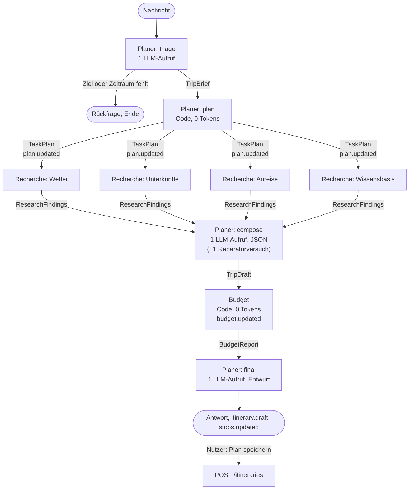

# Phase 3: Multi-Agenten-Orchestrator (Teil a)

Teil des Plans in [`../trip-planner-2.0-plan.md`](../trip-planner-2.0-plan.md), Abschnitt 4, Phase 3.
Baut auf [Phase 1](../phase-1/README.md) (Ereignisse, Reducer) und [Phase 2](../phase-2/README.md)
(echte Tools, Replay, Groq-Limiter) auf. Die Grundsatzentscheidung steht in
[ADR 0001](../adr/0001-eigener-orchestrator.md).

## Vorher → Nachher

**Vorher:** Ein einziger Agent mit einem großen `SYSTEM_PROMPT` (~700 Tokens) und allen sieben
Tool-Definitionen in **jedem** Aufruf. Das Modell entschied Runde für Runde, welches Tool als
Nächstes dran ist, meist eines pro Runde. Eine vollständige Reiseplanung brauchte 4–6 LLM-Aufrufe,
jeder mit dem wachsenden Verlauf, und lief damit schnell in Groqs Limit von 8.000 Tokens pro Minute.

**Nachher (mit `AGENT_MODE=multi`):** Drei Agenten mit klaren Aufgaben. Der **Planer** liest die
Anfrage, plant die Aufgaben und schreibt Tagesplan und Antwort, jeweils mit einem eigenen, kurzen
Prompt ohne Tool-Definitionen. Die **Recherche** ruft Wetter, Unterkünfte, Anreise und Wissensbasis
gleichzeitig auf, ohne LLM. Das **Budget** rechnet in Code. Ein vollständiger Lauf braucht
**3 LLM-Aufrufe** (höchstens 4), eine Rückfrage genau **1**. Im Ablauf steht pro Agent eine Lane, die
parallelen Recherchen laufen sichtbar nebeneinander, darüber die Aufgaben als Checkliste, unter der
Antwort ein Budget-Balken.

| Während des Laufs (Recherche parallel) | Nach der Antwort |
| --- | --- |
|  |  |

Screenshots aus dem echten Frontend, das Backend war dabei ein Mock mit Beispieldaten.

Screenshot aus dem echten Frontend. Das Backend war ein Mock, der einen erfundenen Lauf
(Berlin → Lissabon) mit realistischen Zeiten abspielt; die Zahlen sind Beispielwerte.

Ohne die Variable bleibt der Server-Default **`AGENT_MODE=classic`**; im Chat lässt sich der Modus
pro Anfrage wählen (siehe [Modus wählen](#modus-wählen)). `POST /agent/chat` (Evals, MCP-Server)
nutzt immer den Classic-Agenten.

## Modus wählen


- **Umschalter:** Über dem Eingabefeld steht „Klassisch · ein Agent“ | „Multi-Agent · Planer,
  Recherche, Budget“ (Radiogruppe, mit Pfeiltasten bedienbar). Default ist Multi-Agent, die Wahl
  merkt sich der Browser in `localStorage`. Sie geht mit jeder Anfrage als `mode` an
  `POST /agent/runs`; ungültige Werte lehnt die API vor dem Stream mit 400 ab.
- **Vergleich:** Die eingeklappte Ablauf-Zeile unter jeder Antwort beginnt mit dem Modus, den der
  Server tatsächlich genutzt hat (aus `run.started.mode`), z. B. „Multi-Agent · 3 LLM-Aufrufe · …“.
  So lässt sich dieselbe Frage in beiden Modi direkt nebeneinander vergleichen. Das Replay zeigt
  den Modus ebenso.
- **Server-Default:** Schickt ein Client keinen `mode` (ältere Frontends, Skripte), gilt
  `AGENT_MODE` (`classic`, wenn nicht gesetzt). In Azure setzt ihn der Bicep-Parameter `agentMode`,
  in `infra/main.parameters.json` steht `multi`.
- **Notbremse:** `AGENT_MODE_LOCKED=true` (Bicep-Parameter `agentModeLocked`) erzwingt
  `AGENT_MODE` für alle Läufe und ignoriert die Wahl des Clients, ohne neues Frontend. Der
  Umschalter bleibt sichtbar, die Ablauf-Zeile zeigt dann den erzwungenen Modus. Das Startup-Log
  nennt Default und Sperrstatus („Agentenmodus für POST /agent/runs: multi (Default, Client kann
  per mode wählen)“).

## Entwurf statt Auto-Speichern


**Warum:** Anfangs hat der Planer den fertigen Plan am Ende selbst über `save_itinerary`
gespeichert. Das Feedback dazu: „Er hat es direkt gespeichert, nicht gefragt, man konnte nichts
anpassen, ich habe keine Präferenzen gegeben.“ Vorab nach Vorlieben zu fragen, würde jede Anfrage
um eine Runde verlängern. Deshalb plant der Multi-Modus weiter **sofort**, liefert den Plan aber
als **Entwurf**, nennt seine Annahmen offen und speichert erst, wenn der Nutzer es will.

**Ablauf:**

1. **triage** liest wie bisher Ziel und Zeitraum; nur wenn eines davon fehlt, gibt es eine
   Rückfrage. Nach Vorlieben, Interessen oder Personenzahl fragt der Planer nicht, er nimmt sie an
   und schreibt sie als kurze Stichpunkte in `TripBrief.assumptions` (z. B. „1 Person“,
   „Unterkunft: Mittelklasse“). Liefert das Modell keine, ergänzt der Code, was er selbst weiß
   (keine Vorlieben → gemischtes Programm, kein Budget → mittleres Preisniveau).
2. **compose** bekommt die Annahmen mit und plant danach.
3. **final** speichert **nicht** mehr. Der Planer baut den Entwurf im Format von
   `CreateItineraryDto` (Budget = genanntes Budget oder geschätzte Summe), prüft ihn mit
   `itineraryValidationErrors` und schickt ihn als Ereignis `itinerary.draft`
   (`{ itinerary, assumptions }`); die Stationen gehen wie bisher per `stops.updated` an den Globus.
   Die Antwort endet mit einem Abschnitt **„Annahmen“**, einer Einladung zum Anpassen („mehr
   Kulinarik“, „Tag 2 entspannter“, „günstiger übernachten“) und dem Hinweis auf „Plan speichern“.
   In der Checkliste heißt die Aufgabe jetzt „Antwort schreiben“.
4. **Button „Plan speichern“** unter der Antwortkarte, nur wenn der Lauf einen Entwurf geliefert
   hat ([`components/save-draft-button.tsx`](../../apps/web/src/components/save-draft-button.tsx)):
   `POST /itineraries` mit genau dem Entwurf (über `authFetch`, also dem Konto bzw. Gast des
   Browsers). Danach „Gespeichert · In Meine Reisen ansehen“ mit Link auf
   `/trips/detail?id=<id>`, der Button bleibt deaktiviert. Bei einem Fehler steht eine kurze
   Meldung daneben, der Button ist wieder klickbar; ein Doppelklick speichert nicht doppelt. Das
   Replay zeigt keinen Button, nur den Hinweis „Entwurf“.

Der Classic-Modus bleibt, wie er ist: Dort speichert der Agent weiterhin nur, wenn der Nutzer es
im Gespräch will.

## Die Idee in einem Satz

Nur wo Sprache verstanden oder geschrieben werden muss, fragt der Orchestrator ein LLM; alles
andere (welche Recherche, welches Tool mit welchen Argumenten, was es kostet) entscheidet Code, und
jede Modellausgabe wird geprüft, bevor der nächste Agent sie sieht.



Die Recherche-Aufgaben laufen mit `Promise.all` gleichzeitig. Welche es gibt, folgt aus dem Brief:
ohne Abreiseort keine Anreise, bei einem Tagesausflug keine Unterkunft, bei einem Budget in Złoty
zusätzlich `research:currency`.

## Die neuen Ereignisse

In [`apps/api/src/runs/run-events.ts`](../../apps/api/src/runs/run-events.ts) und dem Spiegel
[`apps/web/src/lib/run-events.ts`](../../apps/web/src/lib/run-events.ts):

| Ereignis | Wann | Was das Frontend damit macht |
| --- | --- | --- |
| `run.started` | wie bisher, jetzt mit `mode: 'classic' \| 'multi'` | Lanes statt Liste bei `multi`; ältere Läufe ohne `mode` gelten als `classic` |
| `agent.started` | ein Agent beginnt eine Aufgabe: `{ stepId, agent, task }` | neuer Balken in der Lane des Agenten |
| `agent.finished` | `{ stepId, agent, task, status, durationMs, summary }` | Balken abschließen, Zusammenfassung darunter |
| `plan.updated` | bei jedem Statuswechsel einer Aufgabe, immer die ganze Liste | Checkliste ○ ◐ ✓ ✗ |
| `budget.updated` | nach dem Budget-Agenten: `{ currency, limitCents, totalCents, status, items }` | Budget-Balken grün/gelb/rot mit Posten |
| `itinerary.draft` | am Ende von final: `{ itinerary, assumptions }`, `itinerary` im Format von `POST /itineraries` | Button „Plan speichern“ unter der Antwort (nicht im Replay) |
| `llm.*`, `tool.started` | wie bisher, im Multi-Modus zusätzlich `agent` (und `parentStepId` bei `*.started`) | Tokens pro Agenten-Schritt |

`summary` enthält nur strukturierte Angaben („3 Tage, Vorjahreswerte“, „8 Unterkünfte“,
„576 € von 800 €, im Rahmen“), nie Nutzerfreitext. Nutzerangaben stecken nur in
`message.completed` und `itinerary.draft`; beide sieht nur der Nutzer selbst (live und in seinem
eigenen Replay). Alle bisherigen Ereignisse (`tool.*`,
`weather.updated`, `lodging.updated`, `place.added`, `route.added`, `stops.updated`, `sources`)
kommen im Multi-Modus genauso, deshalb funktionieren Globus, Wetter-Chips, Unterkünfte, Quellen und
Replay ohne Änderung.

## Rundgang durch den Code

### Backend (`apps/api/src`)

1. **Gemeinsame Messpunkte:** [`runs/step-events.ts`](../../apps/api/src/runs/step-events.ts). Aus
   `AgentService` herausgelöst: `observedLlmCall` (Langfuse-Generation, `llm.started/throttled/call`),
   `observedToolRun` (`tool.started/finished`) und `emitToolResults` (Globus, Wetter, Unterkünfte).
   Classic-Agent und Orchestrator nutzen dieselben Funktionen; ohne `origin` sind die Ereignisse
   Byte für Byte die alten.
2. **Prompt-Regeln:** [`llm/prompt-rules.ts`](../../apps/api/src/llm/prompt-rules.ts). Die Regeln gegen
   Prompt-Injection aus dem `SYSTEM_PROMPT`, wörtlich in allen vier Prompts (Classic, triage, compose,
   final). Ein Test prüft das.
3. **Typen und Prüfungen:** [`orchestrator/agent.types.ts`](../../apps/api/src/orchestrator/agent.types.ts)
   (`AgentContext` mit `emit`, `llm(agent)`, `signal`; `agentStep()` rahmt eine Aufgabe mit
   `agent.started/finished`) und [`orchestrator/trip-draft.ts`](../../apps/api/src/orchestrator/trip-draft.ts):
   - `TripBrief`: Ziel, Abreiseort, Daten (`datesAssumed`, wenn der Planer sie aus „im Oktober“
     gewählt hat), Personen, Budget, Präferenzen, Annahmen (`assumptions`). `parseTripBrief` prüft die triage-Ausgabe: gültige
     Daten, nicht in der Vergangenheit, höchstens 14 Tage.
   - `TaskPlan`: Aufgaben mit `dependsOn` und Status.
   - `TripDraft`: dieselbe Form wie ein gespeicherter Plan. `tripDraftErrors` = `itineraryValidationErrors`
     plus „jeder Tag hat Programm“, „kein Tag nach dem Reiseende“, „alle Punkte mit Koordinaten“.
   - `ResearchFindings`: nur Kennzahlen (Wetter pro Tag, Unterkünfte, empfohlene Anreise, drei gekürzte
     Treffer), damit der Prompt des Planers klein bleibt.
4. **Planer:** [`agents/planner.agent.ts`](../../apps/api/src/orchestrator/agents/planner.agent.ts) mit
   [`planner.prompts.ts`](../../apps/api/src/orchestrator/agents/planner.prompts.ts) und
   [`planner.schema.ts`](../../apps/api/src/orchestrator/agents/planner.schema.ts). Vier Einstiege:
   - `triage`: die letzten 6 Dialog-Nachrichten (ohne Tool-Runden) plus die neue Nachricht, Antwort als
     JSON `ready` oder `ask`. Kaputtes JSON oder ein `ready` ohne Zeitraum wird ebenfalls eine Rückfrage:
     lieber nachfragen als raten, und es bleibt bei einem Aufruf.
   - `plan`: der Aufgaben-Graph in Code.
   - `compose`: Programmpunkte als JSON. Fehlende Koordinaten ergänzt der Code mit denen des Ziels
     (kostet keinen Reparaturversuch), alle anderen Fehler gehen mit der eigenen Antwort zurück ans
     Modell, **genau einmal**. Danach `PlannerOutputError`, der Lauf endet mit `run.error`, nichts wird
     gespeichert.
   - `finalize`: speichert **nicht** (siehe [Entwurf statt Auto-Speichern](#entwurf-statt-auto-speichern)),
     sondern schickt den geprüften Entwurf als `itinerary.draft` (`routeFromStops` liefert die Stationen
     für `stops.updated`) und schreibt die Antwort: Deutsch, Markdown, Preise als geschätzte Spanne,
     Regentage und „Vorjahreswerte“, nur gelieferte Unterkünfte und Links, am Ende „Annahmen“ und
     die Einladung zum Anpassen. Der Planer hat damit keine Tools mehr.
5. **Recherche:** [`agents/research.agent.ts`](../../apps/api/src/orchestrator/agents/research.agent.ts).
   `TASK_TOOLS` bildet jede Aufgabe auf ein Tool ab, die Argumente kommen aus dem geprüften Brief
   (die Suchanfrage an die Wissensbasis ist „Ziel + Sehenswürdigkeiten Essen Transport + Präferenzen“).
   Jede Aufgabe ist ein eigener Agenten-Schritt; eine ausgefallene API macht nur ihre Aufgabe rot.
   Den Zielmarker setzt das erste Tool, das den Ort geokodiert hat.
6. **Budget:** [`agents/budget.agent.ts`](../../apps/api/src/orchestrator/agents/budget.agent.ts). Alles
   Mittelwerte der geschätzten Spannen:

   | Posten | Rechnung |
   | --- | --- |
   | Anreise | Mitte der empfohlenen Option × 2 (hin und zurück) × Personen |
   | Unterkunft | Nächte × Median der gefundenen Unterkünfte ohne Hostels (sonst Preisniveau der Stadt) × Zimmer (2 Personen pro Zimmer) |
   | Programm | Summe `costCents` der Programmpunkte × Personen, ohne Anreise- und Unterkunftspunkte |
   | Essen | Tage × Personen × Tagespauschale nach Preisniveau der Stadt (25 / 35 / 45 / 60 €) |

   Status: über dem Budget `over`, über 90 % `tight`, sonst `ok`. Ohne genanntes Budget ist `limitCents`
   `null` und der Status `ok`. Ein Budget in fremder Währung zählt nur mit EZB-Kurs aus
   `convert_currency`, geraten wird kein Kurs.
7. **State Machine:** [`orchestrator/orchestrator.ts`](../../apps/api/src/orchestrator/orchestrator.ts).
   `run()` läuft `while (state !== 'done') state = await step(state, …)`; jeder `case` stößt einen
   Agenten an. `TaskBoard` hält die Aufgaben und sendet `plan.updated`. Der Dialog wird wie im
   Classic-Modus im `ConversationStore` gespeichert (nur Text), das Ergebnis hat die Form von
   `ChatResult`. Laufzeitlimit 120 s über `AbortSignal`, geprüft zwischen den Zuständen und vor jedem
   LLM-Aufruf. `createOrchestrator` gibt jedem Agenten eine eigene `ToolRegistry` aus denselben
   Tool-Objekten ([`tools/index.ts`](../../apps/api/src/tools/index.ts), `createToolSet`).
8. **Modus:** [`agent.controller.ts`](../../apps/api/src/agent.controller.ts) nimmt pro Lauf `mode`
   aus dem Body, sonst `AGENT_MODE`; mit `AGENT_MODE_LOCKED=true` immer `AGENT_MODE`
   (`resolveAgentMode` in `orchestrator.ts`). Bei `multi` ruft `POST /agent/runs` den Orchestrator
   auf, sonst `AgentService` wie bisher. Die
   Ereignisse danach (`stops.updated`, `sources`, `message.completed`, `run.finished`) und das Speichern
   fürs Replay sind für beide gleich.

### Frontend (`apps/web/src`)

1. **Reducer:** [`lib/run-state.ts`](../../apps/web/src/lib/run-state.ts) kennt `mode`, `agentSteps`,
   `tasks`, `budget` und `lastMs` (spätestes Ereignis bisher). Schritte merken sich `agent` und
   `parentStepId`.
2. **Wasserfall:** [`lib/agent-lanes.ts`](../../apps/web/src/lib/agent-lanes.ts), rein und testbar: eine
   Lane pro Agent, ein Balken pro Aufgabe relativ zur Laufzeit, laufende Balken bis `lastMs`. Weil die
   Zeit aus den Ereignissen kommt statt aus der Uhr im Browser, wachsen die Balken live und im Replay
   gleich.
3. **Anzeige:** [`components/trace-panel.tsx`](../../apps/web/src/components/trace-panel.tsx) zeigt bei
   Agenten-Schritten die Checkliste und die Lanes (Planer dunkelblau, Recherche türkis, Budget gelb,
   Fehler rot), sonst die Liste wie bisher. [`components/budget-bar.tsx`](../../apps/web/src/components/budget-bar.tsx)
   steht unter der Antwort, im Live-Lauf und im Replay.
4. **Entwurf speichern:** Der Reducer übernimmt `itinerary.draft` als `draft`;
   [`components/save-draft-button.tsx`](../../apps/web/src/components/save-draft-button.tsx) steht in
   [`app/chat-window.tsx`](../../apps/web/src/app/chat-window.tsx) unter der Antwortkarte.

## Token-Rechnung pro Lauf

Geschätzt über Zeichen / 3,5 (deutscher Text und JSON), für „3 Tage Lissabon im Oktober, 800 €,
ab Berlin“; bei Reasoning-Modellen wie `gpt-oss` kommt das Nachdenken zur Ausgabe dazu.

| Schritt | LLM | Input | Output | Summe |
| --- | --- | --- | --- | --- |
| Planer triage (Prompt ~550, Nachricht) | 1 | ~600 | ~300 | ~900 |
| Planer plan | – | 0 | 0 | 0 |
| Recherche (4 Tools parallel) | – | 0 | 0 | 0 |
| Planer compose (Prompt ~450, Fakten ~700) | 1 | ~1.150 | ~1.000 | ~2.150 |
| Budget | – | 0 | 0 | 0 |
| Planer final (Prompt ~500, Plan, Budget, Wetter, Unterkünfte, Annahmen ~850) | 1 | ~1.350 | ~850 | ~2.200 |
| **Summe** | **3** | | | **~5.250** |
| mit Reparaturversuch in compose | 4 | +~2.300 | +~1.000 | ~8.300 |
| Rückfrage („Ich will verreisen“) | 1 | ~600 | ~150 | ~750 |

Zum Vergleich Classic: Jeder Aufruf trägt ~700 Tokens System-Prompt und ~1.000 Tokens
Tool-Definitionen, bei 4–6 Aufrufen mit wachsendem Verlauf sind das 10.000 Tokens und mehr.

Der Normalfall liegt damit unter dem Ziel von 7.000 Tokens auf dem Planer-Modell und passt in ein
Groq-Minutenbudget; der Reparaturfall liegt darüber und wartet dann über den Limiter aus Phase 2e.
Gemessen wird das erst mit echtem Key (siehe unten).

## Tests

| Test | Prüft |
| --- | --- |
| `orchestrator/orchestrator.spec.ts` | Szenario „3 Tage Lissabon im Oktober, 800 €, ab Berlin“: vollständige Ereignisfolge (triage, plan, 4 parallele Recherchen, compose, budget, final), 3 LLM-Aufrufe (≤ 4), ≤ 7.000 Tokens, kein `save_itinerary`, genau ein `itinerary.draft` mit 6 Stops, Koordinaten, Budget und Annahmen, Budgetbericht, Quellen, alle Aufgaben `done`; der Entwurf passiert `POST /itineraries` unverändert (ValidationPipe wie in `main.ts`, zusätzlich `forbidNonWhitelisted`); „Ich will verreisen“: genau 1 LLM-Aufruf, keine Recherche-Tools, Dialog gespeichert; gescheiterter Plan: `error` an `compose`, kein Entwurf; abgelaufenes Laufzeitlimit |
| `orchestrator/agents/planner.agent.spec.ts` | triage mit 1 Aufruf (auch JSON in ```-Block), Rückfrage, `ready` ohne Zeitraum und kaputtes JSON werden Rückfragen, Verlauf ohne Tool-Runden; Aufgaben-Graph (ohne Abreiseort, Tagesausflug, fremde Währung); compose ergänzt Koordinaten, ungültiges JSON → 1 Reparaturversuch → Erfolg, Regelverstöße im Reparaturversuch, zweimal ungültig → `PlannerOutputError` nach genau 2 Aufrufen; finalize ruft kein Tool, schickt einen gültigen Entwurf (`itineraryValidationErrors` leer) mit Annahmen, Budget ohne Limit = geschätzte Summe, Fakten ohne Speicherstatus; final-Prompt mit „## Annahmen“, Anpass-Beispielen und „Plan speichern“; triage fragt nicht nach Vorlieben; Annahmen aus Code, wenn das Modell keine nennt; Injection-Regeln in allen Prompts |
| `orchestrator/agents/research.agent.spec.ts` | echte Tools mit nachgebauten API-Clients: Kennzahlen aller vier Aufgaben, alle Starts vor dem ersten Ende (parallel), Classic-Ereignisse mit `agent`/`parentStepId`, genau ein Zielmarker, Statusmeldungen, ausgefallene API trifft nur ihre Aufgabe, Währungsumrechnung, Suchanfrage nur aus Ziel und Präferenzen |
| `orchestrator/agents/budget.agent.spec.ts` | Posten und Summe, `ok` / `tight` / `over`, Grenzen bei 90 % und 100 %, ohne Unterkünfte und ohne Abreiseort, ohne Budget, fremde Währung nur mit Kurs, Ereignisse ohne LLM |
| `agent.controller.spec.ts` | Default `classic` mit `mode` in `run.started`; `AGENT_MODE=multi` ruft den Orchestrator, seine Ereignisse landen im Stream; `mode` im Body schlägt den Default (in beide Richtungen); ungültiger `mode` → 400 vor dem Stream; `AGENT_MODE_LOCKED=true` ignoriert die Wahl des Clients; `/agent/chat` bleibt classic |
| `apps/web/src/lib/agent-mode.test.ts` | Default `multi`, Wahl in `localStorage` merken und lesen, unbekannte Werte, werfender Speicher (Wahl bleibt bis zum Neuladen), Benachrichtigung des Umschalters |
| `apps/web/src/lib/run-state.test.ts` | u. a. `itinerary.draft` landet als `draft` im Zustand, Läufe ohne das Ereignis haben keinen Entwurf |
| `apps/web/src/lib/agent-lanes.test.ts` | Reducer: Modus, Agenten-Schritte, Herkunft der Tool-Schritte, `lastMs`, `plan.updated`, `budget.updated`, alte Läufe ohne `mode`; Lanes: Balken relativ zur Laufzeit, parallele Recherche, Tokens pro Schritt, keine Lanes bei classic |

Kein Test braucht Netz: Groq, Open-Meteo, Overpass, Frankfurter und der RAG-Service sind gemockt.
Die bestehenden Tests des Classic-Agenten laufen unverändert.

## Bewusst offen (Restliste für 3b)

- **Modelle pro Agent:** `ProviderRegistry` und `AGENT_MODEL_*` (Plan 2.5). Heute liefert
  `ctx.llm(agent)` für alle Agenten den einen `LLM_PROVIDER`; die Schnittstelle ist schon so gebaut,
  dass nur die Factory sich ändert.
- **Anpassen per Folgenachricht (`TripDraft` pro Session) folgt:** Die Antwort lädt zu „mehr
  Kulinarik“ oder „Tag 2 entspannter“ ein. Heute läuft so eine Folgenachricht wieder durch triage
  (mit dem Dialog als Kontext) und plant neu, als neuer Entwurf. Mit einem gespeicherten Entwurf pro
  Session (Prisma-Migration) ändert der Planer nur den betroffenen Tag.
- **Entwurf nur im Browser:** Wird der Chat neu geladen, bevor „Plan speichern“ geklickt ist, ist
  der Entwurf weg (das Replay zeigt ihn, speichert aber bewusst nicht).
- **Sparmodus:** automatischer Downgrade auf `classic` (bzw. ein kleinerer Lauf), wenn der Limiter
  weniger als 3.000 freie Tokens für das Planer-Modell meldet, mit Badge in der Timeline.
- **Sparvorschläge:** Bei `over` 1 LLM-Aufruf „3 konkrete Sparvorschläge“ mit einem kleinen Modell.
- **Szenario-Eval** mit Assertions (≤ 4 LLM-Aufrufe, ≤ 7.000 Tokens auf dem Planer-Modell) gegen das
  echte Modell, dazu die Injection-Evals im Multi-Modus.
- **Reparaturfall über 7.000 Tokens:** Der Reparaturversuch schickt die ganze compose-Unterhaltung
  noch einmal. Kürzer ginge es mit nur den fehlerhaften Tagen.
- **Kein Live-Test:** Prompts und JSON-Ausgaben sind nur mit Mocks geprüft. Vor dem Umschalten auf
  `multi` einmal mit echtem Groq-Key laufen lassen, besonders triage mit „im Oktober“ (Datumswahl) und
  compose (Koordinaten, Kategorien).
- **`FakeLlmProvider` kennt den Multi-Modus nicht:** E2E mit `LLM_PROVIDER=fake` bleibt classic; der
  CI-Job setzt dafür `AGENT_MODE_LOCKED=true`, weil der Umschalter sonst `multi` schickt. Lokal mit
  `LLM_PROVIDER=fake` den Umschalter auf „Klassisch“ stellen oder ebenfalls sperren.
- **Reisen über 14 Tage** beantwortet der Multi-Modus mit einer Rückfrage (Wetter-Tool und ein
  Tagesplan pro Aufruf sind darauf begrenzt); Rundreisen mit mehreren Zielen plant nur Classic.
- **Abbruch beim Schließen des Tabs:** wie bisher läuft der Lauf zu Ende; das `AbortSignal` greift nur
  beim Laufzeitlimit.
