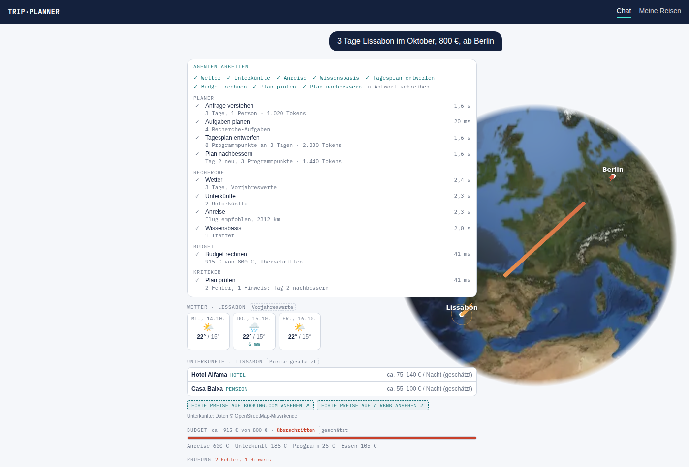
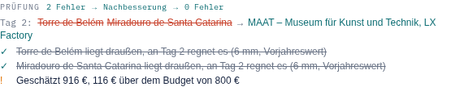
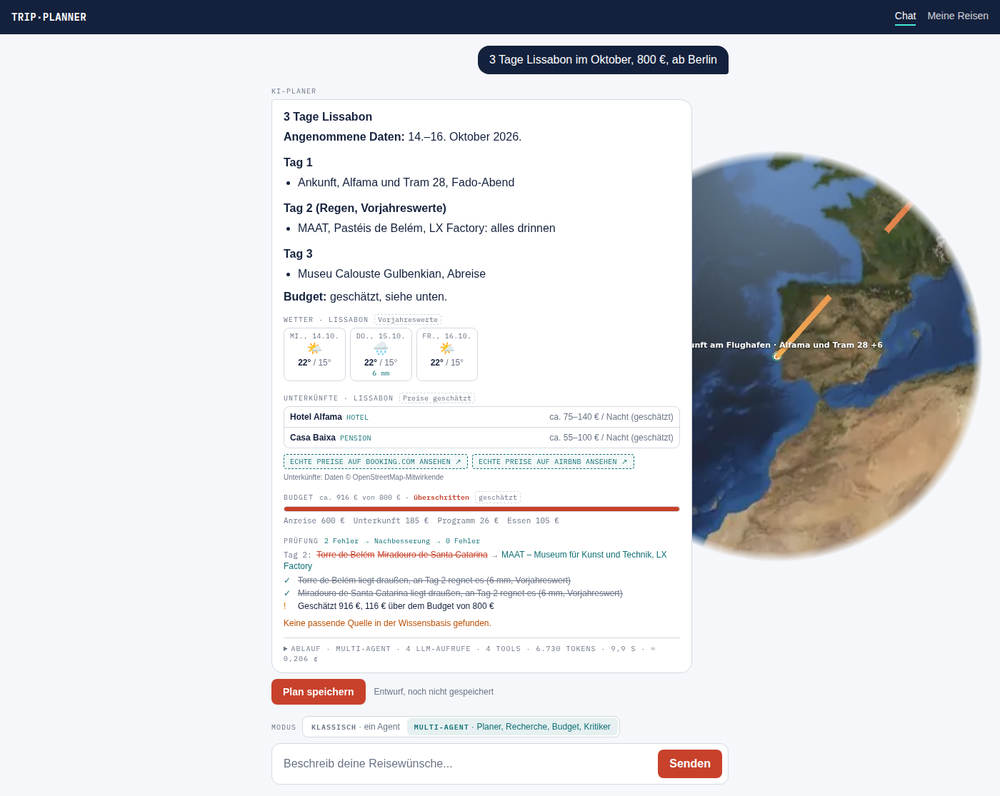
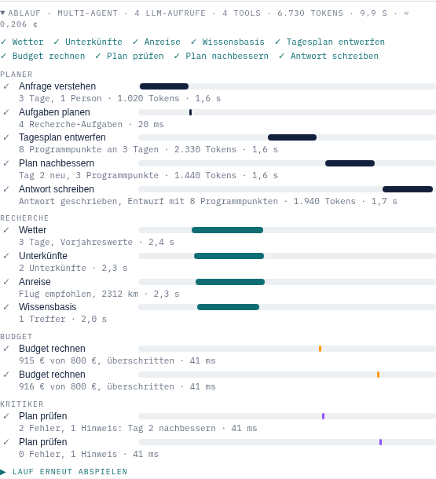
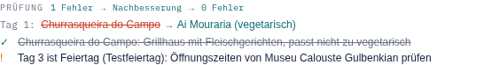
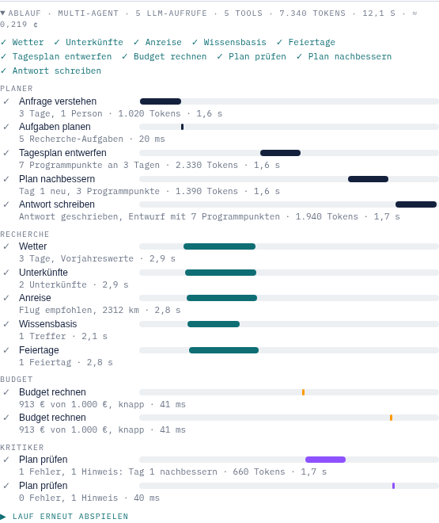

# Phase 4: Kritiker und Nachbesserung

Bis Phase 3 ging jeder Entwurf des Planers direkt an den Nutzer. Ab jetzt
prüft ein **Kritiker** jeden Entwurf, bevor er rausgeht. Findet er einen
Fehler, bessert der Planer **nur den betroffenen Tag** nach, und der Kritiker
prüft erneut. Im Trace-Panel sieht man das live: Der Plan „repariert sich“,
bevor der Nutzer ihn bekommt.

Der Kritiker ist bewusst **ein Agent ohne KI**. Seine Regeln sind kleine
Funktionen in Code: Sie kosten keine Tokens, sie liefern bei gleichem
Entwurf immer dasselbe Ergebnis, und jeder Befund lässt sich nachvollziehen.
Nur die Nachbesserung braucht einen KI-Aufruf, und nur dann, wenn es
wirklich etwas zu reparieren gibt.

## Vorher → Nachher

| | Phase 3 | Phase 4a |
| --- | --- | --- |
| Ablauf | triage → plan → research → compose → budget → final | … → budget → **critique** → (**repair** → budget → critique)* → final |
| Aussichtspunkt am Regentag | geht so an den Nutzer | Kritiker meldet ihn, der Planer tauscht Tag 2 aus |
| Doppelter Programmpunkt, falsche Koordinaten | unbemerkt | Fehler, Nachbesserung |
| Budget überschritten, Tagesausflug, voller Tag | nur im Budget-Balken | Hinweis in der Prüfung und in der Antwort |
| LLM-Aufrufe (ohne Befund) | 3 | 3 (Kritik kostet 0) |
| LLM-Aufrufe (mit Befund) | – | +1 pro Nachbesserung, höchstens 2 |

## So sieht es aus

Live, direkt nach der ersten Prüfung: Die Lane **Kritiker** meldet „2 Fehler,
1 Hinweis: Tag 2 nachbessern“, der Planer arbeitet an „Plan nachbessern“, und
unter dem Budget stehen die Befunde in Rot.



Fertig: Die Prüfung zeigt den Weg „2 Fehler → Nachbesserung → 0 Fehler“, den
Diff für Tag 2 (durchgestrichen: was rausflog, grün: was dazukam) und die
behobenen Befunde. Offen bleibt nur der Budget-Hinweis, und den nennt auch
die Antwort.





Im Ablauf läuft die Schleife als Wasserfall: Budget und Kritiker kommen
zweimal vor, dazwischen „Plan nachbessern“.



Auf dem Globus bekommt jeder beanstandete Programmpunkt einen kleinen **roten
Ring**. Wird der Befund behoben, wird der Ring **grün**.

> Die Screenshots stammen aus einem echten Orchestrator-Lauf mit
> nachgebautem Modell (Fake-LLM, wie in den Tests), abgespielt mit
> realistischen Pausen. Wetter und Unterkünfte kommen aus den Test-Fixtures,
> deshalb „6 mm, Vorjahreswert“ und nur zwei Unterkünfte.

## Die Idee in einem Satz

> Was Code prüfen kann, prüft Code, und die KI bessert nur nach, was Code
> beanstandet hat.

Das ist dieselbe Linie wie in Phase 3 (Recherche und Budget ohne KI): Die
KI macht nur das, wofür sie Sprache und Weltwissen braucht, also einen
Regentag mit einem passenden Museum neu zu füllen. Ob ein Aussichtspunkt an
einem Tag mit 6 mm Regen liegt, weiß der Code genauer und billiger.

## Die Regeln

Jede Regel ist eine reine Funktion `(Entwurf, Recherche, Budget) → Befunde`
in `apps/api/src/orchestrator/rules/`. **Fehler** (error) lösen eine
Nachbesserung aus, **Hinweise** (warning) nennt die Antwort.

| Regel | Datei | Prüft | Stufe |
| --- | --- | --- | --- |
| `rain-outdoor` | `rain-outdoor.rule.ts` | Programm draußen an einem Tag mit ≥ 5 mm Regen | Fehler |
| `duplicate-stop` | `duplicate-stop.rule.ts` | derselbe Programmpunkt zweimal (gemeldet wird die Wiederholung) | Fehler |
| `far-away` | `far-away.rule.ts` | > 150 km vom Ziel: Koordinaten falsch; 30–150 km: Tagesausflug | Fehler / Hinweis |
| `day-load` | `day-load.rule.ts` | mehr als 4 Programmpunkte an einem Tag | Hinweis |
| `budget-over` | `budget-over.rule.ts` | geschätzte Kosten über dem genannten Budget | Hinweis |
| `holiday` | `holiday.rule.ts` | Museum, Galerie, Palast an einem gesetzlichen Feiertag (Teil b) | Hinweis |
| `preference` | `critic.agent.ts` | Widerspruch zu einer Vorliebe, 1 KI-Aufruf (Teil b) | Fehler |

Warum ist das Budget nur ein Hinweis? Den größten Teil machen Anreise und
Unterkunft aus. Ein anderes Tagesprogramm rettet das nicht, eine
Nachbesserung würde nur Tokens kosten. Die Antwort sagt es offen.

**Woher weiß der Code, was „draußen“ ist?** Der Planer setzt pro
Programmpunkt `outdoor: true|false` (neues Feld im compose-Format). Fehlt
es, entscheidet eine kurze Liste eindeutiger Wörter im Titel („Park“,
„Miradouro“, „Strand“, „Bootstour“ …). Das Feld lebt nur im Entwurf. Der
gespeicherte Plan (`POST /itineraries`) bleibt unverändert.

Eine neue Regel ist eine Datei `*.rule.ts` plus eine Zeile in
`rules/index.ts`.

## Die Schleife

```
budget → critique ─(keine Fehler)──────────────→ finalize
            │
            └─(Fehler an Tag 2)→ repair (nur Tag 2) → budget → critique …
                                  höchstens 2×, danach finalize mit offenen Befunden
```

- **Nur die betroffenen Tage:** `planner.repair()` nutzt denselben Weg wie
  „Tag 2 entspannter“ aus Phase 3 (`revise`). Das Modell sieht Tag 2
  vollständig, die anderen Tage nur als Titel, und statt eines Wunsches die
  Befunde unter „Kritik“. Die anderen Tage bleiben Stop für Stop gleich.
- **Höchstens 2 Nachbesserungen** (`MAX_REPAIRS` in `critic.agent.ts`).
  Auch ein „sturer“ Planer, der denselben Fehler wiederholt, kann den Lauf
  nicht endlos machen (Test). Danach geht der Plan mit offenem Fehler raus,
  und die Antwort nennt ihn unter „## Hinweise“.
- **Scheitert eine Nachbesserung** (zweimal kein gültiges JSON), bleibt der
  geprüfte Entwurf stehen. Der Lauf bricht nicht ab, die Antwort nennt den
  Befund.
- **Budget läuft nach jeder Nachbesserung neu**, weil neue Programmpunkte
  andere Eintrittspreise haben.

## Das neue Ereignis

```ts
'critique': {
  round: number;          // 0 = erster Entwurf, 1 und 2 = nach Nachbesserung
  violations: Violation[]; // { ruleId, severity, dayNumber?, stopTitle?, lat?, lng?, message }
  changes?: DayChange[];   // ab round 1: pro Tag { removed, added }
  final: boolean;          // es folgt keine Nachbesserung mehr
}
```

Dazu kommen der Agent `critic` und die Aufgaben `critique` („Plan prüfen“)
und `repair` („Plan nachbessern“). Nachbesserungen erscheinen in der
Checkliste als `repair-1`, `repair-2`, sobald sie nötig werden.

## Rundgang durch den Code

### Backend (`apps/api/src`)

| Datei | Was |
| --- | --- |
| `orchestrator/rules/*.rule.ts`, `rules/index.ts` | die Regeln und die Registry `RULES`, `checkRules()` sortiert Fehler vor Hinweisen |
| `orchestrator/agents/critic.agent.ts` | `CriticAgent.run()`: Regeln prüfen, `critique` senden, Tage zum Nachbessern bestimmen; `dayChanges()` für den Diff |
| `orchestrator/orchestrator.ts` | neue Zustände `critique` und `repair`, `TaskBoard.add()` für `repair-n` |
| `orchestrator/agents/planner.agent.ts` | `repair()` (teilt sich `rewriteDays()` mit `revise()`), offene Befunde als `Hinweise` in den Fakten der Antwort |
| `orchestrator/agents/planner.prompts.ts` | `repairPrompt()`, Hinweise-Regel in beiden Antwort-Prompts, `outdoor` im compose-Prompt |
| `orchestrator/trip-draft.ts` | `DraftStop.outdoor` |
| `runs/run-events.ts` | `critique`, `Violation`, `DayChange`, `PlanTaskInfo` |

### Frontend (`apps/web/src`)

| Datei | Was |
| --- | --- |
| `lib/run-events.ts`, `lib/run-state.ts` | Spiegel der Typen, `critiques` im Laufzustand |
| `lib/critique.ts` | `issueMarkers()` (Ringe: rot offen, grün behoben), `critiqueOverview()`, `critiqueBadge()` |
| `components/critique-panel.tsx` | die Prüfung unter der Antwort, live und im Replay |
| `components/globe-canvas.tsx` | `issues`: kleine rote bzw. grüne Ringe |
| `lib/agent-lanes.ts`, `components/trace-panel.tsx` | Lane „Kritiker“ (violett), Aufgaben „Plan prüfen“, „Plan nachbessern“ |

## Token-Rechnung

- **Ohne Befund:** kein zusätzlicher Aufruf. Die Kritik läuft in Code, in
  wenigen Millisekunden.
- **Mit Befund:** +1 Aufruf pro Nachbesserung. Er ist so klein wie der
  revise-Aufruf bei „Tag 2 entspannter“ (Phase 3): nur der betroffene Tag,
  die anderen als Titel, dazu die Befunde. Die Token-Zahlen in den
  Screenshots stammen vom Fake-LLM. Echte Werte mit Groq stehen noch aus.
- **Schlimmster Fall:** 2 Nachbesserungen, also 5 Aufrufe.

Der compose-Prompt sagt schon seit Phase 3 „an Regentagen drinnen“. Der
Kritiker ist das Sicherheitsnetz, wenn das Modell es trotzdem vergisst.

## Tests

- `rules/rules.spec.ts`: jede Regel positiv und negativ, dazu die
  **Kritiker-Fixtures**, absichtlich fehlerhafte Entwürfe mit bekannter
  Fehlerliste. Recall und Precision der harten Regeln müssen ≥ 90 % sein
  (Plan 5.2).
- `agents/critic.agent.spec.ts`: Ereignis, Tage zum Nachbessern, letzte
  Runde ohne Nachbesserung, Diff pro Tag.
- `orchestrator.spec.ts`: drei neue Szenarien:
  - Regentag: Der Aussichtspunkt wird ersetzt, die zweite Prüfung ist
    sauber, 4 LLM-Aufrufe.
  - Sturer Planer: höchstens 2 Nachbesserungen, der offene Fehler steht
    in der Antwort.
  - Gescheiterte Nachbesserung: Der Plan geht trotzdem raus.
- Web `lib/critique.test.ts`: Reducer, Ringe, Badge.

## Teil b: Vorlieben, Feiertage, Gast-Kontingent

### Vorlieben per KI (1 Aufruf, nur wenn nötig)

„Churrasqueira“ bei „vegetarisch“ oder eine Bar am Abend bei „mit Kind“
erkennt keine Regel in Code. Dafür macht der Kritiker **einen** kurzen
KI-Aufruf, und zwar nur unter drei Bedingungen:

- Der Nutzer hat Vorlieben genannt (`brief.preferences` ist nicht leer).
  Ohne Vorlieben kostet die Prüfung weiter 0 Tokens.
- Es ist die **erste** Prüfung. Nach einer Nachbesserung prüft wieder Code:
  Ein Befund ist offen, solange der beanstandete Punkt noch an seinem Tag
  steht. So kostet eine Nachbesserungsrunde keinen weiteren Prüfaufruf, und
  die KI kann nicht in jeder Runde etwas Neues finden (keine Endlosschleife).
- `CRITIC_PREFERENCE_CHECK` ist nicht `off`.

Was die KI meldet, wird geprüft, bevor es zählt. Der Programmpunkt muss am
genannten Tag wirklich existieren, es gibt höchstens 3 Befunde, und die
Meldung wird zu einer Zeile Klartext. Erfundene oder falsch zugeordnete
Punkte fallen weg. Schlägt der Aufruf fehl, gilt der Plan ohne diese
Prüfung; die harten Regeln haben ihn trotzdem geprüft.



Im Ablauf sieht man den KI-Aufruf in der Lane des Kritikers („660 Tokens“).
Die zweite Prüfung kommt ohne KI aus (40 ms):



> Auch diese Screenshots zeigen einen echten Orchestrator-Lauf mit
> nachgebautem Modell. Der „Testfeiertag“ stammt aus den Test-Fixtures.

### Feiertage (Nager.Date)

- `external/nager-date.client.ts`: landesweite Feiertage pro Land und Jahr
  (kostenlos, ohne Key, 30 Tage im Cache). Regionale Feiertage fehlen
  bewusst, weil nicht sicher ist, ob das Reiseziel dazugehört.
- `tools/holidays.tool.ts` (`get_public_holidays`): Den Ländercode liefert
  die Geokodierung (Open-Meteo, aus dem Cache). Eine Reise über Silvester
  fragt zwei Jahre ab. Nur der Recherche-Agent bekommt das Tool, der
  Classic-Agent nicht, damit sein Prompt nicht länger wird.
- Neue Recherche-Aufgabe `research:holidays` (Chip „Feiertage“). Sie läuft
  parallel zu den anderen und bei einer Überarbeitung nur, wenn sich die
  Daten ändern.
- Der Planer sieht die Feiertage schon beim Entwurf („Museen haben oft
  geschlossen“).
- Regel `holiday` (Hinweis): Museum, Galerie oder Palast an einem Feiertag
  → „Öffnungszeiten prüfen“. Nur ein Hinweis, weil viele Häuser trotzdem
  offen haben.

### Gast-Kontingent

Gäste (anonymer Zugang, `role: 'guest'`) dürfen in 24 Stunden höchstens
`GUEST_DAILY_TOKEN_BUDGET` Tokens verbrauchen (Default 60.000, `0` = aus),
gezählt aus den gespeicherten Läufen (`AgentRun`). Ist das Kontingent
aufgebraucht, antwortet `POST /agent/runs` mit `run.error`
(`quota_exhausted`, „Das Tageskontingent für Gastzugänge … ist
aufgebraucht“), `POST /agent/chat` mit 429. Der Eigentümer hat kein
Kontingent. Das schützt das Groq-Kontingent der Demo vor einem einzelnen
Besucher; ein voller Plan braucht etwa 5.000 bis 10.000 Tokens, 60.000
reichen also für ein Dutzend Pläne am Tag.

Gezählt werden nur die Läufe über `POST /agent/runs`, denn nur die werden
gespeichert. `/agent/chat` (Evals, MCP) prüft das Kontingent, zählt aber
nicht mit.

### Neue Tests (Teil b)

- `critic.agent.spec.ts`:
  - Vorlieben-Befund mit Ort
  - erfundene Punkte werden verworfen
  - ohne Vorlieben oder mit `off` kein Aufruf
  - ein Fehlschlag kostet nicht den Plan
  - nach einer Nachbesserung prüft Code statt KI
- `orchestrator.spec.ts`:
  - „vegetarisch“: 5 Aufrufe, das Grillhaus wird ersetzt, die zweite
    Prüfung ohne KI
  - Feiertag: Hinweis am Museum und Feiertag in den Fakten für den Planer
- `nager-date.client.spec.ts`, `holidays.tool.spec.ts`: Filter, Cache,
  Eingaben, Jahreswechsel
- `agent.controller.spec.ts`: Kontingent (Gast gestoppt, 24-Stunden-Fenster,
  nur der eigene Nutzer, der Eigentümer frei, `0` = aus, 429 bei
  `/agent/chat`); `agent-run-store.spec.ts`: Summe per Prisma-`aggregate`

## Bewusst offen

- **Szenario `rom-regen-oktober`** in den Evals gegen echtes Groq (Phase 5).
  Hier im Container sind Groq, Open-Meteo, OpenStreetMap und Nager.Date
  nicht erreichbar, deshalb bisher nur mit Fake-LLM getestet.
- **Demo-Replay als Ausweg** beim aufgebrauchten Gast-Kontingent: Den
  öffentlichen Demo-Lauf gibt es erst in Phase 6.
- **Plausibilität per KI** (z. B. „3 Museen und ein Tagesausflug an einem
  Tag“): Das deckt die Regel `day-load` grob ab. Eine KI-Prüfung ohne
  Vorlieben würde jeden Lauf verteuern.
