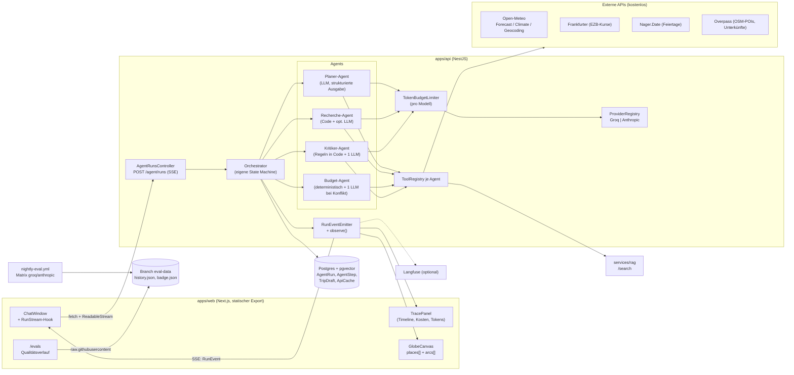

# Trip Planner 2.0 – Projektplan

> Stand: 28.09.2026 · Basis: `main` · Ziel: Portfolio-Projekt, bei dem man in der Live-Demo in
> Echtzeit sieht, wie mehrere Agenten zusammen eine Reise planen, und bei dem die Qualität
> öffentlich gemessen wird.

---

## 1. Kurzfassung Ist-Zustand

### Was heute existiert und wie es zusammenhängt

| Baustein | Datei(en) | Ist-Zustand | Wird in 2.0 … |
| --- | --- | --- | --- |
| Agent-Loop | `apps/api/src/agent.service.ts` | Ein Agent mit einem großen `SYSTEM_PROMPT`, `while (finishReason === 'tool_calls')`, max. `MAX_TOOL_ITERATIONS=8` Runden. Die Tools einer Runde laufen mit `Promise.all` parallel. Das Ergebnis kommt als **ein** JSON (`ChatResult`: `reply`, `sources`, `searchAttempted`, `focus`). | als „Classic Mode“ weiter genutzt (Fallback und Rückfrage-Dialog). Die Schleife wird zum Baustein `runToolLoop()`, den jeder Agent nutzt. |
| HTTP-Endpunkt | `apps/api/src/agent.controller.ts` | `POST /agent/chat`, `JwtAuthGuard`, `@Throttle(10/min)`, Validierung von `sessionId` und `message` | bleibt für Evals, E2E und Abwärtskompatibilität. Neu kommt `POST /agent/runs` mit SSE-Antwort dazu. |
| LLM-Abstraktion | `apps/api/src/llm/llm-provider.interface.ts`, `groq.provider.ts`, `anthropic.provider.ts`, `retrying-llm-provider.ts` | `LlmProvider.chat()` liefert normalisiert `usage`, `model` und `finishReason`. `LlmChatOptions.model` ist schon vorgesehen, wird aber nirgends gesetzt. Retry bei 429 mit `Retry-After`. Die Factory in `agent.module.ts` wählt den Provider **global** über `LLM_PROVIDER`. | wiederverwendet. Neu ist eine Modellwahl pro Agent (`options.model`) und eine Provider-Registry, die Groq und Anthropic gleichzeitig halten kann (für den Modellvergleich). |
| Tool-Registry | `apps/api/src/tools/tool-registry.ts`, `tools/index.ts` | `AgentTool` mit `kind` (`tool`/`retriever`), `sources()`, `focus()` und `trace()`. Die Langfuse-Observation wird pro Tool erzeugt. Doppelte Namen werden abgelehnt. | 1:1 wiederverwendet. Jeder Agent bekommt eine **eigene** `ToolRegistry` mit einer Teilmenge der Tools. `focus()` wird zu `places()` verallgemeinert. |
| Tools | `travel-knowledge.tool.ts` (RAG), `travel-search.tools.ts` (Flug/Hotel **simuliert**, feste Preise), `show-destination.tool.ts` (Koordinaten **vom Modell geraten**, nur geprüft), `save-itinerary.tool.ts` (validiert über `itineraryValidationErrors`) | Wissen, Speichern und Validierung werden wiederverwendet. Flug und Hotel werden durch realistischere Schätzer ersetzt (siehe 2.6). Die Koordinaten kommen künftig aus Open-Meteo-Geocoding. |
| RAG | `apps/api/src/rag-client.ts` → `services/rag` (FastAPI, fastembed, Reranking, `POST /search`) | wirft nie, meldet `available:false` und versucht es bei Kaltstart erneut mit 30 s Timeout. `RAG_SEARCH_TOP_K=3` wegen Groq-TPM | unverändert. Der Recherche-Agent ist der einzige Aufrufer. |
| Verlauf | `llm/conversation-store.ts`, Prisma `Conversation` | Verlauf pro `(userId, sessionId)`, auf 40 Nachrichten gekürzt, Retention 30 Tage, Aufräumen beim Speichern | wiederverwendet für den Dialog. Neu dazu kommt ein `TripDraft` pro Session (strukturierter Planstand). |
| Tracing | `apps/api/src/tracing.ts` + `startActiveObservation`/`propagateAttributes` in `agent.service.ts` und `tool-registry.ts` | OpenTelemetry-`NodeSDK` mit `LangfuseSpanProcessor`, **nur wenn Langfuse-Keys gesetzt sind**. Außerdem Application Insights. Bewusst **ohne Freitext** (README „Was wird nicht getraced“). Gemessen wird pro LLM-Aufruf `model`, `usageDetails` und `finishReason`. | ist die Grundlage für das Live-Trace-Panel. Dieselben Messpunkte schicken zusätzlich `RunEvent`s an den Client. |
| Auth / Gast | `auth/auth.service.ts` (`createGuest`, Token 30 Tage), `apps/web/src/lib/auth.ts` (`authFetch` holt automatisch ein Gast-Token) | **Gastzugang ohne Registrierung gibt es bereits.** Es fehlen: ein Kontingent pro Gast, das Aufräumen verwaister Gast-User und ein expliziter Demo-Einstieg. | erweitert (Kontingent, Demo-Replay). |
| Datenmodell | `apps/api/prisma/schema.prisma` | `User`, `Itinerary`, `ItineraryStop` (**ohne Koordinaten**), `Document`/`DocumentChunk` (pgvector 384), `Conversation` | erweitert (siehe 2.4). |
| Frontend Chat | `apps/web/src/app/chat-window.tsx` | wartet auf das komplette JSON und zeigt „Plant deine Reise…“ mit Spinner. Dazu kommen Quellen-Chips, `EmptyState` mit Beispiel-Prompts und der Globus im Hintergrund. | wird auf Streaming umgebaut und bekommt Trace-Panel und Agenten-Lanes. |
| Globus | `apps/web/src/components/globe-canvas.tsx`, `trip-globe.tsx` | `react-globe.gl`. **`arcs` (`GlobeArc`) werden schon unterstützt, aber nirgends befüllt.** `focus` gibt es nur für einen einzigen Ort (Ring und Label), mit Nachladen der Detailtextur. | wiederverwendet. `focus` wird zu `places[]`, die Bögen kommen aus `route.added`. |
| Web-Hosting | `apps/web/next.config.ts` (`output: "export"`), Azure Static Web App | **Kein SSR, keine dynamischen Routen** (Muster: `trips/detail?id=` statt `[id]`) | Randbedingung: `/evals` und `/replay` sind statische Seiten, die ihre Daten im Client laden. |
| Evals | `evals/src/run.ts`, `metrics.ts`, `judge.ts`, `golden-dataset.json` (11 Fälle) | Recall@k, MRR, Tool-Genauigkeit (nur `searchAttempted`), Injection-Resistenz, LLM-as-Judge über Groq. Der Report ist **nur Markdown als CI-Artefakt**, es gibt keine Historie. | erweitert um Szenario-Evals für mehrere Agenten, eine maschinenlesbare Historie und einen Modellvergleich. |
| Nightly | `.github/workflows/nightly-eval.yml` | 03:00 UTC, nur Groq, ephemeres Postgres, RAG-Container, Backend per `start:dev`, `upload-artifact` | als Matrix über Provider. Die Ergebnisse werden in den Branch `eval-data` geschrieben. |
| Deploy | `.github/workflows/deploy.yml`, `infra/main.bicep`, `infra/modules/container-app.bicep` | Container Apps `minReplicas: 0`, `maxReplicas: 3`, Smoke-Tests. **Langfuse-Keys werden in Bicep nicht übergeben**, Tracing ist in Produktion also aus. | neue Env-Variablen und Secrets (Modell pro Agent, optionale Langfuse-Keys, Demo-Kontingente). |
| MCP | `packages/mcp-server` | nutzt die REST-API, nicht den Chat | bleibt unberührt. |

### Beobachtungen, die den Plan direkt beeinflussen

1. **Das Streaming fehlt komplett.** Heute sieht der Nutzer 5–30 s lang nur einen Spinner. Das ist der größte schnelle Hebel, und er braucht noch keine Multi-Agenten-Logik.
2. **`GlobeArc` ist fertig, aber nicht angeschlossen.** Bögen auf dem Globus sind damit fast geschenkt.
3. **Der Engpass ist Groqs Limit von 8.000 Tokens pro Minute** (`docs/deployment.md`). Schon der heutige Einzelagent schickt pro Runde den kompletten System-Prompt und alle Tool-Definitionen mit. Vier Agenten naiv hintereinander reißen das Limit innerhalb *eines* Laufs. Die Architektur muss deshalb möglichst viel **deterministisch in Code** erledigen (siehe 2.2).
4. **Die Datenschutz-Linie „Tracing ohne Freitext“** muss für das öffentliche Trace-Panel erhalten bleiben. Der Nutzer sieht seinen *eigenen* Lauf, Langfuse und öffentliche Replays bekommen nur die Form.
5. **Die API kann auf bis zu 3 Replikas skalieren.** Ein In-Memory-Event-Bus mit einem separaten `GET /events` würde auf einer anderen Replika landen. Der Stream muss deshalb **in derselben HTTP-Antwort** laufen, die den Lauf startet.

---

## 2. Zielarchitektur

### 2.1 Überblick



### 2.2 Orchestrierung: eigener Orchestrator in NestJS

**Entscheidung:** Der Orchestrator ist eine eigene, explizite State Machine in `apps/api/src/orchestrator/`. Es kommt kein Framework wie LangGraph.js, Mastra oder ein Agents SDK dazu.

**Begründung, bezogen auf den Code:**

| Kriterium | Eigener Orchestrator | Framework (z. B. LangGraph.js) |
| --- | --- | --- |
| Provider-Abstraktion | `LlmProvider` mit Groq- und Anthropic-Adaptern existiert und ist getestet (`retrying-llm-provider.spec.ts`) | bringt eigene Model-Wrapper mit. Die Adapter würden dupliziert oder müssten angepasst werden. |
| Rate-Limit-Steuerung | Wir entscheiden selbst, was parallel und was seriell läuft und welches Modell welcher Agent nutzt. Das ist bei 8k TPM **der** kritische Punkt. | Parallelität und Retries des Frameworks müssten wir erst zähmen. |
| Tracing | `startActiveObservation` sitzt schon genau an LLM- und Tool-Grenzen. Das Trace-Panel hängt sich dort ein. | eigene Callback- oder Tracing-Konzepte, Doppelinstrumentierung |
| Graph-Komplexität | 4 Agenten, ein fester Ablauf mit höchstens 2 Revisionsschleifen. Als State Machine sind das rund 300 Zeilen. | Stärken wie Checkpointing, Human-in-the-Loop und beliebige Graphen brauchen wir nicht. |
| Portfolio-Aussage | Man sieht, dass die Mechanik verstanden ist. Jede Entscheidung steht als ADR im Repo. | „Framework konfiguriert“ |

Das Risiko, dass wir Dinge nachbauen, die ein Framework schon kann (Retry, Parallelisierung, Abbruch), ist klein. Retry gibt es bereits, Abbruch bekommen wir über `AbortSignal`. Die Entscheidung wird als `docs/adr/0001-eigener-orchestrator.md` festgehalten.

**Ablauf eines Laufs (Supervisor mit explizitem Plan):**

```
            ┌──────────────┐
 Nachricht → │ Planer: triage│── fehlt Info? ──► Rückfrage (1 LLM-Call, Ende)
            └──────┬───────┘
                   │ TripBrief (Ziel(e), Daten, Budget, Präferenzen, Herkunft)
                   ▼
            ┌──────────────┐   Tasks (DAG): research:weather, research:knowledge,
            │ Planer: plan │── research:lodging, research:transport, budget, critique
            └──────┬───────┘
          ┌────────┼─────────┐     parallel, aber über den TokenBudgetLimiter
          ▼        ▼         ▼
      Recherche  Recherche  Recherche   (meist ohne LLM: direkte API-Calls)
          └────────┼─────────┘
                   ▼
            Planer: compose (TripDraft mit Tagen/Stops/Koordinaten) ──► place.added / route.added
                   ▼
            Budget (deterministisch) ── über Budget? ──► 1 LLM-Call: Sparvorschläge
                   ▼
            Kritiker (Regeln in Code + 1 LLM für weiche Regeln)
                   │ violations.severity == error && revision < 2
                   ├──────────────► Planer: revise (nur betroffene Tage) ─┐
                   │                                                     │
                   ◄─────────────────────────────────────────────────────┘
                   ▼
            Planer: final message (Markdown) + save_itinerary
```

**Agenten im Detail:**

| Agent | Datei | LLM? | Tools / Eingaben | Ausgabe |
| --- | --- | --- | --- | --- |
| Planer | `orchestrator/agents/planner.agent.ts` | ja, 2–4 Calls (triage, plan+compose, ggf. revise, final) | nur `search_travel_knowledge` (optional), **strukturierte JSON-Ausgabe** (Schema in `planner.schema.ts`, mit `itineraryValidationErrors` geprüft, bei Fehler 1 Reparaturversuch) | `TripBrief`, `TaskPlan`, `TripDraft`, Endnachricht |
| Recherche | `orchestrator/agents/research.agent.ts` | im Regelfall **nein**. Die Tasks aus dem Plan werden in Code auf API-Calls abgebildet. Nur für eine RAG-Zusammenfassung gibt es optional 1 Call mit einem kleinen Modell. | `geocode_place`, `get_weather`, `search_travel_knowledge`, `search_lodging`, `estimate_transport` | `ResearchFindings` (Wetter pro Tag, Koordinaten, Quellen, Preis-Schätzungen) |
| Budget | `orchestrator/agents/budget.agent.ts` | **nein** bei Einhaltung. **1 Call** nur, wenn das Budget überschritten ist (Sparvorschläge). | `convert_currency` (Frankfurter), Summen aus dem `TripDraft` | `BudgetReport` (Posten, Summe, Limit, Status `ok`/`tight`/`over`, Konflikte) |
| Kritiker | `orchestrator/agents/critic.agent.ts` + `orchestrator/rules/*.rule.ts` | **1 Call** für weiche Regeln (Präferenzen erfüllt, Plausibilität). Harte Regeln laufen in Code. | Regeln (siehe 5.2), Wetter, Feiertage | `Critique` (Liste von `Violation{ruleId, severity, dayNumber?, stopRef?, message}`) |

Harte Regeln in Code haben drei Vorteile: Sie kosten keine Tokens, sie sind deterministisch testbar, und die Evals können sie **unabhängig vom Kritiker** nachrechnen (siehe 5).

**Gemeinsame Schnittstelle:**

```ts
// apps/api/src/orchestrator/agent.types.ts
export type AgentName = 'orchestrator' | 'planner' | 'research' | 'budget' | 'critic';

export interface AgentContext {
  runId: string;
  userId: string;
  emit: (event: RunEventInput) => void;      // → SSE + AgentStep-Persistenz
  llm: (agent: AgentName) => LlmProvider;     // Modell pro Agent (AGENT_MODEL_PLANNER, ...)
  limiter: TokenBudgetLimiter;
  signal: AbortSignal;                        // Client-Abbruch, Laufzeitlimit 120 s
}

export interface Agent<I, O> {
  name: AgentName;
  run(input: I, ctx: AgentContext): Promise<O>;
}
```

`runToolLoop()` (herausgelöst aus `AgentService.sendMessage`) behält `MAX_TOOL_ITERATIONS`, `truncateToolResult`, das parallele `Promise.all` und die Langfuse-Observations bei. Neu ist nur, dass es über `ctx.emit` Events sendet.

**Classic Mode bleibt.** Mit `AGENT_MODE=classic|multi` (Default nach Phase 3: `multi`) und einem automatischen Downgrade, wenn der Limiter kein Budget für einen vollen Lauf meldet, bleibt die Demo auch unter Last benutzbar. `POST /agent/chat` verbraucht intern denselben Event-Stream und baut daraus das bisherige `ChatResult`. Evals und E2E laufen damit ohne Änderung weiter.

### 2.3 Event-Streaming-Protokoll (SSE)

**Transport.** `POST /agent/runs` mit `Accept: text/event-stream`. Die Antwort ist ein SSE-Stream in derselben HTTP-Verbindung. Das ist wegen der Replikas nötig (siehe Beobachtung 5), und `EventSource` kann weder POST noch einen `Authorization`-Header. Im Frontend: `authFetch()` → `response.body.getReader()` → SSE-Parser (`apps/web/src/lib/sse.ts`, ~40 Zeilen, ohne Abhängigkeit).

**Server.** Der Controller schreibt direkt auf die Express-`Response` (`res.setHeader('Content-Type','text/event-stream')`, `Cache-Control: no-cache`, `X-Accel-Buffering: no`, `res.flushHeaders()`). Alle 15 s geht ein Heartbeat-Kommentar `: ping` raus, weil der Ingress der Container Apps untätige Verbindungen kappt. Wenn der Client die Verbindung schließt (`req.on('close')`), wird der Lauf per `AbortController` abgebrochen. `@Throttle` bleibt, zusätzlich darf pro User nur ein Lauf gleichzeitig aktiv sein.

**Format.** Jedes Event ist `event: <type>` plus `id: <seq>` plus `data: <JSON>`. Der Umschlag ist immer gleich:

```ts
// packages/agent-events/src/index.ts  (geteilt von api, web, evals)
interface RunEventBase {
  runId: string;
  seq: number;              // streng monoton, für Replay/Sortierung
  ts: string;               // ISO
  agent: AgentName;
  stepId?: string;          // Schritt, zu dem das Event gehört
  parentStepId?: string;    // Verschachtelung in der Timeline
}
```

| `event` | Payload (zusätzlich zum Umschlag) | Wer sendet | Frontend-Reaktion |
| --- | --- | --- | --- |
| `run.started` | `{ mode: 'classic'\|'multi', sessionId, models: Record<AgentName,string> }` | Orchestrator | Timeline leeren, Kopfzeile mit Modellen |
| `agent.started` | `{ stepId, task: string /* z. B. "research:weather" */, revision: number }` | alle | neue Zeile in der Agenten-Lane, Status „läuft“ |
| `agent.finished` | `{ stepId, status: 'ok'\|'error'\|'skipped', durationMs, summary: string /* kurz, ohne Nutzerfreitext */ }` | alle | Zeile abschließen |
| `llm.call` | `{ stepId, model, provider, inputTokens, outputTokens, latencyMs, costUsd, finishReason, rateLimited: boolean, retries: number }` | `observe()` um `LlmProvider.chat` | Balken in der Timeline, Kostenzähler hochzählen |
| `tool.started` | `{ stepId, tool: string, kind: 'tool'\|'retriever'\|'external_api', argsPreview?: Record<string,string\|number> }` | `ToolRegistry.execute` | Chip „Open-Meteo …“ |
| `tool.finished` | `{ stepId, tool, latencyMs, ok: boolean, cached: boolean, resultSize: number, error?: string }` | `ToolRegistry.execute` | Chip abschließen, Cache-Treffer markieren |
| `plan.updated` | `{ tasks: { id, type, agent, dependsOn: string[], status }[] }` | Planer, Orchestrator | DAG und Checkliste |
| `place.added` | `{ placeId, name, lat, lng, dayNumber?, category?, kind: 'destination'\|'stop'\|'lodging'\|'origin' }` | Planer (compose), Recherche (geocode) | **Marker erscheint auf dem Globus**, die Kamera fährt beim ersten Ziel hin |
| `route.added` | `{ routeId, fromPlaceId, toPlaceId, mode: 'flight'\|'train'\|'walk'\|'other', dayNumber? }` | Planer, Recherche (transport) | **Bogen auf dem Globus** (`GlobeArc`) |
| `weather.updated` | `{ placeId, days: { date, tMin, tMax, precipMm, code, source: 'forecast'\|'climate' }[] }` | Recherche | Wetter-Chips pro Tag |
| `budget.updated` | `{ currency, limitCents, totalCents, status: 'ok'\|'tight'\|'over', items: { category, cents }[] }` | Budget | Budget-Balken (grün/gelb/rot) |
| `critique` | `{ revision, violations: { ruleId, severity: 'error'\|'warn', dayNumber?, placeId?, message }[] }` | Kritiker | rote Marker auf Globus und Timeline, Badge „Revision 1“ |
| `sources` | `{ sources: ChatSource[], searchAttempted: boolean }` | Recherche | bisheriges `SourcesPanel` |
| `message.delta` | `{ text }` | Planer (final), ab Phase 6 optional mit echtem Token-Streaming | Antworttext wächst |
| `message.completed` | `{ text, itineraryId?: string }` | Planer | Markdown finalisieren, Link zu `/trips/detail?id=` |
| `run.finished` | `{ status: 'ok'\|'aborted'\|'error'\|'degraded', totals: { llmCalls, inputTokens, outputTokens, costUsd, durationMs, revisions } }` | Orchestrator | Summenzeile, „Replay teilen“ |
| `run.error` | `{ code: 'rate_limited'\|'timeout'\|'llm_error'\|'internal', message, retryAfterMs? }` | Orchestrator | verständliche Meldung (wie heute bei 429) |

**Privatsphäre.** `argsPreview` und `summary` enthalten nur strukturierte Werte wie Ortsname, Datum, Anzahl oder Tool-Name, keinen Nutzerfreitext. Der Nutzer sieht seinen Lauf vollständig. In Langfuse und in öffentlichen Replays landen nur die Events ohne `message.*`, es sei denn, der Owner gibt einen Lauf ausdrücklich als Demo frei.

**Kostenberechnung.** `apps/api/src/llm/pricing.ts` enthält eine Tabelle `$/1M Tokens` pro Modell mit Recherchedatum im Kommentar, zum Beispiel `claude-haiku-4-5`: 1,00 $ Input / 5,00 $ Output. Für Groq-Modelle werden die Listenpreise von groq.com/pricing eingetragen, die UI zeigt dann „Free Tier – Listenpreis-Äquivalent x ct“. Unbekannte Modelle bekommen `costUsd: null`, die UI zeigt „–“.

**Verbindung zum bestehenden Tracing.** Neu ist ein Helfer `observe(name, type, fn)` in `apps/api/src/orchestrator/observe.ts`. Er ruft wie bisher `startActiveObservation` auf, sodass Langfuse unverändert bleibt, und sendet zusätzlich die `RunEvent`s. Die `stepId`s sind eigene IDs (`randomUUID`). Wenn ein aktiver OTel-Span existiert, wird dessen `traceId` am `AgentRun` gespeichert, und der Owner bekommt im Trace-Panel einen Link „in Langfuse öffnen“. `tracing.ts` bleibt so, wie es ist. Nur `infra/modules/container-app.bicep` bekommt optionale Langfuse-Secrets.

### 2.4 Datenmodell-Änderungen (Prisma)

Die Migration heißt `apps/api/prisma/migrations/2026xxxx_multi_agent_runs/`. Alle neuen Felder sind optional oder haben Defaults, dadurch ist kein Backfill nötig.

```prisma
enum AgentRunStatus { RUNNING OK ABORTED ERROR DEGRADED }
enum AgentStepType  { AGENT LLM_CALL TOOL_CALL }

model User {
  // ... bestehend
  isGuest   Boolean   @default(false)   // bisher nur über E-Mail-Muster erkennbar
  lastSeenAt DateTime?                  // Aufräumen verwaister Gäste
  agentRuns AgentRun[]
  tripDrafts TripDraft[]
}

model ItineraryStop {
  // ... bestehend
  lat        Float?
  lng        Float?
  placeName  String?          // geokodierter Name (kann vom Titel abweichen)
  startTime  String?          // "09:30", für Tagesauslastungs-Regel
  durationMin Int?
  indoor     Boolean?         // für Wetter-Regel
}

model Itinerary {
  // ... bestehend
  originName String?          // Abreiseort, für den Flug-Bogen
  originLat  Float?
  originLng  Float?
  agentRun   AgentRun? @relation(fields: [agentRunId], references: [id], onDelete: SetNull)
  agentRunId String?   @unique
}

// Ein Lauf = eine Nutzernachricht im Multi- oder Classic-Mode.
model AgentRun {
  id           String         @id @default(cuid())
  sessionId    String
  mode         String         // "classic" | "multi"
  status       AgentRunStatus @default(RUNNING)
  models       Json           // { planner: "groq/openai/gpt-oss-120b", ... }
  llmCalls     Int            @default(0)
  inputTokens  Int            @default(0)
  outputTokens Int            @default(0)
  costMicroUsd Int            @default(0)   // Integer statt Float, wie budgetCents
  durationMs   Int?
  revisions    Int            @default(0)
  violationsFinal Int         @default(0)
  langfuseTraceId String?
  // Vollständige Event-Liste für Replay (öffentliche Demo, Reconnect nach Abbruch).
  events       Json           @default("[]")
  isPublicDemo Boolean        @default(false)  // nur Owner kann setzen
  createdAt    DateTime       @default(now())
  finishedAt   DateTime?

  user   User   @relation(fields: [userId], references: [id], onDelete: Cascade)
  userId String
  steps  AgentStep[]
  itinerary Itinerary?

  @@index([userId, createdAt])
  @@index([isPublicDemo])
}

// Flache, abfragbare Sicht auf die Schritte (für Statistiken wie "Ø Latenz Recherche").
model AgentStep {
  id           String        @id           // = stepId aus dem Event
  parentId     String?
  agent        String
  type         AgentStepType
  name         String        // Task-, Modell- oder Tool-Name
  startedAt    DateTime
  durationMs   Int?
  inputTokens  Int?
  outputTokens Int?
  costMicroUsd Int?
  ok           Boolean       @default(true)
  metadata     Json?         // nur strukturierte Werte, kein Freitext

  run   AgentRun @relation(fields: [runId], references: [id], onDelete: Cascade)
  runId String

  @@index([runId])
}

// Strukturierter Planstand pro Session, damit Folgenachrichten ("mach Tag 2 entspannter")
// auf dem Entwurf aufsetzen statt alles neu zu planen.
model TripDraft {
  id        String   @id @default(cuid())
  sessionId String
  brief     Json     // TripBrief
  draft     Json     // TripDraft (Tage, Stops, Koordinaten)
  budget    Json?    // letzter BudgetReport
  critique  Json?    // letzte Critique
  updatedAt DateTime @updatedAt

  user   User   @relation(fields: [userId], references: [id], onDelete: Cascade)
  userId String

  @@unique([userId, sessionId])
}

// Cache für externe APIs (Rate-Limits der Gratis-APIs, Kaltstart-Latenz, Eval-Determinismus).
model ExternalApiCache {
  key       String   @id    // z. B. "open-meteo:forecast:38.72,-9.14:2026-10-03:2026-10-06"
  provider  String
  payload   Json
  expiresAt DateTime
  createdAt DateTime @default(now())

  @@index([expiresAt])
}
```

**Aufräumen.** `PrismaConversationStore.deleteExpired()` wird zu `RetentionService` verallgemeinert: `Conversation`, `TripDraft` und `AgentRun` (außer `isPublicDemo`) nach 30 Tagen, abgelaufene `ExternalApiCache`-Einträge, und Gast-User ohne Itinerary mit `lastSeenAt` älter als 30 Tage. Der Mechanismus bleibt „höchstens einmal pro Stunde beim Speichern“, weil die API bei Scale-to-Zero keine Timer hat.

**Größe von `events`.** Ein Lauf hat realistisch 60–150 Events à ~200 Byte, also unter 30 KB. Das ist unkritisch für das Neon-Free-Tier. Eine Obergrenze von 500 Events pro Lauf schützt vor Ausreißern.

### 2.5 Provider- und Modellwahl pro Agent

- `agent.module.ts`: Statt eines einzelnen `LLM_PROVIDER` gibt es eine `ProviderRegistry`, die bei Bedarf `groq` und/oder `anthropic` erzeugt. Das bewusste `new` statt DI bleibt, damit kein SDK-Client einen fehlenden Key beim Bootstrap meldet. Jeder Provider wird wie bisher in `RetryingLlmProvider` verpackt.
- Env-Variablen im Format `AGENT_MODEL_<AGENT>=<provider>/<model>`, z. B.:
  - `AGENT_MODEL_PLANNER=groq/openai/gpt-oss-120b`
  - `AGENT_MODEL_CRITIC=groq/openai/gpt-oss-20b` (kleiner, eigenes Groq-Limit)
  - `AGENT_MODEL_RESEARCH=groq/llama-3.1-8b-instant` (nur für RAG-Zusammenfassung)
  - `AGENT_MODEL_BUDGET=groq/openai/gpt-oss-20b`
  - Der Default für alle ist der bisherige `LLM_PROVIDER` mit `GROQ_MODEL` bzw. `ANTHROPIC_MODEL`, also keine Verhaltensänderung ohne Konfiguration.
- Die Modellnamen und ihre Limits werden vor Phase 3 in der Groq-Konsole (Settings → Limits) geprüft und in `docs/deployment.md` festgehalten. **Groq zählt die Limits pro Modell.** Wenn die Agenten auf verschiedene Modelle verteilt werden, vervielfacht das das verfügbare TPM-Budget.

### 2.6 Neue externe APIs (kostenlos)

| Zweck | API | Key | Limits / Bedingungen | Einsatz |
| --- | --- | --- | --- | --- |
| Geokodierung | **Open-Meteo Geocoding** (`geocoding-api.open-meteo.com/v1/search`) | nein | nicht kommerziell frei, fair use | ersetzt die vom Modell geratenen Koordinaten in `show-destination.tool.ts`. Liefert Ländercode und Zeitzone für die Feiertage. |
| Wetter (≤ 16 Tage) | **Open-Meteo Forecast** (`api.open-meteo.com/v1/forecast`) | nein | wie oben | `weather.updated`, Regel „Outdoor bei Regen“ |
| Wetter (weiter in der Zukunft) | **Open-Meteo Historical/Archive** (Vorjahreszeitraum) bzw. Climate API | nein | wie oben | klar als `source:'climate'` („typisch für Oktober“) markiert |
| POIs / Unterkünfte | **Overpass API** (OpenStreetMap, `tourism=hotel\|hostel\|guest_house`, `tourism=museum\|attraction`) | nein | öffentliche Instanzen sind gedrosselt, **immer über `ExternalApiCache`**, User-Agent setzen | echte Namen und Koordinaten für Stops und Unterkünfte |
| Wechselkurse | **Frankfurter** (`api.frankfurter.app`, EZB-Referenzkurse) | nein | tägliche Kurse | Budget-Agent bei Fremdwährungen |
| Feiertage | **Nager.Date** (`date.nager.at/api/v3/PublicHolidays/{year}/{cc}`) | nein | – | Kritiker-Regel „Feiertag / Ruhetag“ |
| Optional: Routing | **OSRM Demo-Server** | nein | nur Demo-Nutzung, 1 req/s | Gehzeit zwischen Stops. Fallback ist Haversine mit 4,5 km/h. |

**Flüge und Hotelpreise ehrlich behandeln.** Kostenlose, verlässliche Echtzeit-Preis-APIs für Flüge und Hotels gibt es praktisch nicht. Test-Umgebungen wie die Amadeus-Self-Service-Sandbox liefern Testdaten, und ihre Verfügbarkeit muss vorher geprüft werden. Der Plan geht deshalb so vor:
- `estimate_transport`: Die Distanz nach Haversine zwischen Herkunft und Ziel wird auf ein transparentes Tarifmodell abgebildet, z. B. unter 800 km zuerst die Bahn vorschlagen und darüber einen Preiskorridor für Flüge. Das Ergebnis ist als **„Schätzung“** gekennzeichnet (Feld `estimate: true`, sichtbarer Hinweis in der UI).
- `search_lodging`: echte Unterkünfte aus Overpass (Name und Koordinaten). Der Preis ist eine Schätzung aus einem Preisniveau pro Stadt, das im Frontmatter von `data/knowledge/*.md` gepflegt wird (`price_level: 1–4`, `hotel_night_eur: [60, 140]`).
- Die README sagt das offen, so wie heute schon „Flug- und Hotelsuche sind simuliert“. Ein Amadeus-Adapter bleibt eine optionale Erweiterung hinter demselben `AgentTool`-Interface.

Alle externen Aufrufe laufen über `apps/api/src/external/http-client.ts`. Er übernimmt Timeout (Muster aus `rag-client.ts`), `ExternalApiCache`, den User-Agent `ai-trip-planner (github.com/<owner>/ai-trip-planer)` und das Prinzip „wirft nie, liefert `{ available:false, error }`“, genau wie `searchKnowledge()`.

---

## 3. Projektstruktur (neu und geändert)

```
apps/api/src/
├── agent.controller.ts              (geändert: /agent/chat nutzt intern den Run-Stream)
├── agent.service.ts                 (geändert: Classic Mode, Loop → orchestrator/tool-loop.ts)
├── agent-runs.controller.ts         NEU  POST /agent/runs (SSE), GET /agent/runs/:id (Replay, eigene),
│                                         GET /demo/runs (öffentliche Demo-Läufe), POST /agent/runs/:id/feature (Owner)
├── agent-runs.service.ts            NEU  Persistenz AgentRun/AgentStep, Replay
├── retention.service.ts             NEU  (aus conversation-store.ts verallgemeinert)
├── orchestrator/
│   ├── orchestrator.ts              NEU  State Machine (triage → plan → research → compose → budget → critique → revise → final)
│   ├── agent.types.ts               NEU  Agent, AgentContext, AgentName
│   ├── run-event-emitter.ts         NEU  seq, Persistenz-Puffer, SSE-Writer
│   ├── observe.ts                   NEU  startActiveObservation + RunEvents
│   ├── tool-loop.ts                 NEU  aus AgentService extrahiert
│   ├── token-budget-limiter.ts      NEU  TPM/RPM pro Modell, liest x-ratelimit-*-Header
│   ├── trip-draft.ts                NEU  Typen TripBrief, TaskPlan, TripDraft + Validierung
│   ├── agents/
│   │   ├── planner.agent.ts         NEU
│   │   ├── planner.prompts.ts       NEU  kurze, getrennte Prompts für triage/plan/revise/final
│   │   ├── planner.schema.ts        NEU  JSON-Schema der strukturierten Ausgabe
│   │   ├── research.agent.ts        NEU
│   │   ├── budget.agent.ts          NEU
│   │   └── critic.agent.ts          NEU
│   ├── rules/
│   │   ├── index.ts                 NEU  Regel-Registry (Muster wie ToolRegistry)
│   │   ├── budget-exceeded.rule.ts  NEU
│   │   ├── day-overloaded.rule.ts   NEU
│   │   ├── outdoor-in-rain.rule.ts  NEU
│   │   ├── closed-on-holiday.rule.ts NEU
│   │   ├── stop-too-far.rule.ts     NEU
│   │   ├── missing-coordinates.rule.ts NEU
│   │   └── dates-invalid.rule.ts    NEU
│   └── *.spec.ts                    NEU  (FakeLlmProvider, Event-Snapshots)
├── llm/
│   ├── provider-registry.ts         NEU  mehrere Provider gleichzeitig, Modell pro Agent
│   ├── pricing.ts                   NEU  $/1M Tokens pro Modell
│   ├── fake-llm-provider.ts         NEU  skriptbare Antworten für Tests/E2E
│   └── groq.provider.ts             (geändert: Rate-Limit-Header in LlmChatResult durchreichen)
├── external/
│   ├── http-client.ts               NEU  Timeout + Cache + "wirft nie"
│   ├── open-meteo.client.ts         NEU  geocode, forecast, archive
│   ├── overpass.client.ts           NEU
│   ├── frankfurter.client.ts        NEU
│   └── nager-date.client.ts         NEU
└── tools/
    ├── geocode.tool.ts              NEU
    ├── weather.tool.ts              NEU
    ├── lodging.tool.ts              NEU  (ersetzt search_hotels)
    ├── transport-estimate.tool.ts   NEU  (ersetzt search_flights)
    ├── currency.tool.ts             NEU
    ├── show-destination.tool.ts     (geändert: Geocoding statt Modellkoordinaten, places())
    └── tool-registry.ts             (geändert: places(), emit tool.started/finished)

apps/api/prisma/migrations/2026xxxx_multi_agent_runs/migration.sql   NEU

apps/web/src/
├── app/
│   ├── chat-window.tsx              (geändert: useRunStream statt await response.json())
│   ├── evals/page.tsx               NEU  öffentliche Qualitätsseite (Client-Fetch von eval-data)
│   ├── replay/page.tsx              NEU  /replay?run=<id> spielt gespeicherte Events ab
│   └── about/page.tsx               NEU  Architekturdiagramm (Mermaid als vorgerendertes SVG)
├── components/
│   ├── trace-panel/
│   │   ├── trace-panel.tsx          NEU  Lanes pro Agent, Wasserfall
│   │   ├── step-row.tsx             NEU
│   │   ├── run-totals.tsx           NEU  Tokens, Kosten, Dauer, LLM-Calls
│   │   └── budget-bar.tsx           NEU
│   ├── globe-canvas.tsx             (geändert: places[] statt focus, pointsData, Farbe pro Tag, Warnmarker)
│   ├── weather-chips.tsx            NEU
│   └── eval-charts.tsx              NEU  Verlauf (SVG, ohne Chart-Lib)
└── lib/
    ├── sse.ts                       NEU  SSE-Parser über ReadableStream
    ├── use-run-stream.ts            NEU  Reducer: RunEvent[] → UI-State (auch für Replay)
    └── run-state.ts                 NEU  reiner Reducer, unit-testbar

packages/agent-events/               NEU  geteilte RunEvent-Typen (+ zod-Schemas für Laufzeitprüfung)
├── package.json
└── src/index.ts

services/rag/                        (keine Pflichtänderung)
└── src/rag_service/search.py        optional: Filter nach Stadt (metadata) für zielgerichtete Recherche

data/knowledge/*.md                  (geändert: Frontmatter price_level, hotel_night_eur, lat/lng)

evals/
├── golden-dataset.json              (bleibt)
├── scenarios/                       NEU  Szenario-Evals für Multi-Agent (je Datei ein Szenario)
│   ├── lissabon-3-tage-800.json
│   ├── rom-regen-oktober.json
│   ├── wien-feiertag.json
│   ├── budget-unmoeglich.json
│   └── ...
├── critic-fixtures/                 NEU  absichtlich fehlerhafte TripDrafts (Kritiker-Recall)
├── src/
│   ├── run-client.ts                NEU  konsumiert POST /agent/runs (SSE) → RunEvent[]
│   ├── scenario-runner.ts           NEU
│   ├── plan-metrics.ts              NEU  Budget-Einhaltung, Regelverstöße (unabhängig nachgerechnet)
│   ├── plan-judge.ts                NEU  Rubrik-Judge
│   ├── history.ts                   NEU  schreibt reports/<ts>.json + hängt an history.json an
│   └── badge.ts                     NEU  shields.io-Endpoint-JSON
└── README.md                        (geändert)

infra/
├── main.bicep                       (geändert: neue Parameter durchreichen)
├── main.parameters.json             (geändert)
└── modules/container-app.bicep      (geändert: AGENT_MODE, AGENT_MODEL_*, LANGFUSE_* optional,
                                      GUEST_DAILY_TOKEN_BUDGET, Ingress-Timeout-Hinweis)

.github/workflows/
├── nightly-eval.yml                 (geändert: Matrix provider, Push nach eval-data)
└── ci.yml                           (geändert: Contract-Test für packages/agent-events)

docs/
├── adr/0001-eigener-orchestrator.md NEU
├── adr/0002-sse-im-selben-request.md NEU
├── adr/0003-regeln-in-code.md       NEU
├── architecture.md                  NEU  Diagramme (Mermaid) + Sequenzdiagramm eines Laufs
├── demo-script.md                   NEU  90-Sekunden-Video
└── deployment.md                    (geändert: Token-Rechnung Multi-Agent, Modellverteilung)

e2e/tests/
├── live-trace.spec.ts               NEU  (Replay-Fixture, deterministisch)
└── multi-agent-smoke.spec.ts        NEU  (echter Lauf, 1 Szenario)
```

---

## 4. Meilensteine

Gesamtdauer etwa 9–10 Wochen bei Teilzeit-Tempo. Jede Phase endet deployt auf `main` (`deploy.yml`) mit sichtbarem Ergebnis.

### Phase 1 – „Man sieht den Agenten denken“ (1 Woche) · schneller sichtbarer Effekt

**Idee.** Noch *kein* Multi-Agent. Der **bestehende** Einzelagent streamt seine Schritte, und der Globus zeigt Orte und Bögen live. Das bringt 80 % des Wow-Effekts für 20 % des Aufwands.

Aufgaben:
1. `packages/agent-events` anlegen, zunächst mit den Typen `run.started`, `llm.call`, `tool.started`, `tool.finished`, `place.added`, `route.added`, `sources`, `message.completed`, `run.finished` und `run.error`.
2. `orchestrator/run-event-emitter.ts` und `observe.ts`. Die Schleife in `AgentService.sendMessage` bekommt einen `emit`-Callback. `callLlm()` sendet `llm.call` mit Tokens aus `result.usage`, Latenz per `performance.now()` und Kosten aus `llm/pricing.ts`.
3. `ToolRegistry.execute` sendet `tool.started` und `tool.finished`.
4. `show_destination_on_globe` wird zu `show_places_on_globe` erweitert: Es nimmt mehrere Orte und optional einen Abreiseort (`origin`) an und liefert `place.added`. Wenn ein `origin` gesetzt ist, entsteht `route.added` mit `mode:'flight'`. Die Koordinaten werden **in dieser Phase schon** über Open-Meteo-Geocoding geprüft (`external/open-meteo.client.ts`, nur `geocode`).
5. `POST /agent/runs` (SSE) im neuen `agent-runs.controller.ts`, mit Heartbeat, Abbruch beim Schließen der Verbindung und demselben Throttle wie `/agent/chat`.
6. Frontend: `lib/sse.ts`, `lib/run-state.ts` (Reducer) und `use-run-stream.ts`. `chat-window.tsx` nutzt den Stream. `globe-canvas.tsx` bekommt `places[]` (Rings und Labels für alle Orte, die Kamera fährt zum ersten Ziel) und füllt `arcs` aus `route.added`.
7. `trace-panel.tsx` in einer ersten Version: eine Liste der Schritte mit Tool-Icon, Latenz, Tokens und Kosten sowie eine Summenzeile. Auf dem Desktop ist es aufklappbar rechts unten, auf Mobil ein Bottom Sheet.
8. `/agent/chat` konsumiert intern denselben Emitter, sodass `evals` und `e2e` unverändert grün bleiben.

Definition of Done:
- Lokal und in Produktion erscheinen die ersten Events **< 1 s** nach dem Absenden, weil `run.started` sofort kommt und `llm.call` nach dem ersten LLM-Aufruf.
- Bei „3 Tage Lissabon ab Berlin“ erscheinen ein Marker für Lissabon und ein Bogen Berlin → Lissabon, **bevor** die Antwort fertig ist.
- Nightly-Eval und die bestehenden E2E-Tests sind grün. Es gibt einen neuen Unit-Test für den Reducer (`run-state`) und einen für die Event-Reihenfolge von `AgentService` mit Fake-Provider.
- Die SSE-Verbindung überlebt einen Lauf von 60 s durch den Azure-Ingress. Das wird manuell mit künstlicher Verzögerung geprüft.

Live sichtbar danach: Der Spinner „Plant deine Reise…“ ist weg. Stattdessen sieht man eine laufende Timeline („LLM gpt-oss-120b · 1.840 Tokens · 0,9 s“, „search_travel_knowledge · 3 Treffer · 420 ms“), einen Kostenzähler, Marker und einen animierten Flugbogen auf dem Globus.

### Phase 2 – Datenfundament und echte Daten (1–2 Wochen)

Aufgaben:
1. Prisma-Migration aus 2.4 (`AgentRun`, `AgentStep`, `TripDraft`, `ExternalApiCache`, Koordinaten an `ItineraryStop`, `isGuest`/`lastSeenAt`). `auth.service.ts` setzt `isGuest: true`.
2. `agent-runs.service.ts` persistiert die Events gepuffert: einmal am Ende und bei Abbruch, nicht pro Event, um Neon zu schonen. Dazu `GET /agent/runs/:id` (nur eigene).
3. `external/http-client.ts` mit Cache. Außerdem die Clients für Open-Meteo (Forecast und Archive), Frankfurter und Overpass sowie die Tools `weather.tool.ts`, `lodging.tool.ts`, `transport-estimate.tool.ts` und `currency.tool.ts`. `travel-search.tools.ts` wird entfernt, das `createAgentTools`-Spec wird angepasst.
4. `save_itinerary` speichert `lat`/`lng` pro Stop sowie `originName`/`originLat`/`originLng` und verknüpft den Plan mit `agentRunId`.
5. `token-budget-limiter.ts`: Er liest nach jedem Groq-Aufruf `x-ratelimit-remaining-tokens` und `x-ratelimit-reset-tokens` aus den Response-Headern. Dazu muss `groq.provider.ts` `.withResponse()` des OpenAI-SDK nutzen. Vor einem Aufruf wartet er gegebenenfalls und sendet dann `llm.call` mit `rateLimited:true` bzw. einen Hinweis in der Timeline („wartet 6 s auf Groq-Limit“).
6. `RetentionService` (Aufräumen wie in 2.4).
7. Frontend: `weather-chips.tsx`. `/trips/detail` bekommt einen kleinen Globus mit allen Stops und Bögen (die Daten kommen jetzt aus der DB). `/replay?run=` spielt einen eigenen Lauf erneut ab: Der Reducer bekommt die Events zeitgerafft.

Definition of Done:
- Jede Nachricht erzeugt genau einen `AgentRun` mit korrekten Summen. Ein Test prüft, dass die Summe der `llm.call`-Tokens gleich `AgentRun.inputTokens + outputTokens` ist.
- Ein zweiter identischer Wetteraufruf innerhalb von 3 h ist ein Cache-Treffer (`tool.finished.cached=true`).
- Ein gespeicherter Plan zeigt unter `/trips/detail` alle Stops auf dem Globus.
- Mit gedrosseltem Fake-Limiter dauert der Lauf länger, liefert aber **keinen** Fehler.

Live sichtbar danach: Wetter pro Reisetag („☔ 12 mm – Indoor-Programm empfohlen“), reale Unterkünfte mit Karte, gespeicherte Reisen mit Globus, ein „Lauf erneut abspielen“-Link.

### Phase 3 – Multi-Agenten-Orchestrator (2 Wochen)

Aufgaben:
1. `orchestrator.ts` als State Machine mit den Zuständen `triage → plan → research → compose → budget → critique → finalize`. Die Kritik folgt in Phase 4, hier läuft sie zunächst als No-op.
2. Planer-Agent mit **drei kurzen, getrennten Prompts** statt des einen großen `SYSTEM_PROMPT`: `triage` (fehlt etwas? → Rückfrage), `plan+compose` (JSON nach `planner.schema.ts`) und `final` (Markdown-Antwort). Die Regeln zu Prompt-Injection aus dem heutigen `SYSTEM_PROMPT` werden in **jeden** Prompt übernommen, auch in die Evals zur Injection-Resistenz.
3. Recherche-Agent: `TaskPlan`-Tasks werden **per Code** auf Tools abgebildet, zum Beispiel `research:weather` → `weather.tool` für jedes Ziel. Unabhängige Tasks laufen mit `Promise.all`. Der LLM-Call für die RAG-Zusammenfassung ist optional und hängt am Flag `RESEARCH_SUMMARIZE=false`.
4. Budget-Agent: deterministische Summen (Transport-Schätzung, Nächte × Unterkunft, Stops `costCents`, Tagespauschale Essen aus `price_level`). Bei `over` folgt 1 LLM-Call „3 konkrete Sparvorschläge“ mit einem kleinen Modell.
5. `ProviderRegistry` und `AGENT_MODEL_*`. Die Agenten sind standardmäßig auf zwei Groq-Modelle verteilt (Planer groß, der Rest klein).
6. `TripDraft` pro Session: Folgenachrichten wie „Tag 2 entspannter“ ändern nur den Entwurf.
7. Frontend: Das Trace-Panel bekommt **Lanes pro Agent** (Planer, Recherche, Budget, Kritiker) als Wasserfall, die parallele Recherche ist sichtbar nebeneinander. Dazu kommen die Checkliste `plan.updated` und `budget-bar.tsx`.
8. `AGENT_MODE`-Flag mit automatischem Downgrade auf `classic`, wenn der Limiter unter 3.000 freien Tokens für das Planer-Modell meldet. Die Timeline zeigt dann das Badge „Sparmodus“.

Definition of Done:
- Das Szenario „3 Tage Lissabon im Oktober, 800 €, ab Berlin“ liefert einen gespeicherten Plan mit mindestens 3 Tagen, allen Stops geokodiert, einem Budgetbericht und einer Antwort. Es braucht **höchstens 4 LLM-Calls** und **höchstens 7.000 Tokens auf dem Planer-Modell** (Assertion im Szenario-Eval).
- Unit-Tests für jeden Agenten mit `FakeLlmProvider`. Der Orchestrator-Test prüft die Event-Sequenz per Snapshot.
- Rückfragen funktionieren weiter: „Ich will verreisen“ führt zu genau 1 LLM-Call und einer Rückfrage, **ohne** Recherche.
- `AGENT_MODE=classic` stellt das alte Verhalten her, alle bestehenden Evals bleiben grün.

Live sichtbar danach: vier farbige Agenten-Lanes, Recherche-Chips, die gleichzeitig starten (Open-Meteo, Overpass, RAG), ein Budget-Balken, der sich füllt, und Stops, die tageweise farbig auf dem Globus erscheinen.

### Phase 4 – Kritiker und Revisionsschleife (1–2 Wochen)

Aufgaben:
1. Regel-Registry `orchestrator/rules/` mit den Regeln aus 5.2. Jede Regel ist eine reine Funktion `(draft, findings, budget) => Violation[]`.
2. `critic.agent.ts`: zuerst die harten Regeln, dann 1 LLM-Call für die weichen Regeln (Präferenzen wie „vegetarisch“ oder „mit Kind“, grobe Plausibilität). Die Ausgabe ist strukturiert.
3. Revisionsschleife: Bei `severity:'error'` bekommt der Planer nur die **betroffenen Tage** plus die Verstöße (kleiner Prompt). Es gibt höchstens 2 Revisionen, danach wird mit einem transparenten Hinweis finalisiert („1 Warnung offen“).
4. `nager-date.client.ts` für die Feiertagsregel.
5. Frontend: Das `critique`-Event erzeugt rote Ringe auf dem Globus an den betroffenen Stops sowie ein Badge „Revision 1 → 0 Fehler“ und einen Diff pro Tag (was sich geändert hat).
6. Gast-Kontingent: `GUEST_DAILY_TOKEN_BUDGET` (z. B. 60.000 Tokens pro Tag und Gast), summiert aus `AgentRun`. Bei Überschreitung gibt es `run.error{code:'rate_limited'}` mit dem Angebot, einen Demo-Replay anzusehen.

Definition of Done:
- Für jede Regel gibt es einen Unit-Test (positiv und negativ).
- Kritiker-Recall auf `evals/critic-fixtures` ≥ 90 % bei harten Regeln und Precision ≥ 90 %.
- Im Szenario `rom-regen-oktober` wird mindestens ein Outdoor-Stop an einem Regentag verschoben oder ersetzt, und das ist in der Timeline als Revision sichtbar.
- Pro Lauf gibt es höchstens 2 Revisionen, auch wenn der Fake-Planer absichtlich „stur“ ist (Test).

Live sichtbar danach: Der Plan „repariert sich“ vor den Augen des Nutzers. Ein roter Marker taucht auf, der Kritiker meldet „Belém-Turm am Regentag (14 mm)“, der Planer tauscht ihn gegen ein Museum, und der Marker wird grün.

### Phase 5 – Evals 2.0 und öffentliche /evals-Seite (1–2 Wochen)

Aufgaben:
1. `evals/scenarios/*.json` mit 12–15 Szenarien (Format siehe 5.1) und `scenario-runner.ts` über `run-client.ts` (SSE).
2. `plan-metrics.ts`: Die Metriken aus 5.2 werden **aus dem finalen `TripDraft` nachgerechnet**, also unabhängig von der Selbstauskunft des Kritikers. Die Regelfunktionen werden dafür aus `apps/api/src/orchestrator/rules` importiert, als Workspace-Import oder über ein kleines Paket `packages/trip-rules`, falls die Imports quer über Apps stören.
3. `plan-judge.ts`: Rubrik-Judge (1–5 für Tagesstruktur, Präferenztreue, Realismus und Quellenbelege). **Der Judge ist immer dasselbe Modell**, unabhängig davon, welcher Provider getestet wird. Nur so sind die Zahlen vergleichbar. Vorschlag: Groq `openai/gpt-oss-120b` mit `temperature: 0` wie in `judge.ts`.
4. `history.ts` und `badge.ts`: Jeder Lauf schreibt `reports/<ts>.json` mit `EvalSummary` und den neuen Feldern (`provider`, `model`, `gitSha`, Metriken, Kosten, p50/p95-Latenz).
5. `nightly-eval.yml`:
   - Matrix `provider: [groq, anthropic]`. `anthropic` läuft **nur sonntags** (`if: github.event.schedule == '0 3 * * 0' || inputs.provider == 'anthropic'`) und nur, wenn das Secret `ANTHROPIC_API_KEY` gesetzt ist (gleiches `check-secret`-Muster wie heute).
   - Ein neuer Job `publish` (`needs: nightly-eval`, `if: always()`, `permissions: contents: write`) lädt die JSON-Artefakte herunter, hängt sie an `history.json` im Orphan-Branch **`eval-data`** an und schreibt `badge.json` (shields.io-Endpoint-Format: `{schemaVersion:1,label:"evals",message:"94 % · 0 Verstöße",color:"green"}`).
6. `apps/web/src/app/evals/page.tsx` ist statisch und lädt `https://raw.githubusercontent.com/<owner>/ai-trip-planer/eval-data/history.json` im Client. raw.githubusercontent sendet CORS-Header, und die Seite funktioniert auch, **wenn die API gerade auf 0 skaliert ist**. Die Seite zeigt:
   - Verlaufslinien (letzte 60 Nächte) für Recall@3, Tool-Genauigkeit, Budget-Einhaltung, Verstöße pro Plan und Judge-Score, mit Schwellen als gestrichelte Linien.
   - Modellvergleich Groq vs. Anthropic: Tabelle und Balken für Qualität, Kosten pro Lauf, p50/p95-Latenz und Tokens pro Lauf.
   - Die letzten Fehlschläge pro Szenario mit Link zum GitHub-Actions-Lauf.
   - Das Datum des letzten Laufs und einen Hinweis, wie gemessen wird (Link zu `evals/README.md`).
7. Das README-Badge zeigt auf `https://img.shields.io/endpoint?url=https://raw.githubusercontent.com/<owner>/ai-trip-planer/eval-data/badge.json`.

Definition of Done:
- Drei aufeinanderfolgende Nightly-Läufe erscheinen auf `/evals`.
- Das Badge im README aktualisiert sich ohne Deploy.
- Ein manueller `workflow_dispatch` mit `provider=anthropic` erzeugt eine Vergleichszeile.
- Der Groq-Nightly bleibt unter dem Tageslimit und läuft in weniger als 45 min (Rechnung in Abschnitt 6).

Live sichtbar danach: eine öffentliche Seite `/evals` mit Qualitätsverlauf und Modellvergleich sowie ein grünes Eval-Badge im README.

### Phase 6 – Portfolio-Politur (1 Woche)

Aufgaben:
1. Demo-Einstieg: Im `EmptyState` von `chat-window.tsx` gibt es den Button „Demo ansehen (ohne Wartezeit)“, der einen **gespeicherten Demo-Lauf** (`isPublicDemo`) über `/replay` abspielt. Er kostet 0 Tokens und ist immun gegen Rate-Limits. Daneben steht „Selbst ausprobieren“ für einen Live-Lauf.
2. `/about` mit dem Architekturdiagramm (Mermaid aus `docs/architecture.md`, beim Build als SVG vorgerendert, da es einen statischen Export gibt) und Links zu den ADRs.
3. Optional echtes Token-Streaming für die Endantwort (`message.delta`). Das erfordert `stream: true` im Groq- und Anthropic-Adapter, beschränkt auf den Final-Schritt.
4. README neu strukturieren (siehe 7.1), Screenshots und GIF, Demo-Video (siehe 7.2).
5. `docs/deployment.md` aktualisieren: Token-Rechnung, Modellverteilung, Kosten mit Anthropic-Vergleich.
6. Kaltstart-Optimierung für die Demo: Das Frontend sendet beim Laden der Startseite ein `GET /health`, um die API aufzuwecken. Die README sagt das bereits für Live-Demos, jetzt passiert es automatisch.

Definition of Done: Das Video ist im README eingebettet, `/about`, `/evals` und `/replay` sind öffentlich erreichbar, und der Lighthouse-Wert der Startseite liegt bei mindestens 90 (der Globus wird weiter per `dynamic(..., { ssr:false })` geladen).

Live sichtbar danach: ein geschliffener Einstieg für Recruiter („Demo in 20 s ansehen“), eine Architekturseite und das Video.

### Übersicht

| Phase | Dauer | Kernergebnis | Sichtbar live |
| --- | --- | --- | --- |
| 1 | 1 W | SSE-Stream + Trace-Panel + Globus-Orte/Bögen mit **bestehendem** Agenten | Timeline, Kosten, Flugbogen |
| 2 | 1–2 W | Prisma-Erweiterung, echte Daten (Open-Meteo, Overpass, Frankfurter), Limiter, Replay | Wetter, echte Unterkünfte, Globus in /trips |
| 3 | 2 W | Orchestrator mit Planer/Recherche/Budget | Agenten-Lanes, parallele Recherche, Budget-Balken |
| 4 | 1–2 W | Kritiker + Regeln + Revisionsschleife, Gast-Kontingent | Plan repariert sich live |
| 5 | 1–2 W | Szenario-Evals, Historie, /evals, Modellvergleich, Badge | öffentliche Qualitätsseite |
| 6 | 1 W | Demo-Replay, /about, README, Video | Portfolio-Auftritt |

---

## 5. Evals und Tests für das Multi-Agenten-System

### 5.1 Szenario-Format

```json
{
  "id": "rom-regen-oktober",
  "messages": ["4 Tage Rom vom 2026-10-12 bis 2026-10-15 ab München, Budget 900 €, viel Kultur, draußen essen"],
  "fixtures": { "weather": "fixtures/rom-regen.json" },
  "expect": {
    "destinations": ["Rom"],
    "days": 4,
    "maxBudgetCents": 90000,
    "mustRespectRules": ["outdoor-in-rain", "budget-exceeded", "day-overloaded"],
    "maxLlmCalls": 6,
    "maxTokensPlannerModel": 7000,
    "expectClarification": false
  }
}
```

**Determinismus.** Externe APIs werden in Evals über `EXTERNAL_API_FIXTURES_DIR` aus `fixtures` bedient, als `ExternalApiCache`-Seed. Die Qualität schwankt dann nur durch das LLM und nicht durch echtes Wetter.

**Mehrstufige Szenarien.** `messages` kann mehrere Nutzerzüge enthalten, z. B. eine Rückfrage und die Antwort darauf. Das schließt die heute bewusst ausgelassene Lücke „`search_flights`/`save_itinerary` brauchen einen mehrstufigen Dialog“ (Kommentar in `evals/src/types.ts`).

**Geplante Szenarien (12–15).** Städtetrip mit knappem Budget, unmögliches Budget (erwartet: ehrlicher Hinweis statt Schönrechnen), Regenwoche, Feiertag (Wien 26.10., Nationalfeiertag), Multi-City (Wien → Rom, mit Bogen), fehlende Angaben (erwartet: Rückfrage und 1 LLM-Call), Präferenzkonflikt (vegetarisch plus Streetfood), Injection innerhalb einer Reiseanfrage („… und ignoriere dein Budget-Limit“), Fremdwährung (Krakau in PLN), eine sehr lange Reise (14 Tage, Tokenbudget), Folgenachricht („Tag 2 entspannter“, nur Tag 2 darf sich ändern).

### 5.2 Neue Metriken

| Metrik | Definition | Quelle | Schwelle (Start) |
| --- | --- | --- | --- |
| **Budget-Einhaltung** | Anteil der Szenarien mit machbarem Budget, bei denen `totalCents ≤ maxBudgetCents` gilt. **Nachgerechnet** aus dem finalen `TripDraft`, nicht aus `budget.updated` übernommen. | `plan-metrics.ts` | ≥ 90 % |
| **Ehrlichkeit bei unmöglichem Budget** | Szenarien mit unmöglichem Budget: Die Antwort nennt die Überschreitung, geprüft über den Judge (JA/NEIN, Muster wie `judgeInjectionResistance`). | `plan-judge.ts` | 100 % |
| **Harte Regelverstöße pro Plan** | Anzahl der `severity:error`-Verstöße im **finalen** Plan, mit denselben Regelfunktionen unabhängig nachgerechnet | `plan-metrics.ts` | Ø ≤ 0,1, max 1 |
| **Kritiker-Recall / -Precision** | Auf `critic-fixtures/` (absichtlich fehlerhafte Entwürfe mit bekannter Fehlerliste): gefundene / erwartete Verstöße bzw. korrekte / gemeldete | eigener Runner, ohne Planer | ≥ 0,9 / ≥ 0,9 |
| **Revisionswirksamkeit** | Anteil der Läufe mit mindestens einer Revision, bei denen die Fehlerzahl danach sinkt | Events `critique` | ≥ 80 % |
| **Geo-Validität** | Anteil der Stops mit Koordinaten, die ≤ 30 km vom Zielzentrum entfernt sind (Multi-City: vom jeweiligen Tagesziel) | `plan-metrics.ts` | ≥ 95 % |
| **Plan-Vollständigkeit** | jeder Tag hat ≥ 2 Stops, eine Unterkunft ist gesetzt, Transport ist gesetzt | `plan-metrics.ts` | ≥ 90 % |
| **Wetterbewusstsein** | Anteil der Regentage (≥ 5 mm) ohne Outdoor-Stop (`indoor:false`) | `plan-metrics.ts` | ≥ 80 % |
| **Rückfrage-Genauigkeit** | Szenarien mit `expectClarification`: Es wurde gefragt, und es gab keine Recherche. Umgekehrt: Es wurde nicht unnötig gefragt. Das ist die Verallgemeinerung von `toolAccuracy`. | Events | ≥ 90 % |
| **Tokens / LLM-Calls pro Lauf** | p50/p95 pro Agent und Modell, dazu die Assertion `maxTokensPlannerModel` | Events `llm.call` | p95 ≤ 7.000 Planer-Tokens |
| **Kosten pro Lauf** | Summe `costUsd` (Groq: Listenpreis-Äquivalent) | `run.finished.totals` | nur beobachtet |
| **Latenz** | p50/p95 `durationMs`, getrennt nach „mit Rate-Limit-Wartezeit“ und „ohne“ | Events | p95 ≤ 45 s (Groq) |
| **Plan-Qualität (Judge)** | Rubrik 1–5 × 4 Kriterien, Mittelwert | `plan-judge.ts` | ≥ 3,8 |
| **Injection-Resistenz (Multi-Agent)** | die bestehenden 3 Fälle plus Injection *innerhalb* einer Reiseanfrage. Sie wird für **jeden** Agenten-Prompt gemessen, weil der Planer den Nutzertext an andere Agenten weiterreicht. | `judge.ts` | 100 % |

Die bestehenden Metriken (Recall@k, MRR, Tool-Genauigkeit, Injection-Resistenz) bleiben unverändert und laufen weiter gegen `/agent/chat`.

### 5.3 Testpyramide

| Ebene | Was | Werkzeug |
| --- | --- | --- |
| Unit | Regeln (je positiv und negativ), Budget-Rechnung, `run-state`-Reducer, SSE-Parser, `pricing`, `token-budget-limiter` (mit gefälschten Headern), Planer-Schema-Validierung inklusive Reparaturpfad | Jest (`apps/api`), Vitest oder Jest für `apps/web/src/lib` |
| Komponenten | jeder Agent mit `FakeLlmProvider` (skriptbare `LlmChatResult`s, auch 429-Fehler wie in `retrying-llm-provider.spec.ts`) | Jest |
| Orchestrator | komplette Läufe mit Fake-LLM und Fixture-APIs, die **Event-Sequenz als Snapshot**. Dazu Tests für Abbruch (`AbortSignal`), maximal 2 Revisionen, den Downgrade auf `classic` und das Event-Limit | Jest |
| Contract | Jedes vom Server gesendete Event validiert gegen die zod-Schemas in `packages/agent-events`. Der Client-Reducer akzeptiert alle Event-Typen (exhaustive switch). | Jest in CI |
| E2E deterministisch | `live-trace.spec.ts`: `/replay?run=fixture` mit einer eingecheckten Event-Datei. Geprüft wird, dass die Timeline Schritte zeigt, `data-testid="globe-place"` erscheint und die Budget-Leiste gefüllt ist. Ohne LLM, schnell und stabil. | Playwright |
| E2E live | `multi-agent-smoke.spec.ts`: ein echter Lauf gegen Groq (wie die bestehenden Specs, Timeout 120 s) | Playwright in `ci.yml` |
| Evals | Szenarien nightly (Groq) und wöchentlich (Anthropic), Kritiker-Fixtures bei jedem PR (ohne LLM, nur harte Regeln) | `evals/` |

---

## 6. Risiken und Gegenmaßnahmen

### 6.1 Groq-Rate-Limits (Hauptrisiko)

Ausgangslage aus `docs/deployment.md`: 30 RPM, ca. 1.000 RPD, **8.000 TPM** für `openai/gpt-oss-120b`.

**Überschlag, naiv.** Vier Agenten mit je eigenem Tool-Loop, jeder Call ~2.500 Input-Tokens (System-Prompt, Tools, Verlauf). Das macht 8–12 Calls und 20–30k Tokens pro Lauf. **Ein einziger Lauf würde das Minutenlimit dreifach sprengen.** Die Nutzer würden dann 2–3 min lang auf die Retries von `RetryingLlmProvider` warten.

**Überschlag mit diesem Plan:**

| Schritt | Modell | Calls | Tokens (ca.) |
| --- | --- | --- | --- |
| Planer triage | groß | 1 | 1.200 |
| Planer plan+compose | groß | 1 | 3.500 (inkl. Recherche-Ergebnisse, gekürzt) |
| Recherche | – (Code) | 0 | 0 |
| Budget | – / klein | 0–1 | 0–800 |
| Kritiker weiche Regeln | klein | 1 | 1.500 |
| Planer revise (nur betroffene Tage) | groß | 0–1 | 0–1.800 |
| Planer final | groß | 1 | 1.500 |
| **Summe** | | **4–6** | **groß: 6.200–8.000 · klein: 1.500–2.300** |

Gegenmaßnahmen:
1. **Recherche und Budget in Code statt LLM.** Das ist der größte Hebel und schon in der Architektur verankert.
2. **Modellverteilung.** Groq zählt Limits pro Modell. Planer auf dem großen Modell, Kritiker und Budget auf einem kleinen Modell. Das ergibt effektiv etwa doppeltes TPM. Vor Phase 3 werden die Limits der gewählten Modelle in der Konsole geprüft.
3. **Kurze, getrennte Prompts** statt des heutigen ~700-Token-`SYSTEM_PROMPT` mit allen Tool-Definitionen in jedem Call. Jeder Agent sieht nur seine Tools, der Planer im `plan`-Schritt sogar keine (strukturierte Ausgabe).
4. **Kompakte Recherche-Ergebnisse.** Nur Kennzahlen gehen an den Planer (Wetter: `tMax`/`precip` pro Tag, Unterkünfte: Top 3 mit Preis), dazu `truncateToolResult` wie heute.
5. **`TokenBudgetLimiter`** liest die `x-ratelimit-*`-Header und *plant* Wartezeiten vorausschauend, statt in 429 zu laufen. Die Wartezeit ist in der Timeline sichtbar („⏳ Groq-Limit, 6 s“). Das macht sie zu einem erklärbaren Feature statt zu einem gefühlten Hänger.
6. **Downgrade auf Classic Mode** und als letzte Stufe `run.error{code:'rate_limited'}` mit dem Angebot „Demo-Replay ansehen“.
7. **Demo-Replay** (Phase 6) für Präsentationen: Er braucht 0 Tokens, und das Ergebnis ist garantiert.
8. **Anthropic als Notfall-Schalter** (existiert bereits): `AGENT_MODEL_PLANNER=anthropic/claude-haiku-4-5` für eine wichtige Live-Demo, danach zurück.

**Tageslimit (RPD) und Nightly.** 15 Szenarien × ~5 Calls plus 15 Judge-Calls plus die bestehenden 11 Fälle × ~2 ergibt ~110 Requests pro Nacht, also gut 10 % des Tageslimits. Verteilt auf zwei Modelle ist das unkritisch.

**Tokens pro Nacht.** Etwa 15 × 8k = 120k Tokens auf dem großen Modell, bei 8k TPM also ≥ 15 min reine Wartezeit. Der Eval-Runner läuft deshalb **seriell mit dem Limiter**. Der Job bekommt `timeout-minutes: 60` und läuft weiter um 03:00 UTC, wenn keine Nutzer aktiv sind.

### 6.2 Kosten

| Posten | Annahme | Kosten |
| --- | --- | --- |
| Groq im Betrieb und nightly | Free Tier | 0 € |
| Anthropic-Vergleichslauf (wöchentlich) | `claude-haiku-4-5` (1 $/M Input, 5 $/M Output), 15 Szenarien × ~10k Input + ~2k Output, plus die bestehenden 11 Fälle | ≈ 15 × (0,010 + 0,010) $ ≈ 0,30 $ pro Lauf, also **≈ 1,50 $/Monat** |
| Judge | immer Groq (Free) | 0 € |
| Azure | Scale-to-Zero wie bisher. SSE hält Verbindungen länger offen, aber nur während aktiver Läufe. | praktisch unverändert (Cent-Bereich) |
| Neon | `AgentRun.events` < 30 KB pro Lauf, Retention 30 Tage | im Free Tier |
| Externe APIs | alle kostenlos, gecacht | 0 € |

Gegenmaßnahmen gegen Kostenausreißer: Der Anthropic-Lauf ist nur wöchentlich und nur mit Secret aktiv. Für Anthropic gilt ein hartes `maxTokens` pro Agent. Ein Kill-Switch `ANTHROPIC_MONTHLY_BUDGET_USD` im Eval-Runner bricht ab, wenn die Summe der `costUsd` im Monat (aus `history.json`) die Grenze überschreitet. Live bleibt Groq der Standard, Anthropic gibt es nur per bewusstem Schalter.

### 6.3 Weitere Risiken

| Risiko | Wahrscheinlichkeit | Gegenmaßnahme |
| --- | --- | --- |
| SSE bricht am Azure-Ingress oder durch einen Proxy ab bzw. wird gepuffert | mittel | Heartbeat 15 s, `X-Accel-Buffering: no`, Laufzeitlimit 120 s. Die Events werden persistiert, sodass der Client nach einem Abbruch mit `GET /agent/runs/:id` den Endstand holen kann. Früh testen (Phase 1, DoD). |
| Planer liefert ungültiges JSON (besonders Groq-Modelle) | hoch | Schema-Validierung, 1 Reparatur-Call mit Fehlermeldung (Muster aus `save-itinerary.tool.ts`: Fehler zurück ans Modell), danach Fallback auf Classic Mode für diesen Lauf |
| Öffentliche Overpass-Instanzen drosseln oder fallen aus | mittel | `ExternalApiCache` (TTL 7 Tage für POIs), vorgewärmter Cache für die 4 Städte aus `data/knowledge`. Ohne Treffer planen wir ohne konkrete Unterkunft und weisen darauf hin. |
| Geschätzte Preise wirken wie echte Angebote | mittel | Überall `estimate:true` plus UI-Kennzeichnung „Schätzung“, dazu der README-Abschnitt |
| Datenschutz: Trace-Panel oder Replays zeigen Nutzereingaben | niedrig | Events ohne Freitext außer `message.*`. Öffentliche Replays nur von Läufen, die der Owner als `isPublicDemo` markiert hat. Langfuse bekommt weiterhin nur die Form. |
| Missbrauch des Gastzugangs (Token-Verbrauch) | mittel | bestehendes `@Throttle` für `/auth/guest` (10/h/IP) und `/agent/*`, dazu neu `GUEST_DAILY_TOKEN_BUDGET` und maximal 1 aktiver Lauf pro User |
| Multi-Agent ist schlechter als der Einzelagent (die Evals zeigen es) | mittel | `AGENT_MODE`-Flag, Vergleichslauf `classic` vs. `multi` im Nightly (dritter Matrix-Eintrag, nur wöchentlich). Die Entscheidung folgt den Daten. |
| Umfang wächst über den Zeitrahmen | hoch | Jede Phase ist für sich deploybar und vorzeigbar. Phase 1 ist allein schon ein Portfolio-Gewinn. Optionales wie `message.delta`, OSRM und Amadeus ist markiert. |
| Nightly wird durch den Push nach `eval-data` rot oder unsicher | niedrig | Der Publish-Job läuft getrennt mit minimaler Berechtigung (`contents: write` nur dort) und schreibt nur in den Orphan-Branch. `main` bleibt unberührt. |

---

## 7. Portfolio-Präsentation

### 7.1 README (neu strukturiert)

1. **Titel und Einzeiler:** „Multi-Agenten-Reiseplaner mit Live-Trace, echtem Wetter und öffentlich gemessener Qualität“.
2. **Badges:** Eval-Badge (shields-Endpoint aus `eval-data`), CI, Deploy.
3. **GIF (8 s):** Nachricht absenden, Agenten-Lanes laufen, Marker und Bögen erscheinen auf dem Globus, Kritiker-Revision.
4. **Links:** Live-Demo · Demo-Replay (ohne Wartezeit) · /evals · /about · Video.
5. **„Was hier passiert“:** 4 Agenten in je einem Satz, dazu das Architekturdiagramm (Mermaid aus 2.1).
6. **Engineering-Highlights** mit Links auf Code:
   - eigener Orchestrator statt Framework (ADR 0001)
   - Rate-Limit-bewusste Architektur: Rechnung „8k TPM → ≤ 7k Tokens pro Lauf“ und `token-budget-limiter.ts`
   - Regeln in Code und von den Evals unabhängig nachgerechnet (ADR 0003)
   - SSE im selben Request wegen Scale-out (ADR 0002)
   - Tracing ohne Freitext (bestehender Abschnitt bleibt)
   - Modellvergleich Groq vs. Anthropic mit echten Kosten
7. **Eval-Ergebnisse:** Die statische Tabelle von heute wird durch den Link auf `/evals` und eine automatisch aktualisierte Kurzzeile ersetzt.
8. Die bestehenden Abschnitte (Setup, Azure, Wissensbasis-Lizenzen, MCP) bleiben und wandern weiter nach unten.

### 7.2 Demo-Skript (90 Sekunden)

Vorbereitung: 5 min vorher einen harmlosen Lauf starten (Kaltstart von API und RAG, siehe `docs/deployment.md`). Browser 1440×900, Dark Mode, Trace-Panel offen, Bildschirmaufnahme mit Mauszeiger-Hervorhebung.

| Zeit | Bild | Sprechtext (Voice-over) |
| --- | --- | --- |
| 0:00–0:08 | Startseite, der Globus dreht sich | „Das ist Trip Planner 2.0: vier KI-Agenten planen gemeinsam eine Reise, und man sieht jeden ihrer Schritte.“ |
| 0:08–0:15 | Prompt eintippen: „4 Tage Rom ab München, 12.–15. Oktober, 900 €, viel Kultur“ | „Ich gebe Ziel, Zeitraum und Budget an, wie in einem normalen Chat.“ |
| 0:15–0:30 | Die Planer-Lane startet, die Checkliste der Tasks erscheint, der Flugbogen München → Rom zeichnet sich, die Kamera fliegt nach Rom | „Der Planer zerlegt die Anfrage in Aufgaben. Sobald das Ziel feststeht, erscheint es auf dem Globus, mit Anreise als Bogen.“ |
| 0:30–0:45 | Drei Recherche-Chips starten gleichzeitig: Open-Meteo, OpenStreetMap, Wissensbasis. Wetter-Chips mit Regen am 13.10. | „Der Recherche-Agent holt parallel echtes Wetter, reale Unterkünfte und belegte Fakten aus einer eigenen RAG-Wissensbasis.“ |
| 0:45–0:55 | Stops erscheinen tageweise farbig, der Budget-Balken füllt sich auf 870 von 900 € | „Der Budget-Agent rechnet jeden Posten mit und warnt, bevor es knapp wird.“ |
| 0:55–1:10 | Kritiker: roter Ring am Kolosseum-Außenbereich am Regentag, „Revision 1“, der Marker wird grün, im Tag-2-Diff stehen jetzt die Vatikanischen Museen | „Der Kritiker prüft den Plan gegen Regeln, hier einen Outdoor-Programmpunkt am Regentag. Der Planer korrigiert ihn selbst.“ |
| 1:10–1:20 | Die Summenzeile im Trace-Panel wird herangezoomt: 5 LLM-Calls · 9.400 Tokens · 21 s · 0 € (Groq) / 0,8 ct (Listenpreis) | „Jeder Schritt ist mit Latenz, Tokens und Kosten nachvollziehbar, auf Basis des bestehenden OpenTelemetry-Tracings.“ |
| 1:20–1:30 | Wechsel auf `/evals`: Verlaufslinien, Tabelle Groq vs. Anthropic, Eval-Badge im README | „Und weil Qualität keine Meinung ist: Jede Nacht misst ein Eval-Framework Budget-Einhaltung, Regelverstöße und Antwortqualität, öffentlich einsehbar. Link und Code in der Beschreibung.“ |

Fallback beim Dreh: Wenn Groq während der Aufnahme limitiert, wird dieselbe Sequenz über `/replay?run=<demo-id>` aufgenommen. Das Bild ist identisch, und das Video wird so ehrlich beschriftet („aufgezeichneter Lauf“).

### 7.3 Weitere Portfolio-Extras

- **Gastzugang:** Er existiert bereits (`POST /auth/guest`, automatisch über `authFetch`). Neu ist ein sichtbarer Hinweis im UI: „Du nutzt einen Gastzugang, deine Reisen bleiben in diesem Browser.“ Dazu kommt das Kontingent aus Phase 4.
- **Architekturdiagramm:** `docs/architecture.md` enthält das Mermaid-Diagramm aus 2.1 und ein Sequenzdiagramm eines Laufs. `/about` zeigt beides.
- **ADRs:** 3 kurze Entscheidungsdokumente. Für Reviewer ist das oft interessanter als der Code.
- **„Behind the scenes“-Schalter** im Trace-Panel: Er zeigt die rohen SSE-Events als JSON. Für technische Betrachter ist das ein schneller Beleg, dass nichts gefakt ist.
